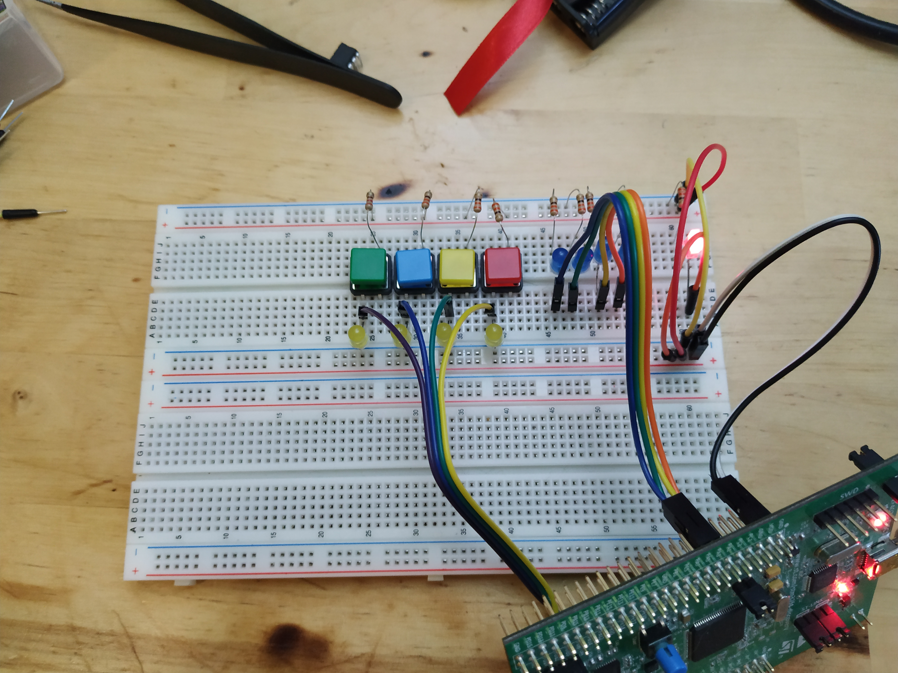
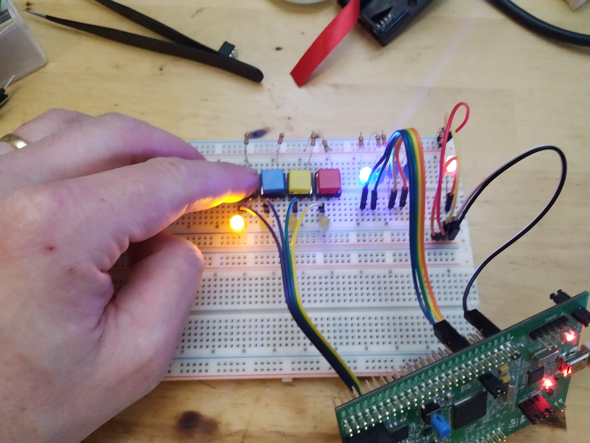

# Assembler programming of ARM Cortex-M microcontrollers - Part 1 - Some more GPIO


This text expands a little bit on the example in the
[previous](https://svenssonjoel.github.io/pages-2021/cortex-m-assembler-1-hardfault/index.html)
post by connecting a set of buttons onto PD0 - PD3 to control the LEDs
connected to PA0 - PA3.

The pictures below show how I have connected buttons and LEDs to my stm32f4-discovery board. 

| LEDs and buttons 0 | LEDs and buttons 1
| --- | --- |
|  |  | 

And here is a [video](https://youtu.be/dvhl-cGmEdY) showing the setup in action. 

The buttons, when closed, pull the PDx pin high. The closing of the
button also lights a yellow LED, just to see that everything is hooked
up properly.

The code runs an infinite loop that, in every iteration, reads the PD
pins and then copies their state to the corresponding PA pins where
the blue LEDs are connected.


## The code

Much of the code today is indentical to the code written last time but
there are additions of course.

let's take a look at the code labeled "main" piecewise.

```
main:
        ldr r1, =0x40023830     @ AHB1ENR
        ldr r0, [r1]
        orr r0, 0x1             @ Turn on GPIO A        
        orr r0, 0x8             @ Turn on GPIO D
        str r0, [r1]
```
This part loads the address of the `AHB1ENR` register into `r1` then
it loads the contents of the register into `r0`. A few bits are set to turn
on GPIO A and D and then the value is written back to the AHB1ENR register.
Details about this register can be found in the reference manual that I will
link to at the bottom of this post. 


```
        ldr r1, =0x40020000     @ Pointer to PA MODER
        ldr r0, [r1]            @ Value of PA MODER
        ldr r2, =0xFFFFFF00
        and r0, r0, r2
        orr r0, r0, 0x55        @ PA0 - PA3 output, 
        str r0, [r1]            @ Write back PA MODER
```
As last time, PA0 - PA3 are set to outputs.

``` 
        ldr r1, =0x40020C00     @ Pointer to PD MODER
        ldr r0, [r1]            @ Value of PD MODER
        ldr r2, =0xFFFFFF00
        and r0, r0, r2
        str r0, [r1]            @ Write back PC MODER
```

Here PD0 - PD3 is set to be inputs. This is done by clearing
8 bits in the `PD MODER` register located at address `0x40020C00`.

``` 
        ldr r1, =0x40020C0C     @ Pointer to PD PUPDR
        ldr r0, [r1]            @ Value of PD PUPDR
        ldr r2, =0xFFFFFF00
        and r0, r0, r2
        orr r0, r0, 0xAA        @ PD 0 - PD 3 pull down
        str r0, [r1]            @ Write back PC PUPDR
```

The code above modifies the `PD PUPDR` register. `PUPDR` stands for
`PULL UP, PULL DOWN Register`. This register is used to configure how
the PD pins behave "electronically" and how to configure this will depend
on what kind of electronics you have connected to the pin.
In this case I have a button that when it is open means that the GPIO pin
is connected to "nothing" but when the button is closed the GPIO pin is
connected to +3V (via a resistor). When a pin is connected to "nothing" like that
it is said to be "floating".

The code above, configures the PD0 - PD3 pins to be PULL DOWN pins.
this means that internally in the "chip" some switches (transistors)
will be configured in such a way that the pins are connected to ground
via a large resistor. With this configuration the pin will never be in
a floating state as it is either pulled to +3V by the button or pulled
to ground internally in the chip. 


The next thing that happens is that we enter into an infinite loop. 
``` 
forever:
        ldr r1, =0x40020C10     @ PD input data register
        ldr r0, [r1]
        and r0, r0, 0xF         @ Only care about 4 LSB 
        ldr r2, =0x40020014     @ PA output data register
        ldr r1, [r2]            @ Load state of PA
        ldr r3, =0xFFFFFF00     
        and r1, r1, r3          @ Clear PA0 - PA3
        orr r1, r1, r0          @ Turn on leds corresponding to buttons
        str r1, [r2]
        b forever
``` 

This loop reads the PD input data register, looks at the 4 bits that corresponds to
PD0 - PD3 and copies their state over to the PA output data register. There
is some masking going on so that only the bits of interest are updated. 

The complete assembly code listing is available below:

```
        .syntax unified
        .cpu cortex-m4
        .thumb
        
        .global vtable
        .global reset_handler

        .section .text
        
vtable:
        .word _estack
        .word reset_handler
        .word 0
        .word hard_fault_handler

.thumb_func     
hard_fault_handler:
        b hard_fault_handler

.thumb_func     
reset_handler:
        ldr r0, =_estack
        mov sp, r0
                
        ldr r0, =_dstart
        ldr r1, =_dend

        sub r2,r1,r0
        cmp r2, #0
        beq main

        ldr r1, =_flash_dstart
        
cpy_loop:
        ldrb r3, [r1]
        strb r3, [r0] 

        add r1, r1, #1
        add r0, r0, #1
        
        sub r2, r2, #1
        cmp r2, #0
        bne cpy_loop
        

main:
        ldr r1, =0x40023830     @ AHB1ENR
        ldr r0, [r1]
        orr r0, 0x1             @ Turn on GPIO A        
        orr r0, 0x8             @ Turn on GPIO D
        str r0, [r1]

        ldr r1, =0x40020000     @ Pointer to PA MODER
        ldr r0, [r1]            @ Value of PA MODER
        ldr r2, =0xFFFFFF00
        and r0, r0, r2
        orr r0, r0, 0x55        @ PA0 - PA 3 output, 
        str r0, [r1]            @ Write back PA MODER   

        ldr r1, =0x40020C00     @ Pointer to PD MODER
        ldr r0, [r1]            @ Value of PD MODER
        ldr r2, =0xFFFFFF00
        and r0, r0, r2
        str r0, [r1]            @ Write back PC MODER   


        ldr r1, =0x40020C0C     @ Pointer to PD PUPDR
        ldr r0, [r1]            @ Value of PD PUPDR
        ldr r2, =0xFFFFFF00
        and r0, r0, r2
        orr r0, r0, 0xAA        @ PD 0 - PD 3 pull down
        str r0, [r1]            @ Write back PC PUPDR   

forever:
        ldr r1, =0x40020C10     @ PD input data register
        ldr r0, [r1]
        and r0, r0, 0xF         @ Only care about 4 LSB 
        ldr r2, =0x40020014     @ PA output data register
        ldr r1, [r2]            @ Load state of PA
        ldr r3, =0xFFFFFF00     
        and r1, r1, r3          @ Clear PA0 - PA3
        orr r1, r1, r0          @ Turn on leds corresponding to buttons
        str r1, [r2]
        b forever

        .section .data 
```


## Conclusion

Ah! that was another one about GPIO. Seems to work fine. This sets a
good foundation for future exploration, I think. I want to take a few
steps back now and take a look at the assembler, the directives, the
instruction set and such things. The code written for
[session0](https://svenssonjoel.github.io/pages-2021/cortex-m-assembler-0/index),
[session1](https://svenssonjoel.github.io/pages-2021/cortex-m-assembler-1-hardfault/index.html)
and this current post is a bit ad-hoc, so going back and learning some
of the basics sounds like a good idea. We can then revisit things like
GPIO and maybe improve on the code by using more features of the
assembly later.

As usual all feedback is very welcome. So do not hesitate to poke me about anything. 

Oh I should add! The code for this sequence of posts is available at
[github](https://github.com/svenssonjoel/Learning-ARM-Cortex-M-Assembly).

Have a good day!

## Additional resources 

1. [STM32F405/415 (407/417) (427/437) (429/439) reference
   manual](https://www.st.com/content/ccc/resource/technical/document/reference_manual/3d/6d/5a/66/b4/99/40/d4/DM00031020.pdf/files/DM00031020.pdf/jcr:content/translations/en.DM00031020.pdf)
2. [STM32F412xG/E reference manual](https://www.st.com/content/ccc/resource/technical/document/reference_manual/9b/53/39/1c/f7/01/4a/79/DM00119316.pdf/files/DM00119316.pdf/jcr:content/translations/en.DM00119316.pdf)
3. [STM32F405xx STM32F407xx datasheet](https://www.st.com/content/ccc/resource/technical/document/datasheet/ef/92/76/6d/bb/c2/4f/f7/DM00037051.pdf/files/DM00037051.pdf/jcr:content/translations/en.DM00037051.pdf)
4. [STM32F411xC STM32F411xE](https://www.st.com/content/ccc/resource/technical/document/datasheet/b3/a5/46/3b/b4/e5/4c/85/DM00115249.pdf/files/DM00115249.pdf/jcr:content/translations/en.DM00115249.pdf)
5. [STM32 Cortex®-M4 MCUs and MPUs programming manual](https://www.st.com/content/ccc/resource/technical/document/programming_manual/6c/3a/cb/e7/e4/ea/44/9b/DM00046982.pdf/files/DM00046982.pdf/jcr:content/translations/en.DM00046982.pdf)
6. [vivonomicon](https://vivonomicon.com/2018/04/02/bare-metal-stm32-programming-part-1-hello-arm/)

___

[HOME](https://svenssonjoel.github.io)
