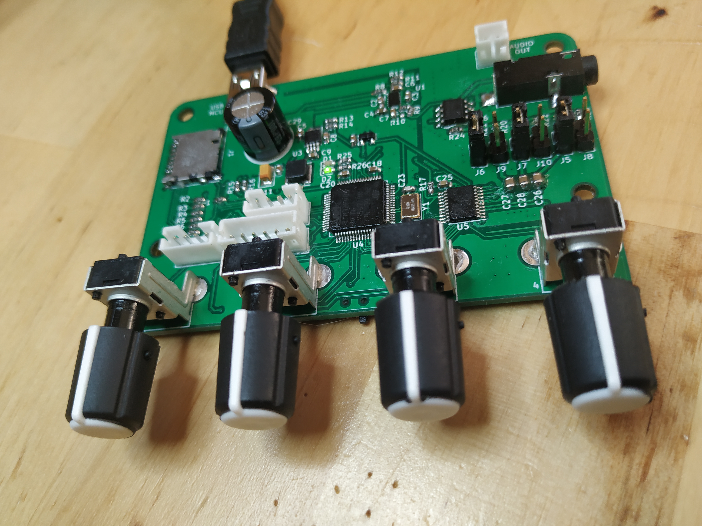
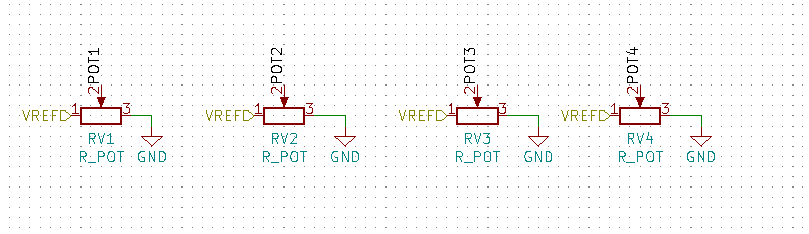
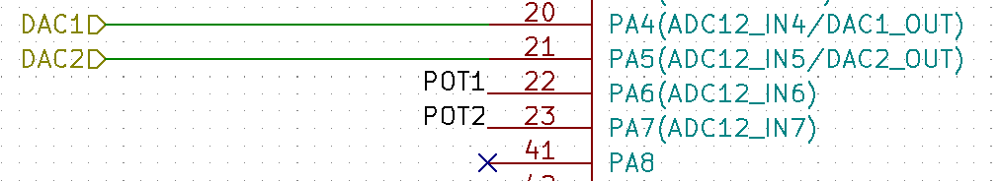
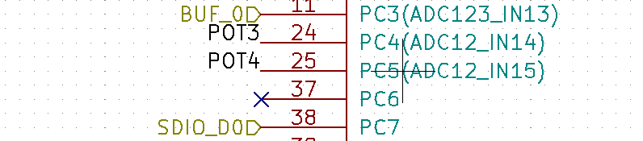

# Analog to digital conversion on STM32F4 in ChibiOS


I have been working on a PCB for sound generation for a while, the
result of this work is shown in the picture below.

I am a beginner when it comes to electronics and definitely totally
clueless when it comes to audio electronics. So, if this board will
ever make a noise at all is left to be seen. It does, however, show
signs of life! The MCU can be flashed, the LEDs can be blinked and the
position of the 4 knobs on the front can be read using the ADC.

If you are interested in more of the story behind this PCB there
are a few videos about it on
[YouTube](https://www.youtube.com/playlist?list=PLtf_3TaqZoDMNIfHCWMzmyu7kqccrfyPw).

This text is just about the reading of the values from the 4 knobs on
the PCB, but I will write about more aspects of this board in the
future (if anything else works that is).



## Some about the hardware

The PCB was designed using [KiCad](https://www.kicad-pcb.org/) and the
design is available at [GitHub](https://github.com/svenssonjoel/SYNTH).

In the schematics there are 4 potentiometers, the knobs, named POT1 to
POT4. These pots have 3 legs one of which are connected to ground
(GND), another to 3.3V and a third, in between the other two, is
connected to the MCU.  Think of it as there are two adjustable
resistors, one between 3.3V and ADC pin and another between ADC pin
and GND. This creates a voltage divider circuit with the result of a
voltage between 0V and 3.3V that is fed to the ADC pin on the
MCU. This voltage can then be read from software running on the MCU as
a value between 0 and 4095 (12 bit ADCs).



POT1 and POT2 are connected to GPIO pins named PA6 and PA7 on the
stm32f4.  The information `(ADC12_IN6)` and `(ADC12_IN7)` on the
schematics can also be found in the
[datasheet](https://www.google.com/url?sa=t&rct=j&q=&esrc=s&source=web&cd=1&ved=2ahUKEwjy7fyqy7PoAhUrlIsKHRK-AoYQFjAAegQIBBAB&url=https%3A%2F%2Fwww.st.com%2Fresource%2Fen%2Fdatasheet%2Fdm00037051.pdf&usg=AOvVaw07P8BbeoTlMpZCNdsHv1OP)
for this MCU and means that analog to digital conversion can be done
on these pins using either ADC unit 1 or 2 on channel 6 and 7. On this
MCU there is a total of three ADC units and 16 channels.



POT 3 and 4 are connected to GPIOs PC4 and PC5 that can be sampled
using ADC unit 1 or 2 on channels 14 and 15.



The following pieces of information will be important when writing the code. 

- POT1 - PA6, ADC 1 or 2, channel 6
- POT2 - PA7, ADC 1 or 2, channel 7
- POT3 - PC4, ADC 1 or 2, channel 14
- POT4 - PC5, ADC 1 or 2, channel 15

## Configuring ChibiOS for ADC usage

Given the information above we know that all of the potentiometers can be
read using just one ADC. And I picked ADC 1. In the file `mcuconf.h` the following
set of defined related to ADC can be found. Here ADC 1, 2 and 3 can be individually turned active
by setting the `STM32_ADC_USE_ADCX` to `TRUE`.  

```
/*
 * ADC driver system settings.
 */
#define STM32_ADC_ADCPRE                    ADC_CCR_ADCPRE_DIV4
#define STM32_ADC_USE_ADC1                  TRUE
#define STM32_ADC_USE_ADC2                  FALSE
#define STM32_ADC_USE_ADC3                  FALSE
#define STM32_ADC_ADC1_DMA_STREAM           STM32_DMA_STREAM_ID(2, 4)
#define STM32_ADC_ADC2_DMA_STREAM           STM32_DMA_STREAM_ID(2, 2)
#define STM32_ADC_ADC3_DMA_STREAM           STM32_DMA_STREAM_ID(2, 1)
#define STM32_ADC_ADC1_DMA_PRIORITY         2
#define STM32_ADC_ADC2_DMA_PRIORITY         2
#define STM32_ADC_ADC3_DMA_PRIORITY         2
#define STM32_ADC_IRQ_PRIORITY              6
#define STM32_ADC_ADC1_DMA_IRQ_PRIORITY     6
#define STM32_ADC_ADC2_DMA_IRQ_PRIORITY     6
#define STM32_ADC_ADC3_DMA_IRQ_PRIORITY     6
```

In another configuration file called `halconf.h`, the ADC subsystem must be turned
active by defining `HAL_USE_ADC` to `TRUE`.

```
/**
 * @brief   Enables the ADC subsystem.
 */
#if !defined(HAL_USE_ADC) || defined(__DOXYGEN__)
#define HAL_USE_ADC                         TRUE
#endif

```

And that is all we need to do to tell ChibiOS we want to use ADC 1.
Note that by setting `STM32_ADC_USE_ADC1` to true, a global variable
called `ADCD1` will be available to use in our code. If we had used
ADC 2 instead, a variable called `ADCD2` would be available. These
variables are of type `ADCDriver` and there is one of these for each
ADC in the system.

## The code

The plan here is to perform the sampling using just one ADC and 4
channels. The samples will be stored in a buffer large enough to hold
one sample per channel. 

```
#define NUM_CH 4
#define NUM_SAMPLES 1
```

The buffer for samples hold values of type `adcsample_t` which is really just
a 16 bit unsigned integer. Only 12 bits per value will be used. 

```
static adcsample_t sample_buff[NUM_CH * NUM_SAMPLES];
```

Next we specify an `ADCConversionGroup` which describe details about
how the digital to analog conversion is to be performed by the
hardware. I will try to explain each of the fields of this structure
below, as I understand them (which may not be entirely accurate).

```
static const ADCConversionGroup ADC_conversion_group = {
  FALSE,                                /*NOT CIRCULAR*/
  NUM_CH,                               /*NUMB OF CHANNELS*/
  NULL,                                 /*NO ADC CALLBACK*/
  NULL,                                 /*NO ADC ERROR CALLBACK*/
  0,                                    /* CR1 */
  ADC_CR2_SWSTART,                      /* CR2 */
  ADC_SMPR1_SMP_AN14(ADC_SAMPLE_3) |
  ADC_SMPR1_SMP_AN15(ADC_SAMPLE_3),     /* SMPR1 */
  ADC_SMPR2_SMP_AN6(ADC_SAMPLE_3) |
  ADC_SMPR2_SMP_AN7(ADC_SAMPLE_3) ,     /* SMPR2 */
  0,                                    /* HTR */
  0,                                    /* LTR */
  0,                                    /* SQR1 */
  0,                                    /* SQR2 */
  ADC_SQR3_SQ1_N(ADC_CHANNEL_IN6) | 
  ADC_SQR3_SQ2_N(ADC_CHANNEL_IN7) |
  ADC_SQR3_SQ3_N(ADC_CHANNEL_IN14) |
  ADC_SQR3_SQ4_N(ADC_CHANNEL_IN15)    /* SQR3 */
  
};
```
1. Circular buffer mode.
2. Number of channels to perform conversion on.
3. Callback.
4. Callback in case of error.
5. CR1: ADC Control Register 1
6. CR2: ADC Control Register 2
7. SMPR1: ADC Sample Time Register 1
8. SMPR2: ADC Sample Time Register 2
9. SQR1:  ADC Regular Sequence Register 1
10. SQR2: ADC Regular Sequence Register 2
11. SQR3: ADC Regular Sequence Register 3

For in depth information about the CR, SMPR and SQR registers see [the
reference
manual](https://www.st.com/resource/en/reference_manual/dm00031020-stm32f405415-stm32f407417-stm32f427437-and-stm32f429439-advanced-armbased-32bit-mcus-stmicroelectronics.pdf)

There is a bit in `ADC_CR2` that can be set for software start of a
conversion. This is what is indicated with the use of the
ChibiOS-defined `ADC_CR2_SWSTART` value.

In the SMPR registers we can set sample time. As I understand this it
means that taking the sample will take as many cycles as the value we
indicate there. `ADC_SAMPLE_3`, indicating 3 cycles, is the lowest
value we can put there. Setting a larger value must mean, along some
metric, a "better" result, why else spend the extra time?
All channels are set to same sample time in the SMPR registers.

The SQR registers are for specifying the sequence in which the ADC is
performing conversion over the channels. So, in this case it means,
first channel 6, then 7, 14 and last 15.


Next up is the thread function. This thread just loops forever and
in each iteration performs an ADC conversion and a sleep of half a second. 

```
#define ADC_WA_SIZE 2048

static THD_FUNCTION(ADCThread, arg) {
  (void) arg;

  while(TRUE) {
    adcConvert(&ADCD1, &ADC_conversion_group, sample_buff, NUM_SAMPLES);
    chThdSleepMilliseconds(500);
  }
}
```

The arguments to `adcConvert` specify which ADC driver to use, out
conversion group and sample buffer and its length. Now, I am guessing
that this means that each time adcConvert is called the fields of the
conversion group are written to the corresponding registers (CR, SMPR,
SQR), which does not seem very efficient. There are other modes to set
up ADC sampling in that probably are more efficient. Will save looking
into that for the future.


The function below, called `adc_init` performs the last bits of
configuration and then starts the ADC subsystem and creates the
`ADCThread`. 


```
void adc_init(void) {

  palSetPadMode(GPIOA, 6, PAL_MODE_INPUT_ANALOG);
  palSetPadMode(GPIOA, 7, PAL_MODE_INPUT_ANALOG);
  palSetPadMode(GPIOC, 4, PAL_MODE_INPUT_ANALOG);
  palSetPadMode(GPIOC, 5, PAL_MODE_INPUT_ANALOG);

  adcStart(&ADCD1, NULL);

  chThdCreateFromHeap(NULL, ADC_WA_SIZE, "ADC", NORMALPRIO + 1, ADCThread, NULL);
}
```

In `adc_init` the GPIOs we are going to use are set into an alternate
mode, analog input.


To access the values sampled use the `adc_value` function defined
below.  It just returns the value at a given index within the sample
buffer. Nothing fancy, just an example.

```
uint16_t adc_value(int ix) {
  if (ix < 0 || ix >= 4) return 0;
  return (int16_t)sample_buff[ix];
}
```

## An example main function

To tie it all together, here is an example main function.  Here
ChibiOS is initialized, ADC initialized, USB is set up (to get
feedback to a computer connected via for example miniterm). 

```
int main(void) {
  halInit();
  chSysInit();

  adc_init();

  sduObjectInit(&SDU1);
  sduStart(&SDU1, &serusbcfg);

  usbDisconnectBus(serusbcfg.usbp);
  chThdSleepMilliseconds(1500);
  usbStart(serusbcfg.usbp, &usbcfg);
  usbConnectBus(serusbcfg.usbp);
  chThdSleepMilliseconds(500);

  while (true) {

    for (int i = 0; i < 4; i ++) {
      chprintf((BaseSequentialStream *)&SDU1, "%d: %d \r\n", i, adc_value(i));
    }    
    chThdSleepMilliseconds(500);
  }
}
```

Main then goes into a loop that forever prints the contents of the sample buffer and
outputs the following:

```
0: 2091 
1: 0 
2: 722 
3: 189 
0: 2091 
1: 0 
2: 721 
3: 190 
0: 2090 
1: 1 
2: 722 
3: 189 
0: 2097 
1: 1 
2: 724 
3: 192 
0: 2091 
1: 1 
2: 724 
3: 192 
...
```

If you read this and see places where my understanding of this is
falling short, please help me improve by pointing me in the correct
direction. I am still quite a beginner when it comes to ChibiOS and
embedded in general. I am writing these things down, just as much to
share the information (and perhaps occasional useful insights) as to
improve my own knowledge of the concepts.


___

[HOME](https://svenssonjoel.github.io)
