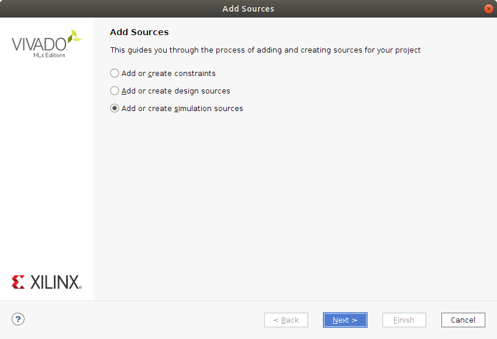
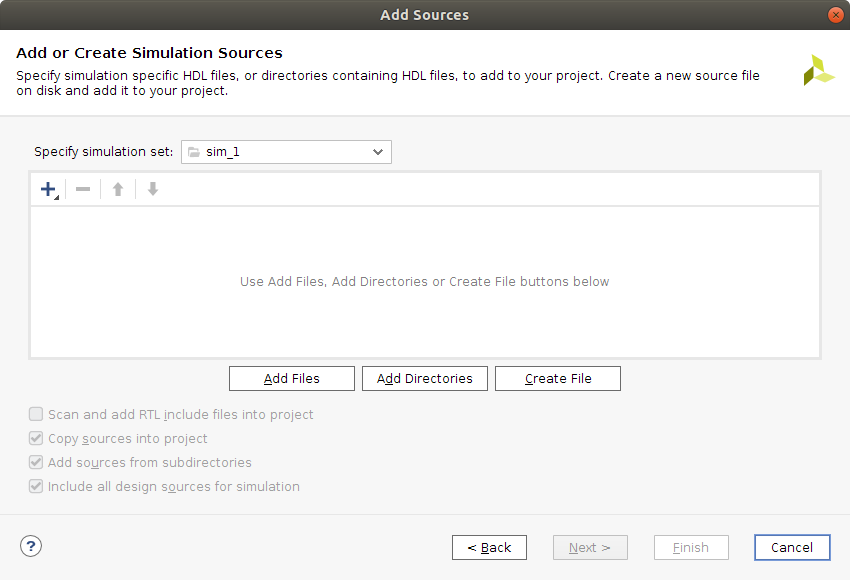
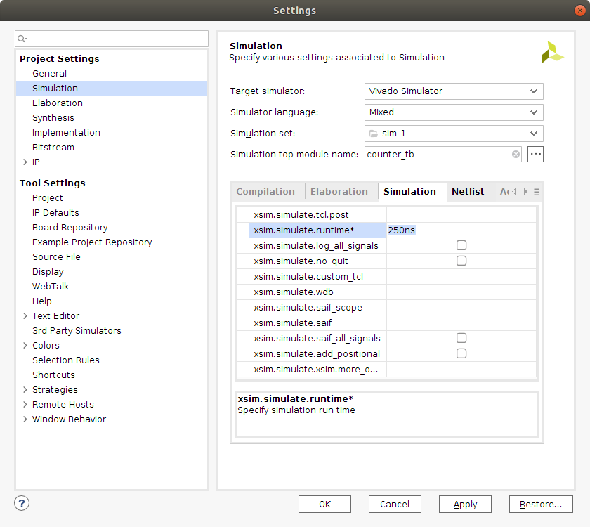
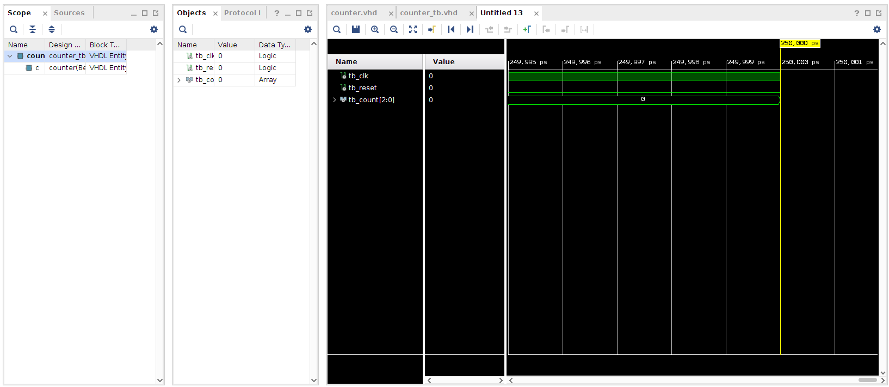
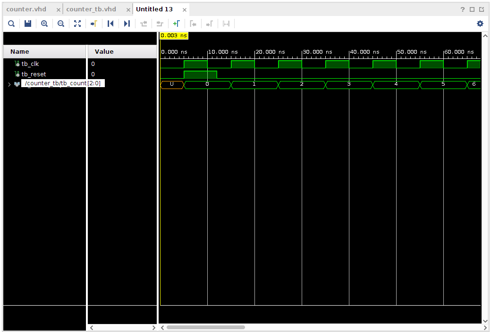
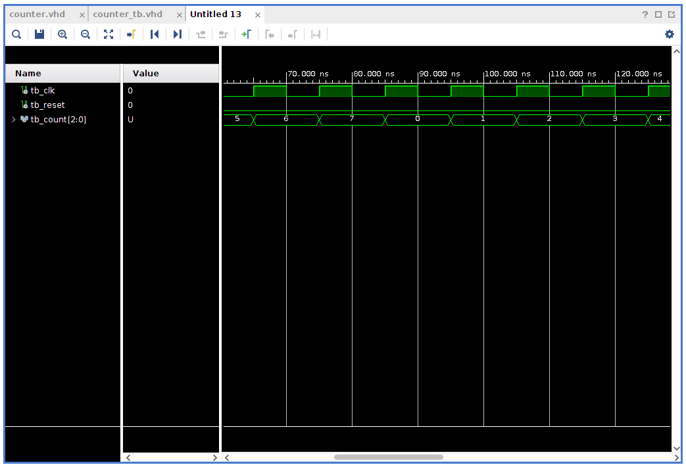

# Behavioral simulation in Vivado

This is a follow-up to the previous post titled [Getting started with the Nexys A7 and Vivado](http://svenssonjoel.github.io/pages/vivado-nexys-a7-getting-started/index.html). 
I feel that simulation may be an important tool to learn how to use. I hope 
to be continuing to learn about hardware description and simulation will surely 
turn out to be an important aspect of that. 


To get started with this, let's create a project using the steps 
from [the earlier post in the series](http://svenssonjoel.github.io/pages/vivado-nexys-a7-getting-started/index.html). 
We continue from the point where the Vivado GUI starts up and we have not yet 
started creating any source files. 


## Implementing a counter in VHDL

The plan is to implement a 3 bit counter that will count at each tick
of the clock through the sequence 0,1,2,..,7 and then repeat (start
from 0 again).  There will be reset signal that sets the state of the
counter to the zero state.  Then onwards the counter will increment at
each rising edge of the clock signal. The current value of the counter 
will be output as a signal using a `std_logic_vector` of 3 bits. 

So here is the *entity* or interface that I will try to implement.

``` 
entity counter is
  Port ( clk : in std_logic; 
         reset : in std_logic;
         count : out std_logic_vector(2 downto 0)
       );
end counter;
```

The implementation of this will have an internal state signal 
called `counter_state` and it will be of the type `unsigned(2 downto 0)`. 
This is because we can perform arithmetic on these unsigned signals easily and 
they can also be easily converted into an `std_logic_vector` for use 
in the `count` signal. 


Let's take a look at the implementation. 
``` 
architecture Behavioral of counter is

    signal counter_state : unsigned(2 downto 0); 

begin 

    count <= std_logic_vector(counter_state);

    counter_proc: process(clk, reset)
    begin 
        if (reset = '1') then
            counter_state <= "000";
        elsif rising_edge(clk) then
            counter_state <= counter_state + 1;
        end if;
    end process; 
end Behavioral;
```

What this means is that `count` should always have the value of the
`counter_state` (converted to an `std_logic_vector`). Then there is a
process that is sensitive to `clk` and `reset`.  If reset is high then
the internal state is set to 0. The reset here is independent of the
clock which is called an asynchronous reset.  If reset is not high and
there is a rising edge on the clock, then the internal counter state
is incremented. Nothing special needs to be done to make the counter
wrap around to zero it will happen automatically when trying to
increment the value 7 as there are only 3 bits. 


The complete VHDL listing looks as follows: 

```
library IEEE;
use IEEE.STD_LOGIC_1164.ALL;
use IEEE.NUMERIC_STD.ALL;

entity counter is
  Port ( clk : in std_logic; 
         reset : in std_logic;
         count : out std_logic_vector(2 downto 0)
       );
end counter;

architecture Behavioral of counter is

    signal counter_state : unsigned(2 downto 0); 

begin 

    count <= std_logic_vector(counter_state);

    counter_proc: process(clk, reset)
    begin 
        if (reset = '1') then  
            counter_state <= "000";
        elsif rising_edge(clk) then       
            counter_state <= counter_state + 1;
        end if;
    end process; 
end Behavioral;
```
Now it would be nice to be able to get some kind of indication 
on whether or not this counter will behave appropriately. That 
is where the simulation comes in. 

## Writing a testbench for the counter

To simulate the counter we need to create a kind of testing harness 
for it. This harness will instantiate a counter and provide stimulus 
for it. The stimuli the counter will need is the `clk` and the `reset` 
signals. 

To create a testbench right click in the *Sources* pane of the
*Project Manager* and select *Add Sources*. Select *Add or create
simulation sources* and click *Next*. On the next screen press *Create
File* and give it a name, for example `counter_tb`. Click *Finish* 
and then just click *Ok* in the *Define Module* dialog that pops up. 

 Add Sources | Add Simulation Sources
| :---:|:---:|
| 

Now you should have a `counter_tb.vhd` file listed in the *Sources* 
pane under *Simulation Sources*. Double click on the `counter_tb`
to open it in an editor window. 

The testbench will define some local signals that it connects 
to an instance of our counter. This is done using `port map( ... )` 
syntax. Then, the testbench should provide a clock signal 
and perform a reset. If all works out, we should see the counter count. 

A testbench is just another VHDL program. So it has an entity and an
architecture. The entity declaration is empty though. No external
interface on this one.

```
entity counter_tb is
end counter_tb;
``` 
Then the architecture: 

```
architecture Behavioral of counter_tb is
    signal tb_clk : std_logic := '0';
    signal tb_reset: std_logic := '0';
    signal tb_count: std_logic_vector(2 downto 0) := "000";
begin

    c: entity work.counter port map (reset => tb_reset, clk => tb_clk, count => tb_count);
    
    tb_reset <= '1' after 5ns, '0' after 12ns; 
    
    tb_clk <= not tb_clk after 5ns;
    
end Behavioral;
``` 
We define three signals, `tb_clk`, `tb_reset` and `tb_count`. 
I preceded the signal names with `tb` but I really don't think that 
is necessary. The signals here have default values, which is fine 
for a testbench but less ok for hardware to be synthesized as I understand 
it currently (This seems like something that would be very tricky and 
wasteful to build into hardware). 

Next the entity is instantiated and the `port map` is performed. In my 
opinion the port map is using a very confusing syntax. The arrow implies 
to me that there is a direction but rather It seems that, for example
`reset => tb_reset` means that these signals are connected (As if 
a wire was soldered between the two).


Next we provide some stimulus. `tb_reset` will be active for a short while 
starting 5ns after simulation starts. The `tb_clock` signal will oscillate 
with 10ns period throughout simulation. 

Save the file with **CTRL+s**.

The complete testbench VHDL code listing looks like this: 

```
library IEEE;
use IEEE.STD_LOGIC_1164.ALL;

entity counter_tb is
end counter_tb;

architecture Behavioral of counter_tb is
    signal tb_clk : std_logic := '0';
    signal tb_reset: std_logic := '0';
    signal tb_count: std_logic_vector(2 downto 0) := "000";
begin

    c: entity work.counter port map (reset => tb_reset, clk => tb_clk, count => tb_count);
    
    tb_reset <= '1' after 5ns, '0' after 12ns; 
    
    tb_clk <= not tb_clk after 5ns;
    
end Behavioral;
``` 


## Simulating the counter using the testbench

Before we jump to simulation, let's go into the settings and set for 
how long the simulation should be run. You find the settings near the 
top of the *Flow Navigator* under *Project Manager*. Click on *Settings* 



Go into the *Simulation* settings and locate the *Simulation* tab and 
the `xsim.simulate.runtime` and set it to something like 250ns. Then 
click *Apply* and *Ok*. 

Now, in the *Flow Navigator* under *Simulation* you find *Run Simulation*. 
Click on *Run Simulation* and select *Run Behavioral Simulation*. The contents
of the GUI on the right side should now change and display something like 
this. 



You can zoom in and out in the window showing the waveforms by using 
**CTRL + mouse_scroll_wheel**.

 Simulation waves | Simulation waves zoomed
| :---:|:---:|
| 


## Conclusions

Lots left to look into when it comes to simulation but I feel that it 
is more fun to do things like that when there is a need. So, this is 
enough simulation for today. I hope to have a moment to try out some 
more VHDL programming in a not to distant future. 

As usual, I would love input and suggestions. Do not be afraid to poke me. 

Thanks for reading and have a good day!

___

[HOME](https://svenssonjoel.github.io)
