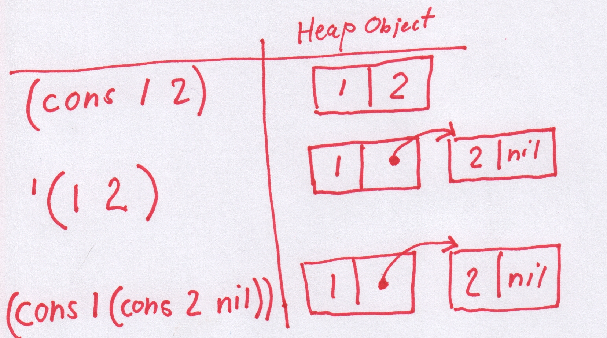

# Another Lisp for Microcontrollers

For a while now, not too long, couple of years or so, I have been
working in the vicinity of microcontrollers (MCUs). I don't have a
whole lot of experience in low-level programming of devices like the
[STM32](https://www.st.com/en/evaluation-tools/stm32-discovery-kits.html)
, the
[NRF52](https://www.nordicsemi.com/Products/Low-power-short-range-wireless/nRF52833/GetStarted)
or the ARM Cortex A9 of the Xilinx Zynq chip on the [Trenz
ZynqBerry](https://shop.trenz-electronic.de/en/TE0726-03M-ZynqBerry-Module-with-Xilinx-Zynq-7010-in-Raspberry-Pi-Form-Faktor). But
I do enjoy learning about them, **slowly**. The Code in C,
Cross-compile, Flash and Debug loop (CCFDL?) is a bit heavy
though. Wouldn't it be nice with a REPL (Read, Evaluate and Print
Loop)?

The [MIT 6.001 Structure and Interpretation of Computer
Programs](https://www.youtube.com/watch?v=-J_xL4IGhJA&list=PLE18841CABEA24090)
series of lectures is a lot of fun and I recommend everyone to watch
it. I watched this lecture series several times while entertaining the
idea of some day implement some kind of a Lisp. However, I didn't want
to implement a Lisp interpreter in Lisp, or even in Haskell, it would
feel a bit like cheating. So instead, the idea is to combine these two
newly found interests (MCUs and Lisps).

The [lispBM](https://github.com/svenssonjoel/lispBM) project is my
(ongoing) attempt to learn some about lisp while at the same time
learn more about MCUs and to make them more accessible to me, once you
get used to having a REPL it is hard to go back.

I don't have very much experience or long background in programming
numerous Lisps, so my attempt of making one is most likely very
naive. A small amount of dabbling with [Emacs
Lisp](https://www.gnu.org/software/emacs/manual/html_node/elisp/) and
I did like skimming [Land Of Lisp](https://nostarch.com/lisp.htm) but
navigating the jungle of Lisp dialects is not where I am at. This
means that lispBM is not going to adhere to any standard or be a real
*Scheme* or *CL*, to me that does not matter!

Now I know that there are many other MCU-lisps. I have tried not to
peek at the insides of these at all. But I looked at
[Lisperator](http://lisperator.net/pltut/) for some tips with the
evaluator, I would definitely recommend this tutorial. I have probably
stared at the tail-call optimizing evaluator at Lisperator for hours
trying to understand what is going on there. I am not going to pretend
that I fully understand it yet. Early on I used the
[MPC](https://github.com/orangeduck/mpc) Micro Parser Combinators for
parsing expressions. This is the same parser generator code that is
used in [BuidYourOwnLisp](http://www.buildyourownlisp.com/). However,
when going towards smaller MCUs (with less than 256k of RAM) the MPC
library showed to be a bit to hungry on memory and I had to hack something
up (more about that in the section about parsing).

Here is a list of other Lisp-on-odd-hardware projects:
 1. [Let's Run Lisp on Microcontrollers.](https://dmitryfrank.com/articles/lisp_on_mcu)
 2. [uLisp.](http://www.ulisp.com/)
 3. [XS.](http://www.yuasa.kuis.kyoto-u.ac.jp/~yuasa/xs/)
 4. [esp-lisp.](https://github.com/yesco/esp-lisp)

I'm sure there are more examples! please let me know what you are working on.

If you want to see lispBM in action, check out the video [LISPBM on
NRF52](https://youtu.be/OeQ161G_Kgs) or the video that goes over what went
into porting it to NRF52 [LISPBM Porting to
NRF52](https://youtu.be/cXSavxC3th0).

LispBM is written in C, compiles with -std=c11 flag, for 32bit
platforms. So far it has been tried out on x86 (with -m32 flag and
depending on something like multilib if you are on a 64bit platform),
ARM Cortex M4 (the STM32F4 MCU), ARM Cortex M4 (the NRF52 MCU) and ARM
Cortex A9 (The Xilinx Zynq 7000). When deploying lispBM on an MCU it
helps a lot to have access to a *Hardware Abstraction Layer*, HAL. So
far lispBM has been compiled into code based on
[ChibiOs](http://chibios.org/dokuwiki/doku.php) and
[ZephyrOs](https://www.zephyrproject.org/) both providing a lot of HAL
functionality. LispBM has also been tried on the ARM A9 core of the
Xilinx Zynq 7000 here depending on the HAL that is provided with the
Xilinx toolchain.

## A Few Thoughts on Lisp

The series of MIT video lectures showed a simple elegance and really
made me want to try making some kind of a Lisp. If you just get over
the strange "prefix" notation where `(+ 1 2)` means `(1 + 2)` and
instead focus on the really cool part that `(+ 1 2)` is actually
exactly what the expression looks like loaded into memory (the Lisp
heap) and that it extends to *N* arguments `(+ 1 2 3 4)`. When I say
that `(+ 1 2)` is exactly what it looks like in memory, what I mean is
that it is stored as a linked list where the first element is the
*symbol* `+` and the second and third elements of the list are the
*values* `1` and `2`. The elements and pointers to the next cell are
stored in what is called *cons cells*. a cons cell consists of enough
bytes of memory to hold two pointers or two values or some two element
permutation of pointer and value (many of the details of this as
implemented in lispBM can be found later in this text). In more detail
then, the expression `(+ 1 2)` will in memory be made up out of a
first cons cell containing `+` in its first position (or car) and a
pointer to the next cell in its second (cdr) position. Likewise, the
next cell contains the `1` in the car position and a pointer to the
next cell in the cdr. The last cell in the linked up structure of cons
cells contains a `2` in car and a special symbol called `nil` in the
cdr position to terminate the list.


Now, if we give `(+ 1 2)` to a Lisp interpreter, it will evaluate it
and arrive at the answer `3`. The first stage in this, though, is to
read the string `(+ 1 2)` into the heap (generating the linked list of
symbols and values), this is called *Reading*. Following that the lisp
interpreter will start to consume the linked list to reduce it to an
answer, called *evaluating*. Finally the result is *printed*. This is
what a *REPL* does, it reads, evaluates and prints and then it does it
all again.


If giving the lisp interpreter a list (such as `(+ 1 2)`) it will be
assumed to mean "add 1 and 2", so how does one actually create a list
*of data*? Giving the list `(1 2 3)` to the interpreter will not
work. The interpreter always treats a list given to it in this way as
an application of the *function* represented by the first element to
the rest of the elements. So doing that will give some kind of an
error message. There is, However, an operator that tells the
interpreter not to evaluate its argument, this operator is called
*quote* and is written `'` as in for example `'(1 2 3)`. So when you
give the expression `'(1 2 3)` to the REPL, it will reply with `(1 2
3)`. We have created a list.  It is also possible to give the
expression `'(+ 1 2)` to the REPL and this will result in a linked
list in memory consisting of elements `+`, `1` and `2`. The REPL will
now give `(+ 1 2)` as the output result of your computation. There is
an operation with the reversed meaning as well called `eval` that
means "do evaluate this". As an example the expression `(eval '(+ 1
2))` given to the REPL again results in it printing out the answer
`3`. Together `'` and `eval` are very powerful, it means we can
construct code **on the fly** in memory and then have the interpreter
compute the result.

Using `'` to create a list works well in some simple cases like
above. A more down-to-earth way to create a list is to use the `list`
function.

```
# (list (+ 1 2) (+ 3 4) (+ 5 6))
> (3 (7 (11 nil)))
```

If trying to use `'` in this case the result would be:

```
# '((+ 1 2) (+ 3 4) (+ 5 6))
> ((+ (1 (2 nil))) ((+ (3 (4 nil))) ((+ (5 (6 nil))) nil)))
```

So the difference here is that with `list` each element is evaluated
and what `'` really does is to just give back its argument
unevaluated. So To make lists, in general, use `list`, even though `'`
can be used in some cases (such as `'(1 2 3)`).


In the paragraphs above there are a couple of words that I emphasized
without much explanation. These are words that (as I understand it)
are part of the Lisp vocabulary. The heap consists of cons cells, only
large enough to hold two pointers or values (or mix there-of) so a
symbol (such as `+`) also has to be represented by a number no larger
than a pointer in number of bits. This means that values (characters,
signed or unsigned integers), symbols, pointers all can appear on
either car or cdr part of a cell. To tell them apart a couple of bits
are sacrificed. I will go into the details about this in the section
about the heap below.

## Introducing the LispBM Language constructs

Before going into the implementation details, I want to give a few
examples of lispBM code in order to introduce many of the concepts
that we will see again in the following sections.

When starting up the example REPL from the lispBM github repository
you see something like this:

```
Symrepr initialized.
Heap initialized. Heap size: 0.015625 MiB. Free cons cells: 2048
Evaluator initialized.
Extension added.
Lisp REPL started!
Type :quit to exit.
     :info for statistics.
# 
```

It shows a prompt where you can type in your lisp expressions or you
can type `:info` for some statistics and information about the current
state of the runtime system:

```
# :info
############################################################
Used cons cells: 402
ENV: ((foldl (closure ((f (i (xs nil))) ((if ((= (xs (nil nil))) ...
Allocated arrays: 0
GC counter: 0
Recovered: 0
Recovered arrays: 0
Marked: 0
Free cons cells: 1646
############################################################
#
```

This information will show how much of the heap is in use currently
and how much is free, how many times garbage collection has been
executed and so on. `ENV` refers to the contents of the environment
that will be touched upon shortly in this section.

Now let's explore some of the basic functionality of this REPL. 

### `cons`, `car` and `cdr`

The `cons` function is used to construct. What it constructs are cons cells.
```
# (cons 1 2)
> (1 2)
```

`cons` takes two arguments and returns a pair. Used like this, with
two values, `cons` allocates a cons cell from the heap and puts the
values in the car and cdr position of that cell. This is not the same
as evaluating `'(1 2)`

```
# '(1 2)
> (1 (2 nil))
``` 



It is a little bit unfortunate that lispBM is printing the result of
`(cons 1 2)` as `(1 2)`. As I understand it, it is common to print
this heap structure as `(1 . 2)` and call it a dotted pair. LispBM
does not recognize dotted pairs in reading or uses them in output,
should add this to the todo-list.

The `car` and `cdr` functions break things apart.

```
# (car (cons 1 2))
> 1
# (cdr (cons 1 2))
> 2

```


### `if`

The conditional `if` takes three arguments, the first should be
something that evaluates to true `t` or `nil` for false. The next two
arguments are the expressions to evaluate on the *then* or *else*
branch.

```
# (if 't 1 2)
> 1
# (if 'nil 1 2)
> 2
```

### `define`

`define` is used to add things to a global environment.

```
# (define apa 1)
> t
```

This function application adds an entry into the environment that
states that `apa` is defined to `1`. Typing `:info` in the REPL should
show this mapping.

```
# :info
############################################################
Used cons cells: 547
ENV: ((apa 1) ((foldl (closure ((f (i (xs nil))) ((if ((= (xs (nil nil))) ...
Allocated arrays: 0
GC counter: 0
Recovered: 0
Recovered arrays: 0
Marked: 0
Free cons cells: 1501
############################################################

```

After defining `apa` to be 1 this is what it will evaluate to.

```
# apa
> 1
# (+ 10 apa)
> 11
#
```

### `let`

`let` is used to bind a variable (symbol) to a value locally. It takes
two arguments where the first is a list of bindings and the second is
an expression which will be evaluated in an environment extended with
those given bindings.

```
# (let ((a 10)) (+ a 1))
> 11
```

If you want to set up more bindings with `let` it looks like this:

```
# (let ((a 10) (b 20) (c 30)) (+ a b c))
> 60
```
It is also possible to nest `let` bindings and locally override a binding:

```
# (let ((a 1)) (+ a (let ((a 10)) (+ a a))))
> 21
```

Below is an example that shows that a local binding also overrides a
global binding and that the global binding is left unchanged when
leaving the local scope.

```
# (let ((apa 1000)) (+ apa 1))
> 1001
# apa
> 1
```

The form of `let` used in lispBM allows an earlier binding in the list
of bindings to be used as part of computations in later bindings.

```
# (let ((g 1) (h (+ g 1000))) h)
> 1001

```

### `lambda` and `closure`

New functions are defined using `lambda` that takes two arguments a
list of parameter names and an expression. Using `lambda` creates an
anonymous function that can be either directly applied or bound to a
name using either `define` or `let`.

Here is an example of a directly applied anonymous function:
```
# ((lambda (x) (+ x x)) 2)
> 4
``` 

That is a lot of parentheses and may be hard to read. Binding the
anonymous function to a name may help a bit.

```
# (define f (lambda (x) (+ x x)))
> t
# (f 2)
> 4
# 
```

Evaluating the expression `(lambda (x) (+ x x))` results in a `closure`.
```
# (lambda (x) (+ x x))
> (closure ((x nil) ((+ (x (x nil))) (nil nil))))
```

The `closure` looks very similar to the original `lambda` except that
it has one more parameter, an environment. When forming a `closure`
any local bindings that are needed within the expression body of the
lambda is sucked into this closure-local environment. This is what
makes it possible for us to write functions that return functions.
Here is an example of a closure with sucked-in values from the
surrounding local scope:

```
# (let ((y 100)) (lambda (x) (+ x y)))
> (closure ((x nil) ((+ (x (y nil))) (((y 100) nil) nil))))

```

Here we can see that the binding `(y 100)` is present in the `closure`
object created.


### `progn`

The `progn` primitive evaluates a sequence (an arbitrary number of) expressions for
side-effects and finally returns the value of the last expression in
the sequence as the final result.

```
# (progn (print "Hello world" \#newline) (+ 1 2))
Hello world
> 3
```

The `print` function used in this example is an
*extension*. Extensions are a way to add platform dependent
functionality to lispBM. The target platforms have many different ways
of dealing with this kind of IO so I don't want to build any
expectations on existing methods of presenting text into lispBM
itself. There are still a few calls to `printf` present in lispBM but
removing these are on the todo-list.


### A Slightly Larger Example 

Here is a larger example that makes combined use of many of the
features introduced above. It is a function that computes the nth
Fibonacci number in a tail-recursive way. There will be more about
tail-recursion in the section about the evaluator. 

```lisp
(define fib (lambda (n)
	      (let ((fib0 (lambda (n a b)
			   (if (= n 0) a
			     (if (= n 1) b
			       (fib0 (- n 1) b (+ a b)))))))
		(fib0 n 0 1))))


(fib 10)
```

This example code evaluates to `55`.


With this example we conclude the walk through of some fundamental
language constructs that can be used in lispBM programs. From now on
this text will be mostly about how these things are implemented.

## Heap Consisting of Cons cells

The implementation of the heap is found in the files `heap.c` under
`src` and `heap.h` under `include`. The `heap.h` file also contains
quite a bit of commentary showing the choices I was contemplating
there.

A type called `VALUE` is defined in `typedefs.h` and represents values
that make sense in a lisp computation. `VALUE` is really just a
32Bit unsigned integer. I mention `VALUE` here as it is frequently
used throughout. Another type that is quite frequently in use is
`UINT` which is the same size as `VALUE` but does not necessarily make
sense in the lisp world. `UINT` is used when it is important that the
size matches that of a `VALUE`. Maybe because it will be turned into a
`VALUE`. When it does not matter if a type matches in size with
`VALUE`, I use `int` or `bool` or whatever is needed. This is the case
when data that is used only internally in the runtime system. I am not
very strict on conventions and will at some point try to take a pass
over all code and make it a bit more aligned in that sense.

Within the lispBM runtime system a cons cell is represented by the struct:
```
typedef struct {
  VALUE car;
  VALUE cdr;
} cons_t;
```
Where `VALUE` is defined as:
```
typedef uint32_t VALUE;
```
As an example a heap of 1024 cons cells is allocated as follows
```
cons_t *heap = (cons_t *)malloc(1024 * sizeof(cons_t));
```

The `VALUE` type is a 32bit word used to store: symbols (these are
special values that represent variables, pieces of syntax and many
other things), signed and unsigned integers and characters. The
`VALUE` type is also large enough to hold a pointer within the heap
used to set up linked data-structures. But there is also a lot of
bookkeeping that needs to be tracked within the 32bit word (an
alternative would be to use additional fields within the `cons_t`
structure for this information. This would mean that the whole 32bit
word is usable to store data, but it would increase the memory
footprint of the heap.).

The information that is kept within the 32bits of a `VALUE` is:

1. one mark-bit for the *Garbage Collector* (explained in a future blog post).
2. one bit that differentiates between pointers and values.
3. In the case of a value, an additional 2 further bits are used to
encode the type of that value.
4. In the case of a pointer, there are several bits that are
unused. This is because the heap is *small* (from kilobytes on the
small MCUs up to 64MB on the Zynq) and to represent these *offsets*
not that many bits are needed.

The binary representation of a pointer stored in either the `car` or
the `cdr` has the following shape:

```
Bit pos: 31 30 29 28 27 26                               2 1 0
Bit val: 0  0  0  0  0  0  XX XXXX XXXX XXXX XXXX XXXX X 0 0 0
```

Since the value of the pointer, made up by the Xed out bits above,
is only meant to reference other cons cells (which are 8 bytes apart
in the allocated heap) the bottom three bits are unused. The zero in
position 0 is used to differentiate between pointer and value, thus
all pointers will have a zero there and all values will have a
one. Bit position 1 is used for the Garbage Collector's mark-bit but
only in the `car` position, in the `cdr` this bit is unused. Bit
position 2 is unused. Depending on how large the heap is there is some
number of bits unused on the most significant side as well. The
example shows the bits used for a 64MB heap.

For a value there are 28 bits left. Bit 0 and 1 work exactly as in the
case above for pointers. That is, bit 0 and 1 are used for
differentiation with a pointer and garbage collection. Bits 2 and 3
are used to encode 4 different *types* of values.

The different types of values are:
1. symbols.
2. 28Bit integer.
3. 28Bit unsigned integer.
4. Character.

That was a lot of text about values for a section about the heap. But
these two concepts are pretty tightly linked as all that extra runtime
information bookkeeping has to go in there and be available to for
example the garbage collector.

After allocating the heap, the next step is to link all the cons cells
that it consists of into a single, long, linked list called the
`free_list`.

When a program is requesting a fresh cons cell, for example from a
usage of the `cons` function, the head (car) of the `free_list` is
provided. The `free_list` variable is then set to the cdr of
itself. This operation is performed by the function
`heap_allocate_cell` in file `heap.c`. If there are no free cells on
the `free_list` the heap allocation returns a symbol indicating out of
heap. This will trigger the evaluator to perform a round of garbage
collection.


## Symbols

Symbols are represented by text strings in source (or in what you
enter into the REPL). So for example if the line `(define accumulator
0)` is entered into the REPL, `accumulator` is a symbol. The word
`define` is actually also a symbol.

But as we have seen symbols can live on the heap. This means that the
string of text that is the symbol in the source code must be turned
into something that can be stored in a `VALUE`.

In lispBM the files `symrepr.h` and `symrepr.c` takes care of this
conversion from text strings to integer values. It is also important
that the backwards mapping from the integer value to the text string
is maintained so that the string representation can be presented to
the user of the REPL rather than just some obscure number. There are
currently two different implementations maintaining this mapping of
symbols as integers to symbols as string and the other way around. One
implementation based on a hash-table and one based on a
linked-list. The hash-table implementation has a larger memory
footprint but should allow for faster lookups while the linked-list
implementation uses memory proportional to the number of symbols that
have been introduced. When using lispBM on, for example, an STM32 with
less memory the linked-list implementation is used.

Symbols are stored on the heap and thus they must fit into a
`VALUE`. This means there are only 28Bits available to represent
different symbols since there are 4Bits that represent type and used
by garbage collector and so on (28 bits should be plenty enough
though!.).

Using the hash-table or the linked-list the conversion process is very
similar.

The string representation of a symbol is hashed into a 16Bit
value. Actually a value between `0` and `0xFFFE`. This means that
there can be collisions where 2 different symbols have the same 16Bit
id. Collisions are resolved by each bucket of the hash-table (or each
element of the linked-list) contain a linked-list of length at most
4096. So if two values collide and have the same 16Bit id, they will
get an additional 12Bits of id that depends upon how deeply within the
(bucket) linked list they are.

```
UINT hash_string(char *str, UINT modulo) {

  UINT r = 1;
  size_t n = strlen(str);

  for (UINT i = 0; i < n; i ++) {
    UINT sp = small_primes[i % SMALL_PRIMES];
    UINT v = (UINT)str[i];
    r = (r + (sp * v)) % modulo;
  }

  return r;
}
```

The `hash_string` function is called with a `modulo` of `0xFFFF` which
means that the return value can never be `0xFFFF`. This frees up 4096
symbols that it is impossible to **create** from a source string
entered by the lispBM programmer. These 4096 symbols are treated
specially in the implementation for things like signaling errors and
for symbols that are present by default (such as `nil` and `define`).

## Environments

Environments store mappings between symbols and expressions. In lispBM
environments are implemented as lists made from cons cells on the heap.
The files `env.c` and `env.h` contains five functions used to
manipulate environments.

```
VALUE env_set(VALUE env, VALUE key, VALUE val);
VALUE env_lookup(VALUE sym, VALUE env);
VALUE env_copy_shallow(VALUE env);
VALUE env_modify_binding(VALUE env, VALUE key, VALUE val);
VALUE env_build_params_args(VALUE params, VALUE args, VALUE env0);
```

The function `env_set` adds a key-value pair to an
environment. However, if the key-value binding already exists in the
environment then this existing binding is updated instead.

Looking up in the environment is done using the `env_lookup`
function. This function loops over the cons cells that make up the
environment and if a key-value pair matches the key provided, the
value part is returned. If no binding that matches is found, a special
symbol called error_not_found is returned. 

The `env_set` and the `env_lookup` functions are used by the evaluator
to implement the function `define` and for looking up what
variables are bound to as in `(+ a b)`. The rest of the functions,
`env_copy_shallow`, `env_modify_binding` and `env_build_params_args`
have more specific use cases related to `let` and `closure` and
applications that will be pointed out in the section about evaluation. 

## Parsing

The Current parser used in lispBM is contained in files `tokpar.c` and
`tokpar.h`. Earlier the MPC library (Parser combinators for C) was used
but showed to be too memory hungry for my liking. And before finding
MPC I looked briefly at more traditional parser generators such as
[BNFC](https://bnfc.digitalgrammars.com/),
[Flex](https://github.com/westes/flex) and
[Bison](https://www.gnu.org/software/bison/). But the C code
generated from these setups seemed clunky and obscure. I did not
really know how to port that code over to an embedded platform. Maybe
parser generators specifically for embedded platforms should be a
thing? These should generate code with an absolute minimal set of
dependencies and they could even require the user of them to implement
a small interfacing layer that provides the functionality needed in
terms of the operations available in the HAL used. Such generated
parser should also use as little memory as possible and maybe be ok
with operating in a small (fixed size) memory area provided as an
argument from the user.

The parser in lispBM operates on an abstracted character stream that provides
four operations: `more`, `get`, `peek` and `drop`.

1. `more` checks if there are elements left in the character stream
and returns a boolean.
2. `get` returns the character at the head of the character stream and
removes it from the stream.
3. `peek` takes an integer offset and returns a character found at the
point in the stream (counted from the head of the stream).
4. `drop` removes N characters from the stream.

The reason it is abstracted like this is that lispBM can read both
plain strings of ASCII characters as well as a compressed stream of
characters. In the case of reading a compressed stream this approach
with an arbitrary `peek` will result in the stream being decoded
multiple times (but only up peek-depth), trading compute resources for
memory usage.

## Printing

The printing of expressions is an area that has not been given a lot
of love or attention in lispBM. Printing functionality is contained in
files `print.c` and `print.h` and provides the functions
`simple_print` and `simple_snprint`. These functions recurse over a
heap representation of an expression and can get stuck if the there is
a circular structure on the heap, so they must be used carefully.

The `simple_snprint` prints into a buffer provided from the user and
it does not grow that buffer. `simple_print`, however, uses `printf`.
Here using the `snprint` variant is preferred, then let some HAL
functionality take care of relaying the print buffer to the user maybe
over UART. Having a the `printf` based version is of course convenient
when working on X86 (32Bit) under linux for testing and debugging.

## Evaluating Expressions

The functions that are used in evaluating lispBM expressions is found
in the file `eval_cps.c` with accompanying `eval_cps.h` file of
course. The entry point function here is called `eval_cps_program`:

```
VALUE eval_cps_program(VALUE lisp);
```

The argument `lisp` should be a list of lispBM expressions on the
heap. These will be evaluated from the first to the last one. The
result that the last expression evaluates to is returned to the caller
of `eval_cps_program`. 

The evaluator used in lispBM is an attempt at a continuation passing
style evaluator. While implementing this I looked a lot at
[Lisperator](http://lisperator.net/pltut/cps-evaluator/) and it helped
me quite a bit. However, writing this in C rather than, I think it
was, Javascript introduces some extra complexities. One big difference
is that it seems to be possible in javascript to create functions on
the fly, which I guess is "impossible" in C (if you don't have some
kind of a JIT compilation library in there as well). This is a
feature that seems to be quite handy when creating a so-called
continuation.

The following code snippet is borrowed from
[Lisperator](http://lisperator.net/pltut/cps-evaluator/):

```
function evaluate(exp, env, callback) {
    switch (exp.type) {

...

    case "call":
        evaluate(exp.func, env, function(func){
            (function loop(args, i){
                if (i < exp.args.length) evaluate(exp.args[i], env, function(arg){
                    args[i + 1] = arg;
                    loop(args, i + 1);
                }); else {
                    func.apply(null, args);
                }
            })([ callback ], 0);
        });
        return;

...
    }
}
```

The code above shows how function application can be evaluated in
continuation passing style in a more expressive language than C.

The "call" case above is used to evaluate something like `(f a b c)`
where `f` is an expression that evaluates to a function (for example a
`lambda` in lispBM).  `a`, `b` and `c` are the expressions passed as
argument. The application could as an example look like this: `(f (+ 1
2) (- 3 2) 1)`.

So, within the "call" case above, the evaluate function is called with `f`
and an environment as arguments. It is also passed a function
that is created on the spot (the continuation), `function(func){
... }`.

The continuation function represents what to do next (that is, after
evaluating the function itself in this case). The continuation
specified here iterates over the arguments arguments to `f` and
evaluates them one after other and puts the results in a list. Once
all arguments are evaluated, the function can be applied to them; It
is already evaluated into some applicable func object at this
point. For more in depth information on this go to
[Lisperator](http://lisperator.net/pltut/cps-evaluator/).

Now, In C it is not (easily) possible to do generate a continuation
function in this way. But fortunately it is not necessary to be able
to create totally arbitrary functions (at least this is what it seems
like to me), just a few different kinds of continuations has to be
implemented. Maybe it is possible to think of the approach used in
lispBM as a kind of defunctionalized continuation passing style?

The implementation of evaluation in lispBM relies on a stack holding
32Bit words (same size as `values`) that represents the continuation
together with a set of 9 predefined continuation functions that are
identified by the following definitions:

```
#define DONE              1
#define SET_GLOBAL_ENV    2
#define FUNCTION_APP      3
#define FUNCTION          4
#define BIND_TO_KEY_REST  5
#define IF                6
#define ARG_LIST          7
#define EVAL              8
#define PROGN_REST        9
```

I'm going to try to illustrate how this works by showing a few cases
from the evaluator in lispBM. But first a few concepts must be
introduced for it to make sense.

While the function `cps_eval_program` is what the REPL calls, the function that does
the actual evaluation is called `run_eval`. 

```
VALUE run_eval(eval_context_t *ctx);
```

The `run_eval` function takes a `eval_context_t` as argument. There is
a global such context that is initiated by the `cps_eval_program`
function before it in turn calls `run_eval`.  The eval context
contains and keeps track of environment, current evaluation point and
the continuation stack.

```
typedef struct eval_context_s{
  VALUE program;
  VALUE curr_exp;
  VALUE curr_env;
  stack *K;
  struct eval_context_s *next;
} eval_context_t;

```

The very first thing that `run_eval` does is push a continuation onto
the continuation stack:

```
VALUE run_eval(eval_context_t *ctx){

  push_u32(ctx->K, enc_u(DONE));
``` 

The `DONE` continuation will now be present as the only element on the
stack. This continuation represents that computation of the program is
finished. 

Next a `run_eval` enters into a loop:

```
  VALUE r = NIL;
  bool done = false;
  bool app_cont = false;

  while (!done) {

    if (app_cont) {
       r = apply_continuation(ctx, r, &done, &app_cont);
       continue;
     }
    ...

```

Some things related to garbage collection are omitted from `run_eval`
at this point. I hope to soon write a text about the garbage
collection and will then revisit the evaluater there.

The `r` variable defined above represents the result of the
computation and is what will be returned from `run_eval` in the end.

What is essential here is that within the loop there is a `switch`
statement that branches depending on what kind of expression is in the
variable `curr_exp` within the context.

```
    VALUE value;  // a temporary value used throughout.
    switch (type_of(ctx->curr_exp)) {
    case VAL_TYPE_I:
      app_cont = true;
      r = ctx->curr_exp;
      break;
```

If the expression is an integer it is an easy case. The `app_cont`
variable is set to true which means that in the next iteration of the
while loop the continuation will be applied.

Another not to tricky case is when `curr_exp` is a variable.

```
    case VAL_TYPE_SYMBOL:
      value = env_lookup(ctx->curr_exp, ctx->curr_env);
      if (type_of(value) == VAL_TYPE_SYMBOL &&
	  dec_sym(value) == symrepr_not_found()) {
        r = enc_sym(symrepr_eerror());
        done = true;
        continue;
      } 
      app_cont = true;
      r = value;
      break;
```

In the `VAL_TYPE_SYMBOL` case the `curr_exp` represents a symbol and
is looked up in the environment. If the symbol is not found the result
of the computation is set to an error symbol signaling evaluation
error and the `done` flag is set to `true`. If the symbol has a
binding, `r` is set to this binding and the next step will apply the
continuation.

The `VAL_TYPE_SYMBOL` case is slightly simplified as shown above. In
the actual implementation it also looks up the symbol in the global
environment and only if it is not present in either there will be an
error. There is also a check if the symbol corresponds to some built
in function or some extension. But this is left out from here.

If the `curr_exp` is a list we end up in the following case:

```
    case PTR_TYPE_CONS:
      head = car(ctx->curr_exp);
      if (type_of(head) == VAL_TYPE_SYMBOL) {
``` 

In the case of a list the evaluator can take many different paths
depending on what the first element of that list is. For example, if
the first element is the symbol `define`, the list of expressions
represents defining a binding in the global environment. If the first
element of the list is `lambda', the list represents a function
definition and so on for all the *special forms*.

Let's look at a few of the possible cases within the `PTR_TYPE_CONS`
case, starting with the `'` *quote* case.

```
	if (dec_sym(head) == symrepr_quote()) {
	  r = car(cdr(ctx->curr_exp));
	  app_cont = true;
	  continue;
	}
```

This case is also one of the simpler ones. `r` is set to the rest of the list and we apply the continuation.

Now it is time for a more interesting case, `define`.

```
	if (dec_sym(head) == symrepr_define()) {
	  VALUE key = car(cdr(ctx->curr_exp));
	  VALUE val_exp = car(cdr(cdr(ctx->curr_exp)));

	  if (type_of(key) != VAL_TYPE_SYMBOL ||
	      key == NIL) {
	    done = true;
	    r =  enc_sym(symrepr_eerror());
	    continue;
	  }

	  push_u32_2(ctx->K, key, enc_u(SET_GLOBAL_ENV));
	  ctx->curr_exp = val_exp;
	  continue;
	}
```

The `define` form takes two arguments the key and an expression. In
lispBM when using `define` the value expression is evaluated before
the key-val binding is created. So the key is bound to the evaluated
result of the value expression. There is a small bit of error checking
here in case someone tries to rebind `nil`.

The interesting part is the last three lines. Here the key and the
continuation identifier for `SET_GLOBAL_ENV` are both pushed onto the
continuation stack. The `curr_exp` of the context is set to the value
expression and the eval loop starts over. This means that the next
thing that will happen is that the value expression is evaluated and
once that reduces to a basic case the continuation `SET_GLOBAL_ENV`
will be applied.

One more example to close the circle with the initial example that I
got from Lisperator. The function application case.

In the evaluator the function application case is what is used if no
other special form (`define`, `lambda`, `if', ...) was applicable.

```
      push_u32_2(ctx->K, head, enc_u(FUNCTION));
      if (type_of(cdr(ctx->curr_exp)) == VAL_TYPE_SYMBOL &&
	  cdr(ctx->curr_exp) == NIL) {
        // no arguments
        app_cont = true;
        r = NIL;
        continue;
      } else {
        push_u32_4(ctx->K, ctx->curr_env, NIL,
                   cdr(cdr(ctx->curr_exp)), enc_u(ARG_LIST));

        ctx->curr_exp = car(cdr(ctx->curr_exp));
        continue;
      }
```

This starts out by pushing the head of the list (that represents the
function) and a value representing the `FUNCTION` continuation onto
the stack. Then either there are no arguments to the function or there
are. If there are none we set `app_cont` and let the continuation
proceed. Which will go directly into the `FUNCTION` continuation and compute it.
If there are arguments four things are pushed onto the continuation stack:

1. The current environment (that all of these arguments should be evaluated in)
2. An empty accumulator list.
3. The tail of the list of arguments.
4. The `ARG_LIST` continuation.

Then the `curr_exp` in the context is set to the first element of the
argument list and the evaluator loops restarts from the beginning.


So, if the `app_cont` flag is set when we enter a new iteration of the loop we
jump to an `apply_continuation` function.

```
VALUE apply_continuation(eval_context_t *ctx, VALUE arg, bool *done, bool *app_cont) {
``` 

This function is a huge switch statement that depends on what the top
value of the continuation stack is. The first couple of lines look
like this.  Here the top of the stack is popped, some variables
defined, `app_cont` set to a default `false` state.

```
  VALUE k;
  pop_u32(ctx->K, &k);

  VALUE res;

  *app_cont = false;

  switch(dec_u(k)) {
  case DONE:
    *done = true;
    return arg;
```

The line above also shows what happen in the case of the `DONE`
continuation. This case sets `done` to `true` in order to break the
eval loop and returns the argument passed to the continuation as a
result.

Let's revisit those cases from the evaluator that pushed continuations. Starting
with `define` that pushed the `SET_GLOBAL_ENV` continuation.

```
 case SET_GLOBAL_ENV:
    res = cont_set_global_env(ctx, arg, done, perform_gc);
    if (!(*done)) 
      *app_cont = true;
    return res;
```

It relies on a helper function that updates the actual environment
`cont_set_global`. If this was to fail (fatally) `done` would be set to true and res
will be an error indicating symbol. If it is successful `app_cont` is set to true
and the result (which should be `t`) is returned.

```
 case FUNCTION: {
    VALUE fun;
    pop_u32(ctx->K, &fun);
    push_u32_2(ctx->K, arg, enc_u(FUNCTION_APP));
    
    ctx->curr_exp = fun;
    return NONSENSE; // Should return something that is very easy to recognize as nonsense 
  }
```
The `FUNCTION` continuation pops off the function expression from the stack and
then pushes `arg` that represents the argument list and the `FUNCTION_APP` continuation to the stack.

Then the context is set up so that the function expression is evaluated
into a function object (`closure`, extension, built in function).

```
 case ARG_LIST: {
    VALUE rest;
    VALUE acc;
    VALUE env;
    pop_u32_3(ctx->K, &rest, &acc, &env);
    VALUE acc_ = cons(arg, acc);
    if (type_of(rest) == VAL_TYPE_SYMBOL &&
        rest == NIL) {
      *app_cont = true;
      return acc_;
    }
    VALUE head = car(rest);
    push_u32_4(ctx->K, env, acc_, cdr(rest), enc_u(ARG_LIST));
    ctx->curr_env = env;
    ctx->curr_exp = head;
    return NONSENSE;
  }
```

The `ARG_LIST` continuation pops of the environment, accumulator and
"rest of the list of arguments" from the stack. It conses the arg
(which is the first evaluated argument) to the accumulator and then
checks if the "rest of the list of arguments" is empty. In that case
we are done and can apply the continuation. If it is not empty a
second round of `ARG_LIST` continuation is initiated in the same way
as it was first done in the evaluation function.

So, The point of implementing the evaluator in this convoluted way
using continuation passing style. As I understand it (and what
experiments seems to show) is that with this evaluator It is possible
to evaluate tail-recursive functions such that it does not result in
memory usage that grows with each recursive call. One thing I want to
be able to run on the microcontrollers are infinite loops. In lispBM I
would express such a function as a tail-recursion and it should be
possible to run it indefinitely. I think another option would be to
transform the program itself (the program to evaluate) into what is
called continuation passing style. Then an evaluator for that
continuation passing style program could be written in a way that has
the same property. I think there are some cases in the evaluator where
one has to be very careful with in what order things are done not to
fall into the growing stack problem. Also, I have no strong argument
that this evaluator is currently totally correct. It does seem to run
quite well though!

I hope this gives a taste of how the CPS evaluator works. If you have
insights or questions please contact me. 

## A Prelude of Convenient Lisp Functions

The following set of lispBM functions are included into the binary generated when
compiling lispBM and are added to the global environment on startup.

This functionality can be turned on or off at compile-time depending
on if `_PRELUDE` is defined or not.

```
(define reverse
  (lambda (xs)
    (let ((revacc (lambda (acc xs)
		    (if (= nil xs)
			acc
		      (revacc (cons (car xs) acc) (cdr xs))))))
      (revacc nil xs))))


(define iota (lambda (n)
	       (let ((iacc (lambda (acc i n)
			     (if (> i n)
				 acc
			       (iacc (cons (- n i) acc) (+ i 1) n)))))
		 (iacc nil 0 n))))

(define length (lambda (xs)
		 (let ((len (lambda (l xs)
			      (if (= xs nil)
				  l
				(len (+ l 1) (cdr xs))))))
		   (len 0 xs))))

(define take (lambda (n xs)
	       (if (num-eq n 0)
		   nil
		 (cons (car xs)
		       (take (- n 1) (cdr xs))))))

(define drop (lambda (n xs)
	       (if (num-eq n 0)
		   xs
		 (if (= xs nil)
		     nil
		   (drop (- n 1) (cdr xs))))))

(define zip (lambda (xs ys)
	      (if ( = xs nil)
		  nil
		(if ( = ys nil)
		    nil
		  (cons (cons (car xs) (car ys)) (zip (cdr xs) (cdr ys)))))))

(define map (lambda (f xs)
	      (if (= xs nil)
		  nil
		(cons (f (car xs)) (map f (cdr xs))))))

(define lookup (lambda (x xs)
		 (if (= xs nil)
		     nil
		   (if (= (car (car xs)) x)
		       (cdr (car xs))
		     (lookup x (cdr xs))))))

(define foldr (lambda (f i xs)
		(if (= xs nil)
		    i
		  (f (car xs) (foldr f i (cdr xs))))))

(define foldl (lambda (f i xs)
		(if (= xs nil)
		    i
		  (foldl f (f i (car xs)) (cdr xs)))))

```

EDIT: Here is a simpler variant of the `iota` function provided by [Josef Svenningsson](http://www.cse.chalmers.se/~josefs/).

```
(define iota (lambda (n)
         (let ((iacc (lambda (acc i)
                 (if (< i 0)
                 acc
                   (iacc (cons i acc) (- i 1))))))
         (iacc nil n))))
```


## Things Left Out

1. Garbage Collector.
2. Compression of source code.
3. Interfacing with ChibiOS.
4. Interfacing with ZephyrOS.
5. Build for a bare-metal Zynq 7010 (using Xilinx HAL).
6. Built in functions (`fundamental.c` and `fundamental.h`).
7. Extensions (`extensions.c` and `extensions.h`).

I hope to write about these aspects of lispBM at a later time.

___

[HOME](https://svenssonjoel.github.io)
