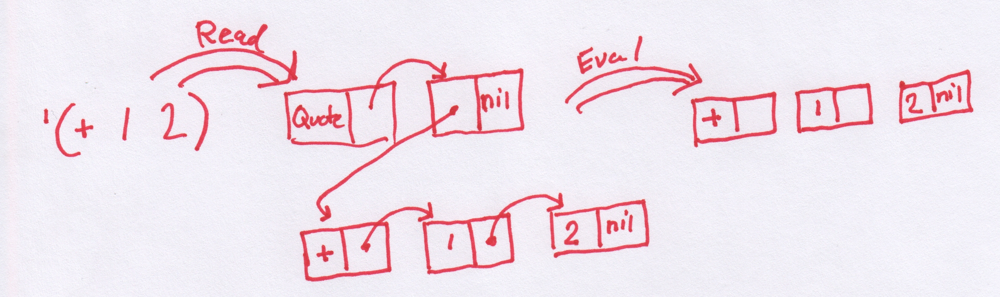

# Another Lisp for Microcontrollers

For a while now, not too long, couple of years or so, I have been
working in the vicinity of microcontrollers (MCUs). I don't have a
whole lot of experience in low-level programming of devices like the
[STM32](https://www.st.com/en/evaluation-tools/stm32-discovery-kits.html)
, the
[NRF52](https://www.nordicsemi.com/Products/Low-power-short-range-wireless/nRF52833/GetStarted)
or the ARM Cortex A9 of the Xilinx Zynq chip on the [Trenz
ZynqBerry](https://shop.trenz-electronic.de/en/TE0726-03M-ZynqBerry-Module-with-Xilinx-Zynq-7010-in-Raspberry-Pi-Form-Faktor). But
I do enjoy learning about them, **slowly**. The Code in C, Cross-compile,
Flash and Debug loop (CCFDL?) is a bit heavy though. Wouldn't it be nice with a
REPL (Read, Evaluate and Print Loop)?

The [MIT 6.001 Structure and Interpretation of Computer
Programs](https://www.youtube.com/watch?v=-J_xL4IGhJA&list=PLE18841CABEA24090)
series of lecturs is a lot of fun and I recommend everyone to watch
it. I watched this lecture series several times while entertaining the
idea of some day implement some kind of a Lisp. However, I didn't want to
implement a Lisp interpreter in Lisp, or even in Haskell, it would
feel a bit like cheating. 

The [lispBM](https://github.com/svenssonjoel/lispBM) project is my
(ongoing) attempt to learn some about lisp while at the same time
learn more about MCUs while making them more accessible, once you get
used to having a REPL it is hard to go back.

I don't have very much experience or long background in programming
numerous Lipses, so my attempt of making one is most likely very
naive. A small amount of dabbling with [Emacs
Lisp](https://www.gnu.org/software/emacs/manual/html_node/elisp/) and
I did like skimming [Land Of Lisp](https://nostarch.com/lisp.htm) but
navigating the jungle of Lisp dialects is not where I am at. This
means that lispBM is not going to adhere to any standard or be a real
*Scheme* or *CL*, to me that does not matter!

Now I know that there are many other MCU-lisps. I have tried not to
peek at the insides of these at all. But I looked at
[Lisperator](http://lisperator.net/pltut/) for some tips with the
evaluator, I would definitely recommend this tutorial. I have probably
stared at the tail-call optimizing evaulator at Lisperator for hours
trying to understand what is going on there. I am not going to pretend
that I fully understand it yet. Early on I used the
[MPC](https://github.com/orangeduck/mpc) Micro Parser Combinators for
parsing expressions. This is the same parser generator code that is
used in [BuidYourOwnLisp](http://www.buildyourownlisp.com/). However,
when going towards smaller MCUs (with less than 256k or RAM) the MPC
library showed to be a bit to hungry on memory and I had to hack something
up (more about that in the section about parsing).

Here is a list of other Lisp-on-odd-hardware projects:
 1. [Let's Run Lisp on Microcontrollers.](https://dmitryfrank.com/articles/lisp_on_mcu)
 2. [uLisp.](http://www.ulisp.com/)
 3. [XS.](http://www.yuasa.kuis.kyoto-u.ac.jp/~yuasa/xs/)
 4. [esp-lisp.](https://github.com/yesco/esp-lisp)

I'm sure there are more examples! please let me know what you are working on.

If you want to see lispBM in action, check out the video [LISPBM on
NRF52](https://youtu.be/OeQ161G_Kgs) or the video that goes over what went
into porting it to NRF52 [LISPBM Porting to
NRF52](https://youtu.be/cXSavxC3th0).

LispBM is written in C, compiles with -std=c11 flag, for 32bit
platforms. So far it has been tried out on x86 (with -m32 flag and
depending on something like multilib if you are on a 64bit platform),
ARM Cortex M4 (the STM32F4 MCU), ARM Cortex M4 (the NRF52 MCU) and ARM
Cortex A9 (The Xilinx Zynq 7000). When deploying lispBM on an MCU it
helps a lot to have access to a *Hardware Abstraction Layer*, HAL. So
far lispBM has been compiled into code based on
[ChibiOs](http://chibios.org/dokuwiki/doku.php) and
[ZephyrOs](https://www.zephyrproject.org/) both providing a lot of HAL
functionality.


## A Few Thoughts on Lisp

The series of MIT video lectures showed a simple elegance and really
made me want to try making some kind of a Lisp. If you just get over
the strange "prefix" notation where `(+ 1 2)` means `(1 + 2)` and
instead focus on the really cool part that `(+ 1 2)` is actually
exactly what the expression looks like loaded into memory (the Lisp
heap) and that it extends to *N* arguments `(+ 1 2 3 4)`. When I say
that `(+ 1 2)` is exactly what it looks like in memory, what I mean is
that it is stored as a linked list where the first element is the
*symbol* `+` and the second and third elements of the list are the
*values* `1` and `2`. The elements and pointers to the next cell are
stored in what is called *cons cells*. a cons cell consists of enough
bytes of memory to hold two pointers or two values or some two element
permutation of pointer and value (all the details of this as it is
implemented in lispBM can be found later in this text). In more detail
then, the expression `(+ 1 2)` will in memory be made up out of a
first cons cell containing `+` in its first position (or car) and a
pointed to the next cell in its second (cdr) position. Likewise, the
next cell contains the `1` in the car position and a pointer to the
next cell in the car. The last cell in the linked up structure of
cons cells contains a `2` in car and a special symbol called `nil` in
the cdr position to terminate the list.


Now, if we give `(+ 1 2)` to a Lisp interpreter, it will evaluate it
and arrive at the answer `3`. The first stage in this, though, is to
read the string `(+ 1 2)` into the heap (generating the linked list of
symbols and values), this is called *Reading*. Following that the lisp
interpreter will start to consume the linked list to reduce it to an
answer, called *evaluating*. Finally the result is *printed*. This is
what a *REPL* does, it reads, evaluates and prints and then it does it
all again.


If giving the lisp interpreter a list (such as `(+ 1 2)`) it will be
assumed to mean "add 1 and 2", so how does one actually create a list
*of data*? Giving the list `(1 2 3)` to the interpreter will not
work. The interpreter always treats a list given to it in this way as
an application of the *function* represented by the first element to
the rest of the elements. So doing that will give some kind of an
error message. There is, However, an operator that tells the
interpreter not to evaluate its argument, this operator is called
*quote* and is written `'` as in for example `'(1 2 3)`. So when you
give the expression `'(1 2 3)` to the REPL, it will reply with `(1 2
3)`. We have created a list.  It is also possible to give the
expression `'(+ 1 2)` to the REPL and this will result in a linked
list in memory consisting of elements `+`, `1` and `2`. The REPL will
now give `(+ 1 2)` as the output result of your computation. There is
an operation with the reversed meaning as well called `eval` that
means "do evaluate this". As an example the expression `(eval '(+ 1
2))` given to the REPL again results in it printing out the answer
`3`. Together `'` and `eval` are very powerful, it means we can
construct code **on the fly** in memory and then have the interpreter
compute the result.



In the paragraphs above there are a couple of words that I emphasized
without much explanation. These are words that (as I understand it)
are part of the Lisp vocabulary. The heap consists of cons cells, only
large enough to hold two pointers or values (or mix there-of) so a
symbol (such as `+`) also has to be represented by a number no larger
than a pointer in number of bits. This means that values (characters,
signed or unsigned integers), symbols, pointers all can appear on
either car or cdr part of a cell. To tell them apart a couple of bits
are sacrificed. I will go into the details about this in the section
about the heap below.

## Introducing the LispBM Language constructs

Before going into the implementation details, I want to give a few
examples of lispBM code in order to introduce many of the concepts
that we will see again in the following sections.

When starting up the example REPL from the lispBM github repository
you see something like this:

```
Symrepr initialized.
Heap initialized. Heap size: 0.015625 MiB. Free cons cells: 2048
Evaluator initialized.
Extension added.
Lisp REPL started!
Type :quit to exit.
     :info for statistics.
# 
```

It shows a prompt where you can type in your lisp expressions or you
can type `:info` for some statistics and information about the current
state of the runtime system:

```
# :info
############################################################
Used cons cells: 402
ENV: ((foldl (closure ((f (i (xs nil))) ((if ((= (xs (nil nil))) ...
Allocated arrays: 0
GC counter: 0
Recovered: 0
Recovered arrays: 0
Marked: 0
Free cons cells: 1646
############################################################
#
```

This information will show how much of the heap is in use currently
and how much is free, how many times garbage collection has been
executed and so on. `ENV` refers to the contents of the environment
that will be touched upon shortly in this section.

Now let's explore some of the basic functionality of this REPL. 

### `cons`, `car` and `cdr`

The `cons` function is used to construct. What it constructs are cons cells.
```
# (cons 1 2)
> (1 2)
```

`cons` takes two arguments and returns a pair. Used like this, with
two values, `cons` allocates a cons cell from the heap and puts the
values in the car and cdr position of that cell. This is not the same
as evaluating `'(1 2)`

```
# '(1 2)
> (1 (2 nil))
``` 


It is a little bit unfortunate that lispBM is printing the result of
`(cons 1 2)` as `(1 2)`. As I understand it, it is common to print
this heap structure as `(1 . 2)` and call it a dotted pair. LispBM
does not recognize dotted pairs in reading or uses them in output,
should add this to the todo-list.

The `car` and `cdr` functions break things apart.

```
# (car (cons 1 2))
> 1
# (cdr (cons 1 2))
> 2

```


### `if`

The conditional `if` takes three arguments, the first should be
something that evaluates to true `t` or `nil` for false. The next two
arguments are the expressions to evaluate on the *then* or *else*
branch.

```
# (if 't 1 2)
> 1
# (if 'nil 1 2)
> 2
```

### `define`

`define` is used to add things to a global environment.

```
# (define apa 1)
> t
```

This function application adds an entry into the environment that
states that `apa` is defined to `1`. Typing `:info` in the REPL should this mapping.

```
# :info
############################################################
Used cons cells: 547
ENV: ((apa 1) ((foldl (closure ((f (i (xs nil))) ((if ((= (xs (nil nil))) ...
Allocated arrays: 0
GC counter: 0
Recovered: 0
Recovered arrays: 0
Marked: 0
Free cons cells: 1501
############################################################

```

After defining `apa` to be 1 this is what it will evaluate to.

```
# apa
> 1
# (+ 10 apa)
> 11
#
```

### `let`

### `lambda` and Closures

### `progn`

### A Larger Example

```lisp
(define fib (lambda (n)
	      (let ((fib0 (lambda (n a b)
			   (if (= n 0) a
			     (if (= n 1) b
			       (fib0 (- n 1) b (+ a b)))))))
		(fib0 n 0 1))))


(fib 10)
```
This example code evaluates to `55`.


## Heap Consisting of Cons cells


Within the lispBM runtime system a cons cell is represented by the struct:
```
typedef struct {
  VALUE car;
  VALUE cdr;
} cons_t;
```
Where *VALUE* is defined as:
```
typedef uint32_t VALUE;
```
As an example a heap of 1024 cons cells is allocated as follows
```
cons_t *heap = (cons_t *)malloc(1024 * sizeof(cons_t));
```

The `VALUE` type is a 32bit word used to store: symbols (these are
special values that represent variables, pieces of syntax and many
other things), signed and unsigned integers and characters. The
`VALUE` type is also large enough to hold a pointer within the heap
used to set up linked datastructures. But there is also a lot of
bookkeeping that needs to be tracked within the 32bit word (an
alternative would be to use additional fields withing the `cons_t`
structure for this information. This would mean that the whole 32bit
word is usable to store data, but it would increase the memory
footprint of the heap.).

The information that is kept withing the 32bits of a `VALUE` is:

1. one mark-bit for the *Garbage Collector* (explained in a later section).
2. one bit that differentiates between pointers and values.
3. In the case of a value, an additional 2 further bits are used to
encode the type of that value.
4. In the case of a pointer, there are several bits that are
unused. This is because the heap is *small* (from kilobytes on the
small MCUs up to 64MB on the Zynq) and to represent these *offsets*
not that many bits are needed.

The binary representation of a pointer stored in either the `car` or
the `cdr` has the following shape:

```
Bit pos: 31 30 29 28 27 26                               2 1 0
Bit val: 0  0  0  0  0  0  XX XXXX XXXX XXXX XXXX XXXX X 0 0 0
```

Since the value of the pointer (made up by the Xed out bits above) is
only meant to reference other cons cells (which are 8 bytes apart) the
bottom three bits are unused. The zero in position 0 is used to
differentiate between pointer and value, thus all pointers will have a
zero there and all values will have a one. Bit position 1 is used for
the Garbage Collectors mark-bit but only in the `car` position, in the
`cdr` this bit is unused. Bit position 2 is unused. Depending on how
large the heap is there is some number of bits unused on the most
significant side as well. The example shows the bits used for a 64MB
heab. 

For a value there are 28 bits left. Bit 0 and 1 work exactly as in the
case above for pointers. That is, bit 0 and 1 are used to
differentiation with a pointer and garbage collection. Bits 2 and 3
are used to encode 4 different *types* of values.

The different types of values are:
1. symbols.
2. 28Bit integer.
3. 28Bit unsigned integer.
4. Character.

That was a lot of text about values for a section about the heap. But
these two concepts are pretty tightly linked as all that extra runtime
information bookkeeping has to go in there and be available to for
example the garbage collector. Back to the heap.

After allocating the heap, the next step is to link all the cons cells
that it consists of into a single, long, linked list called the
`free_list`.

## Symbols

## The Environment

## Parsing

## Printing

## Compressed Source Code

## Built in Functions

## Add Custom Functionality Using Extensions 

## Garbage Collection

## Evaluating Expressions

## A Prelude of Convenient Lisp Functions

## Interfacing with ChibiOs

## Interfacing with ZephyrOs

## Future Work

___

[HOME](https://svenssonjoel.github.io)
