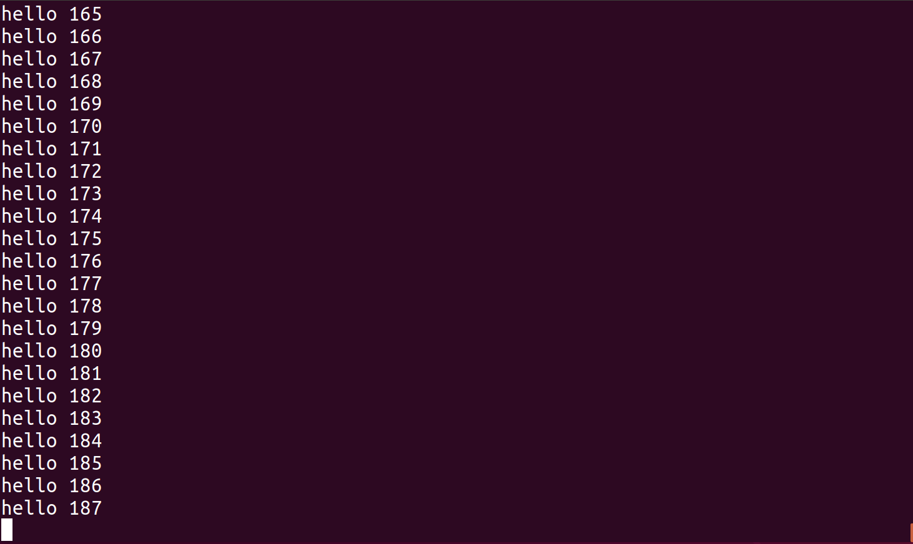
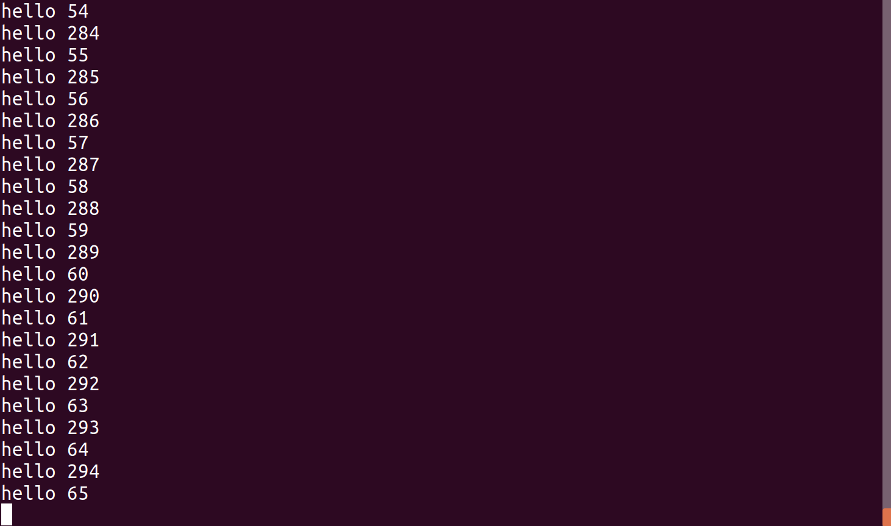
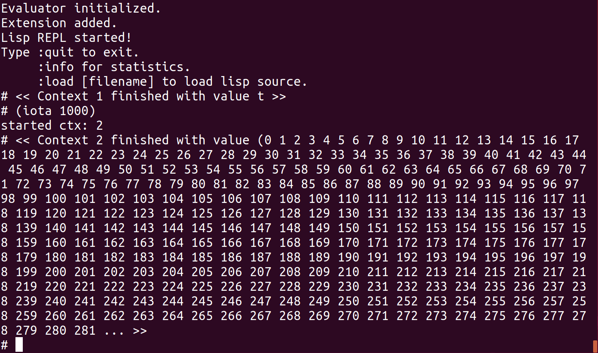

# Concurrent Tasks

I am currently trying to make it possible to run concurrent "tasks" on
the lispBM evaluator. This text is a description of the state, at this
point in time, of that experiment. There are many changes to the code
that goes into this, therefore the code goes on a separate branch
called "concurrency" in the [GitHub
repo](https://github.com/svenssonjoel/lispBM/tree/concurrent).

The "concurrent" branch contains a working example REPL, called
`repl-cps` but the collection of tests have not been updated to run on
the, let's call it, concurrent runtime system. So all tests will
currently fail. The repl example runs on x86 32bit and uses pthreads
to continuously run the evaluator in parallel with the reader part of
the repl. 

This experiment is about concurrency, not parallelism, so the idea is
to time-share the evaluator between several *contexts*. To realize
this the biggest changes are all in the `eval_cps.c` file which
contain the evaluator.

Constructive feedback is as usual extremely appreciated. Thanks!

## Example Program

Let's start with an example that illustrate what is currently
implemented. The program below runs forever and starts off with
yielding for `500000` usec (0.5 seconds), then prints out a message
and a counter value.

```
(let ((f (lambda (x)
           (progn
             (yield 500000)
             (print "hello " x \#newline)
             (f (+ x 1))))))
  (f 0))
```
The lispBM program above is conceptually similar to the C program below.

``` 
while (true) {
  usleep(500000);
  printf("hello %d\n", x++);
}
```

The screenshots below show what is output to the screen with one or two
instances of this example program running. In the `Two instances`
case, the second instance was started when the first one had reached a
count of about 229.

One instance              |  Two instances 
:-------------------------:|:-------------------------:
  |  

## Evaluation Contexts and Task Queues

The earlier [text](../lispbm_evaluation_function/index.html) on the
evaluator hints that there is a datatype called `eval_context_t` that
holds most information about the currently running program. This
`eval_context_t` datatype is extended a little bit here. Just as before, the
context hold a program, a currently executing expression and a current
environment as well as the continuation stack. Thus, each task has its
own private continuation stack while the heap is shared between all
tasks.

```
typedef struct eval_context_s{
  VALUE program;
  VALUE curr_exp;
  VALUE curr_env;
  VALUE r;
  bool  done;
  bool  app_cont;
  stack K;
  /* Process control */ 
  uint32_t timestamp;
  uint32_t sleep_us;
  CID id;
  /* List structure */ 
  struct eval_context_s *prev;
  struct eval_context_s *next;
} eval_context_t;
``` 

Now, `eval_context_t` also contains a block of *Process control*
values. The `timestamp` and the `sleep_us` that are used to know when
it is time to wake up a sleeping task. The `id` is an identification
number for the task. The `eval_context_t` now also have a `prev` and
`next` pointer to allow forming a doubly linked list. The list
structure of contexts, will be used to implement a queue of tasks
later.

Apart from these task/process management fields, the `done` and
`app_cont` flags have moved into the context. This is because it is
necessary to maintain this information on a per task basis
now. Before, the RTS only ever dealt with one task at a time and those
flags could be globals.

```
static eval_context_t *ctx_queue = NULL;
static eval_context_t *ctx_queue_last = NULL;
static eval_context_t *ctx_done = NULL;
static eval_context_t *ctx_running = NULL;
```

There is a `ctx_queue` that contains contexts that wait for their turn
to be run.  A pointer to the first element and last element of this
queue is maintained so that new tasks can be easily added to the end
of the queue. If no context is currently running, the `ctx_queue` is
scanned from the front in a search for a context with a timestamp and
sleep time that indicates it should be set as the running
context. More details about this later.

The `ctx_running` pointer points to the currently executing context.

Contexts that terminate, either because of an error or because of
running all the way through their programs, are moved to the
`ctx_done` queue.


## Callbacks for Interfacing with a Host OS

The example program above, that sleeps and prints hello, was run on
x86 32-bit and made use of PThreads to decouple the "user interface"
part of the REPL from the lispBM RTS. The evaluation function now runs
continuously in its own thread. Now lispBM also needs to get access to
functions for generating timestamps and for sleeping. All of this
should happen in a way that is portable over (I hope) ChibiOS,
ZephyrOS, FreeRTOS and X86 + PThreads. There are a number of callback
functions that should be set for each specific implementation for,
sleeping and timestamp generation.

There is also a callback function that optionally can be set called
the `ctx_done_callback`. This function is executed each time a task
completes. The example REPL uses this callback to present the result
of a computation to the user.



```
static void (*usleep_callback)(uint32_t) = NULL;
static uint32_t (*timestamp_us_callback)(void) = NULL;
static void (*ctx_done_callback)(eval_context_t *) = NULL;

void eval_cps_set_usleep_callback(void (*fptr)(uint32_t)) {
  usleep_callback = fptr;
}

void eval_cps_set_timestamp_us_callback(uint32_t (*fptr)(void)) {
  timestamp_us_callback = fptr;
}

void eval_cps_set_ctx_done_callback(void (*fptr)(eval_context_t *)) {
  ctx_done_callback = fptr;
}
``` 

## Enqueueing, Dequeueing and Context Creation Functions

The enqueueing and dequeueing functions, together, implement the
scheduling strategy.  The `enqueue_ctx` function places a context at
the end of the `ctx_queue` queue and the `dequeue_ctx` function
searches for a context to run from the front of the `ctx_queue`.  This
should mean that contexts that have been in the queue the longest have
priority over recently enqueued ones.


The `enqueue_ctx` function just adds a context to the `ctx_queue`. So
if the queue is empty, `ctx_queue` and `ctx_queue_last` will point to
the newly added context. Otherwise, the new context is added after
`ctx_queue_last` and `ctx_queue_last` is updated. 

```
void enqueue_ctx(eval_context_t *ctx) {

  if (ctx_queue_last == NULL) {
    ctx->prev = NULL;
    ctx->next = NULL;
    ctx_queue = ctx;
    ctx_queue_last = ctx;
  } else {
    ctx->prev = ctx_queue_last;
    ctx->next = NULL;
    ctx_queue_last->next = ctx;
    ctx_queue_last = ctx;
  }
}
```

The `dequeue_ctx` function, performs a search from the front of the
`ctx_queue` and uses the `timestamp` and `sleep_us` fields of the
context to see if there is a context that should be dequeued at this
time. If there is no context to run at this time, either a default
sleep period or the smallest `sleep_us` found when traversing the
queue, whichever is smaller, is provided to the caller. This means
that there is a maximum sleep period that is returned by the dequeue
operation. 

```
eval_context_t *dequeue_ctx(uint32_t *us) {
  uint32_t min_us = DEFAULT_SLEEP_US;

  uint32_t t_now;
  if (timestamp_us_callback) {
    t_now = timestamp_us_callback();
  } else {
    t_now = 0;
  }

  eval_context_t *curr = ctx_queue;

  while (curr != NULL) {
    uint32_t t_diff;
    if ( curr->timestamp > t_now) {
      /* There was an overflow on the counter */
      t_diff = (0xFFFFFFFF - curr->timestamp) + t_now;
    } else {
      t_diff = t_now - curr->timestamp;
    }

    if (t_diff >= curr->sleep_us) {
      eval_context_t *result = curr;
      if (curr == ctx_queue_last) {
        if (curr->prev) {
          ctx_queue_last = curr->prev;
          ctx_queue_last->next = NULL;
        } else {
          ctx_queue = NULL;
          ctx_queue_last = NULL;
        }
      } else if (curr->prev == NULL) {
        ctx_queue = curr->next;
        if (ctx_queue) {
          ctx_queue->prev = NULL;
        }
      } else {
        curr->prev->next = curr->next;
        if (curr->next) {
          curr->next->prev = curr->prev;
        }
      }
      return result;
    }
    if (min_us > t_diff) min_us = t_diff;
    curr = curr->next;
  }

  *us = min_us;
  return NULL;
}
```

A context can only reach completion when it is the currently running
context, `ctx_running`. The `finish_ctx` function puts the
`ctx_running` on the `ctx_done` list and calls the `ctx_done_callback`.
The currently running context is set to NULL. This function is called
from `advance_ctx` that is explained below.


```
void finish_ctx(void) {
  if (ctx_done == NULL) {
    ctx_running->prev = NULL;
    ctx_running->next = NULL;
    ctx_done = ctx_running;
  } else {
    ctx_running->prev = NULL;
    ctx_running->next = ctx_done;
    if (ctx_running->next) {
      ctx_running->next->prev = ctx_running;
    }
    ctx_done = ctx_running;
  }

  if (ctx_done_callback) {
    ctx_done_callback(ctx_done);
  }
  ctx_running = NULL;
}
```

The `remove_done_ctx` removes a context with id `cid` from the
`ctx_done` list. The idea is that this should be used in the
implementation of some kind of `wait` functionality later, the details
of that needs to be worked out.

```
void remove_done_ctx(uint32_t cid) {

  eval_context_t * curr = ctx_done;

  while(curr) {
    if (curr->id == cid) {
      if (curr->prev) {
        curr->prev->next = curr->next;
      }
      if (curr->next) {
        curr->next->prev = curr->prev;
      }

      stack_free(&curr->K);
      free(curr);
      break;
    }
    curr = curr->next;
  }
}
```

--- 
**EDIT 2020-04-09** 

`remove_done_ctx` is flawed for the case when the context to remove is
the first in the `ctx_done` list.  I hope the following is a
fix. Here, special cases are added for an empty list of done contexts
as well as a case for a list of length one. Code got a bit bulky now,
in general `eval_cps.c` is in need of some refactoring. 


```
bool eval_cps_remove_done_ctx(CID cid, VALUE *v) {

  if (!ctx_done) return false;

  eval_context_t * curr = ctx_done->next;
  
  if (ctx_done->id == cid) {
    *v = ctx_done->r;
    stack_free(&ctx_done->K);
    free(ctx_done);
    ctx_done = curr;
    if (ctx_done) {
      ctx_done->prev = NULL;
    }
    return true;
  }

  while(curr) {
    if (curr->id == cid) {
      if (curr->prev) {
	curr->prev->next = curr->next;
      }
      if (curr->next) {
	curr->next->prev = curr->prev;
      }
      *v = curr->r;
      stack_free(&curr->K);
      free(curr);
      return true;
    }
    curr = curr->next;
  }
  return false;
}

```

---


A new context is created and enqueued on the `ctx_queue` using the
`create_ctx` function.  This function takes a program, a stack size
and a flag indicating if the stack should be reallocated when full, as
arguments. Here, a context is allocated, a stack allocated, and then
the context is enqueued. This function also assigned context ids,
which are currently just increasing numbers with no recycling schema. 

```
CID create_ctx(VALUE program, uint32_t stack_size, bool grow_stack) {

  if (next_ctx_id == 0) return 0; // overflow of CIDs

  if (type_of(program) != PTR_TYPE_CONS) return 0;

  eval_context_t *ctx = NULL;
  ctx = malloc(sizeof(eval_context_t));
  ctx->program = cdr(program);
  ctx->curr_exp = car(program);
  ctx->curr_env = NIL;
  ctx->done = false;
  ctx->app_cont = false;
  ctx->timestamp = 0;
  ctx->sleep_us = 0;
  ctx->id = next_ctx_id++;
  if (!stack_allocate(&ctx->K, stack_size, grow_stack)) {
    free(ctx);
    return 0;
  }
  if (!push_u32(&ctx->K, enc_u(DONE))) {
    free(ctx);
    stack_free(&ctx->K);
    return 0;
  }

  enqueue_ctx(ctx);

  return ctx->id;
}
```

Lastly a small helper function that is called from the REPL to easily
add a new context to the queue.

```
CID eval_cps_program(VALUE lisp) {
  return create_ctx(lisp, 256, false);
}
```


## Scheduling and the Evaluator Thread Function

Earlier,`eval_cps.c` contained a static function (local to that file)
called `run_eval`. Now evaluation should run continuously in a
separate thread, but how to create that thread differs depending on
platform. Therefore the new variant of `run_eval`, called
`eval_cps_run_eval` is an extern function that should be wrapped in a
thread.

The new `eval_cps_run_eval` function contains an infinite loop,
`while (eval_running)`, that in each iteration checks if there is a
currently running context. If there is no currently running context,
it attempts to dequeue one. Dequeueing either provides a context or a
sleep period that can be used to go to sleep for a while before trying
to dequeue again.

When a context is running, the `eval_cps_run_eval` function behaves
the same way as the the old
[`run_eval`](../lispbm_evaluation_function/index.html) did.

```
void eval_cps_run_eval(void){

  bool perform_gc = false;
  uint32_t non_gc = 0;

  while (eval_running) {

    if (!ctx_running) {
      uint32_t us;
      ctx_running = dequeue_ctx(&us);
      if (!ctx_running) {
        if (usleep_callback) {
          usleep_callback(us);
        }
        continue;
      }
    }

    ...

``` 


## Yielding

Yielding is the only way that a context (that is not done executing)
can be removed from being the currently running context. That is,
there is no preemption currently.  There is a symbol `yield` that can
be used like a function application in a lispBM program.  It takes one
argument which is a sleep time. When `yield` is evaluated the function
`yield_ctx` is executed.

`yield_ctx` updates the timestamp and sleep time of the context and
adds it to the queue. The intermediate result maintained in the
context is set to `t` for true as this is the value of `yield`.

The last thing `yield_ctx` does is set the `ctx_running` to `NULL`
which means that the next iteration of the evaluator can try to
schedule another context or go to sleep for a while.

```
void yield_ctx(uint32_t sleep_us) {
  if (timestamp_us_callback) {
    ctx_running->timestamp = timestamp_us_callback();
    ctx_running->sleep_us = sleep_us;
  } else {
    ctx_running->timestamp = 0;
    ctx_running->sleep_us = 0;
  }
  ctx_running->r = enc_sym(symrepr_true());
  ctx_running->app_cont = true;
  enqueue_ctx(ctx_running);
  ctx_running = NULL;
}
```

Handling of the `yield` application is very similar to how
[fundamental
operations](https://svenssonjoel.github.io/pages/lispbm_fundamentals_and_extensions/index.html) are
applied. In the `apply_continuation` function and the `APPLICATION`
case, there is a check to see if what is being applied is the `yield`
function. in that case the `yield_ctx` function is applied.

```
  ...

  if (dec_sym(fun) == symrepr_yield()) {
    if (type_of(fun_args[1]) == VAL_TYPE_I) {
      INT ts = dec_i(fun_args[1]);
      stack_drop(&ctx->K, dec_u(count)+1);
      yield_ctx(ts);
    } else {
      error_ctx(ctx, enc_sym(symrepr_eerror()));
    }
    return;
  }

  ...
```


## Advancing Program Execution and Finishing Tasks

A program is a list of expressions to be evaluated one after the
other. The context keeps track of which expression is the currently
executing one and also what expressions are left to evaluate within
the program. When evaluation of one expression within a program is
done, the next expression should be set as the current one. This
operation is performed by the `advance_ctx` function. 

If there are no further expressions to evaluate as part of the
program, the `finish_ctx` function is run and the context is moved to
the done list.

```
void advance_ctx() {

  if (type_of(ctx_running->program) == PTR_TYPE_CONS) {
    push_u32(&ctx_running->K, enc_u(DONE));
    ctx_running->curr_exp = car(ctx_running->program);
    ctx_running->program = cdr(ctx_running->program);
    ctx_running->r = NIL;
    ctx_running->app_cont = false;

  } else {
    ctx_running->done = true;
    finish_ctx();
  }
}
```

The evaluator knows that it is done with an expression when a `DONE`
continuation is encountered on the continuation stack. In this case
the `advance_ctx` function is called. 

```
void apply_continuation(eval_context_t *ctx, bool *perform_gc){

  VALUE k;
  pop_u32(&ctx->K, &k);

  VALUE arg = ctx->r;

  ctx->app_cont = false;

  switch(dec_u(k)) {
  case DONE:
    advance_ctx(ctx);
    return;
  ...
  
``` 


## Garbage Collection

A small change is needed in how garbage collection is performed. Now that there
are multiple contexts in flight, it is important to remember that all of them need
to be considered when marking.

The `gc` function below loops over all contexts that are runnable (the
`ctx_queue`) and performs a marking phase on each of their
environments, expressions, programs and so on. The currently running
context is treated the same way.

The contexts that are on the done list do not need to be kept on the
heap. Only the result they computed can be needed in the
future. Therefore only the result of contexts on the done list are
given a marking run. 
 
```
int gc(VALUE env,
       eval_context_t *runnable,
       eval_context_t *done,
       eval_context_t *running) {
  
  gc_state_inc();
  gc_mark_freelist();
  gc_mark_phase(env);

  eval_context_t *curr = runnable;
  while (curr) {
    gc_mark_phase(curr->curr_env);
    gc_mark_phase(curr->curr_exp);
    gc_mark_phase(curr->program);
    gc_mark_phase(curr->r);
    gc_mark_aux(curr->K.data, curr->K.sp);
    curr = curr->next;
  }

  curr = done;
  while (curr) {
    gc_mark_phase(curr->r);
    curr = curr->next;
  }

  gc_mark_phase(running->curr_env);
  gc_mark_phase(running->curr_exp);
  gc_mark_phase(running->program);
  gc_mark_phase(running->r);
  gc_mark_aux(running->K.data, running->K.sp);
  

#ifdef VISUALIZE_HEAP
  heap_vis_gen_image();
#endif

  return gc_sweep_phase();
}
``` 

## The REPL

The REPL example makes use of PThreads and runs the `eval_cps_run_eval` function
in a separate thread. A small wrapper is needed around that function to make it
compatible with the type that PThreads assumes for a thread function. 

```
void *eval_thd_wrapper(void *v) {

  eval_cps_run_eval();
  
  return NULL;
}
```

The callbacks that are used in the REPL implementation are shown below. The `done_callback`
outputs some information every time a context ends up on the done list. 

```
void done_callback(eval_context_t *ctx) {

  char output[1024];
  char error[1024];

  CID cid = ctx->id;
  VALUE t = ctx->r;
  
  int print_ret = print_value(output, 1024, error, 1024, t);

  if (print_ret >= 0) {
    printf("<< Context %d finished with value %s >>\n# ", cid, output);
  } else {
    printf("<< Context %d finished with value %s >>\n# ", cid, error);
  }
  fflush(stdout);
}
```

The `timestamp_callback` uses `gettimeofday` to generate a timestamp in
number of microseconds. 

``` 
uint32_t timestamp_callback() {
  struct timeval tv;
  gettimeofday(&tv,NULL);
  return (uint32_t)(tv.tv_sec * 1000000 + tv.tv_usec);
}
```

The `sleep_callback` uses `nanosleep` to put the calling thread to sleep
for a while. 

```
void sleep_callback(uint32_t us) {
  struct timespec s;
  struct timespec r;
  s.tv_sec = 0;
  s.tv_nsec = (long)us * 1000;
  nanosleep(&s, &r);
}
```
Then the callbacks are registered with the evaluator. 

```
  eval_cps_set_ctx_done_callback(done_callback);
  eval_cps_set_timestamp_us_callback(timestamp_callback);
  eval_cps_set_usleep_callback(sleep_callback);
```

And just for completeness, how to start the PThread is shown below. 

```
 /* Start evaluator thread */
  if (pthread_create(&lispbm_thd, NULL, eval_thd_wrapper, NULL)) {
    printf("Error creating evaluation thread\n");
    return 1;
  }
```

For a more complete picture of how the REPL is put together
see [the code](https://github.com/svenssonjoel/lispBM/blob/concurrent/repl-cps/repl.c). 


## Future work

1. More testing! The heaviest load I've started is 8 instances of the
example program that sleeps and prints hello. More and more diverse
test programs are needed. 

2. Add `wait` functionality. Calling `(wait cid)` should cause the
task that called `wait` to stop until the task with context-id `cid`
finishes. The result of `(wait cid)` should be the result computed by
the task with context-id `cid`. Finished contexts are stored on a list
called `ctx_done`, so one way to implement wait is wake up a waiting
task periodically and perform a search over the `ctx_done` list. If
the `cid` is not present in the list then the waiting task can go back
to sleep for a while.

3. Some way to create tasks "programmatically". Currently a new task
is created for each expression entered using the repl. I don't have
any idea of how the details of this will work out, but imagine that
there should be some kind of `spawn` or `fork` function. 

4. Some way to communicate values between running tasks would be
nice. Maybe a queue structure that those tasks who want to communicate
both know about. All tasks run in the same heap, so it is just a
matter of making both tasks aware of the existence of the queue.

5. Testing on top of  ChibiOS, ZephyrOS and FreeRTOS. 

6. There are no priorities, preemptions or periodic task switches. So
a task that is running forever and does not `yield` can starve
everything else out. This is definitely not suitable for anything
timing critical.

7. Be opportunistic and run the GC in case there is currently no
runnable context.

8. The `gc` function should perform error checking! Each call to
`gc_mark_phase` can fail and if one does, there RTS should be
reset. There is no need to try to continue executing after such a
failure as the heap will most likely be corrupt.

9. What about events from the outside, such as a button press or data
arriving over some communication channel? These things are sometimes
handled using an interrupt. Some way of dealing with these "external"
events are needed. There may be more suitable abstractions for these
kinds of interruptions to apply to this system. Streams/queues of
events? where the underlying enqueueing of events is performed by the
RTS.


## Notes 

1. If all memory is depleted, there is no way for the RTS to
recover. This means that the heap is not dimensioned appropriately for
the job at hand and there is no use in trying to to recover. The
system recognizes this kind of failure by there being two consecutive
runs of the garbage collectors with no useful work being performed in
between.

## Thanks

Thank you for reading. If you have insights I seem to have missed, please let me know!
I would be very grateful. 

___

[HOME](https://svenssonjoel.github.io)
