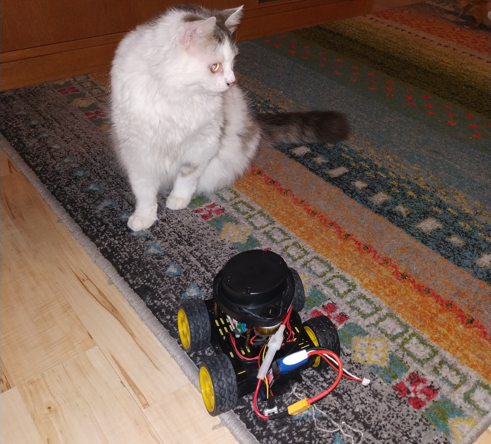

# Interfacing a Neato Lidar with an STM32 under ChibiOS

I bought my Neato lidar very cheaply from Ebay. I did get it to run
and talk to an stm32f4 under ChibiOs.  But it does seem to not be top
working order. Good enough to play with though. There are several
blogs and forum posts on the web that discuss the Neato lidar in one
way or another and I pieced together the information needed to talk to
lidar from such sources. At this time I cannot remember exactly which
source gave me what insight and I also am uncertain that I managed to
find all the sources that helped me. So here is a list other sites that
talk about the Neato lidar in a hobbyist setting:

1. [Lidar on RPI](https://hackaday.com/2016/01/22/how-to-use-lidar-with-the-raspberry-pi/)
2. [Adding Inexpensive Lidar to your Robot](https://www.impulseadventure.com/elec/robot-lidar-neato-xv11.html)
3. [Forum post about reading of Neato lidar serial data](https://forum.processing.org/two/discussion/26201/neato-lidar-sensor-and-reading-the-serial-data-and-making-sense-of-it)
4. [Wayne's Tinkering Page](https://sites.google.com/site/wayneholder/home/neato-s-lidar-module)
5. [Lloyd Brombach](https://lloydbrombach.com/2018/08/24/reading-the-xv11-neato-botvac-lidar-with-the-raspberry-pi-and-c/)
6. [Scratch Robotics](https://scratchrobotics.com/2018/04/25/hacking-xv-11-lidar/) 
7. [Paynter's Palace](https://www.fpaynter.com/2015/08/more-work-on-the-neato-xv-11-lidar-module/)

I'm sure there are many more and if you are the author of a page that I
missed and you can tell from the contents here that I am influenced by
your work, please point it out and I will add this acknowledgment.

Below is a picture of my little robot (and cat) equipped with the
neato. The robot controller used is my hobby project the
[FMRC](https://www.github.com/svenssonjoel/FMRC). If this seems fun
there are a bunch of videos on youtube on the development and
redesigns of the FMRC. [FMRC YouTube
videos](https://www.youtube.com/playlist?list=PLtf_3TaqZoDM_xsXJHJVC7ktZzplqYM2Z)



## A little bit about the setup

The FMRC (Four Motor Robot Controller) can independently control 4
different DC motors independently using 2 DRV8833 or on the newer
version DRV8847 chips. It has two MCUs, an stm32f4 and an NRF52. When
it comes to connectivity it has USB, UART, Bluetooth and a CAN
Transceiver.

To interface with the Neato lidar, the UART connector is used for data
and one of the motor drive channels is used to control the RPM of the
motor that spins the lidar. The never version of the PCB has two
additional motor drive outputs that are not full H-Bridges but rather
just a mosfet that can be pwmed, on this version all 4 motor drive
channels would remain free even when equipped with lidar.


## The CODE

The code consists of the following parts:

1. A ChibiOS thread that talks to the lidar.
2. An initialization function.
3. A calibration function
4. Functions for reading, parsing and computing checksums
5. An external interface function that you can ask for a distance. 
6. Some structs and defines.


Let's begin with some code related to the uart
connection. [Playembedded](https://www.playembedded.org/blog/stm32-usart-chibios-serial/)
has a good text about about the serial driver in ChibiOS, this is the
driver that is used here.

The pins used are PC10 and PC11 for `TX` and `RX`. One alternative
function of these pins (see [STM32F405
Datasheet](https://www.google.com/url?sa=t&rct=j&q=&esrc=s&source=web&cd=1&ved=2ahUKEwiI9M_tlcrnAhVkw4sKHbvwD-8QFjAAegQIARAB&url=https%3A%2F%2Fwww.st.com%2Fresource%2Fen%2Fdatasheet%2Fstm32f405rg.pdf&usg=AOvVaw1ez8SdVFSDYvzPSFlZ6LgE))
is `USART3` and since `USART3` is used the ChibiOS serial driver to use
is SD3. 

```
#define LIDAR_UART_PORT GPIOC
#define LIDAR_UART_TX   10
#define LIDAR_UART_RX   11
#define LIDAR_SERIAL_DRIVER SD3
```

Then a serial configuration object is created. 
```
static SerialConfig serial_cfg = {
  115200,
  0,
  USART_CR2_STOP1_BITS,
  0
};
```

The rest of the setup of the serial communication takes place in the
initialization function.

```
void neato_lidar_init(void) {

  palSetPadMode(GPIOC, 10, PAL_MODE_ALTERNATE(7));
  palSetPadMode(GPIOC, 11, PAL_MODE_ALTERNATE(7));
  sdStart(&SD3, &serial_cfg);

  if (!calibrate_lidar_motor()) {
    return;
  }

  (void)chThdCreateStatic(neatoLidarThreadArea,
			  sizeof(neatoLidarThreadArea),
			  NORMALPRIO,
			  neatoLidarThread, NULL); 
}
```

The `neato_lidar_init` function configures PC10 and 11 to alternative
mode 7.  In the stm32f4 datasheet you can find this information in the
section about *Alternate Function Mapping*. It then starts the serial
driver.

After setting up the uart, the lidar spinning motor is calibrated. The
lidar reports its RPM in its output data. So what the calibration is
doing is trying to find the PWM duty cycle that makes the lidar spin
at 300RPM. I am not sure that 300RPM is really the ideal. I found this
number by experiments. It seemed to me that at 300RPM it returned the
highest number of valid distance readings. This may of course be
something specific to my used and not 100% *OK* lidar.

Following the calibration, the `neatoLidarThread` is set up. We will
look at this code after first looking at the calibration routine.
There are a few things in the calibration that have not yet been
introduced. But just assume that there is a way to read the current
RPM out from the lidar, the details of that are shown later. 

The calibration routine performs a so-called binary search over the
PWM duty cycles and try to lock down on a duty cycle that results in
300RPM.

It does this by:
1. Set duty cycle to 50% (`duty = 5000`).
2. Set the range to search `low` to `high` to 0% and 100%.
3. Enter a loop.
   - Set PWM duty on the motor to `duty`.
   - Allow some time to pass for motor to spin up.
   - Get 200 samples of RPM info from the lidar.
   - Check if RPM is higher or lower than 300 (on average)
   - If the RPM is higher than 300 set duty to halfway between current duty and low and update high to be equal to duty.
   - Else if the RPM is lower than 300 set duty to halfway between current duty and high and update low to be equal to duty.
   - repeat until the difference between low and high is so little that changing the duty cycle any within that range cannot possibly have any effect.
4. A duty cycle that gives on average 300RPM has been found and can be set to use.

```
int calibrate_lidar_motor() {

  neato_lidar_packet_t p;
  
  unsigned int avg_rpm;
  bool done = false;
  
  int duty = 5000;
  int low  = 0;
  int high = 10000;

  while (!done) {

    pwmEnableChannel(&PWMD2, 3 , PWM_PERCENTAGE_TO_WIDTH(&PWMD2,duty));
    chThdSleepMilliseconds(500);
    avg_rpm = 0;
    for (int i = 0; i < 200; i ++ ) {
      if (read_packet(&p)) {
	avg_rpm += p.rpm;
      }
    }

    if ( abs(high - low) < 5) {
      done = true;
    } else if ( avg_rpm > 60000 ) {
      high = duty;
      duty = low + ((duty - low) / 2);
    } else if ( avg_rpm < 60000) {
      low = duty; 
      duty = high - ((high - duty) / 2);
    }
  }
  
  motor_duty = duty;
  pwmEnableChannel(&PWMD2, 3 , PWM_PERCENTAGE_TO_WIDTH(&PWMD2,motor_duty));
  return 1;  
}
```

The `motor_duty` is a global variable that is later accessed by the
lidar thread and fine tuned a little bit during operation.

```
static int motor_duty = 5000;
```


Each data-packet that is sent from the lidar over the uart contains
for distance readings.  90 packets are sent from the lidar during one
rotation giving 360 distance readings for a full revolution.
The struct below represents the data sent in each package.
It contains:
   - An index `0 - 89`. Encoded as `0xA0` to `0xF9` 
   - The current RPM.
   - Four 13Bit distance readings.
   - Four Valid bits.
   - Four Warn bits.
   - Four Signal strength indicators, 16 bits each.
   - A checksum ok indicator.
   
Each package is 22bytes and the checksum ok indicator is calculated in
the function called `parse_packet` that takes the raw data bytes and
fills in the fields of this struct: 

```
typedef struct {
  uint8_t  index;
  float    rpm;
  uint16_t dist[4];  
  bool     valid[4];
  bool     warn[4]; 
  uint16_t signal[4];
  bool     checksum_ok; 
} neato_lidar_packet_t;
```

The `parse_packet` function starts out by computing the checksum over
the first 20 bytes of the package. This checksum is them compared to
the checksum already stored in the last 2 bytes of the package.
After checking the checksum and storing the result of that in the struct,
all the data fields are extracted from the bytes.

```
static int parse_packet(uint8_t *bytes, neato_lidar_packet_t *p) {

  uint16_t chk  = checksum(bytes);

  uint16_t packet_chk = bytes[21] << 8;
  packet_chk += bytes[20];

  p->checksum_ok = chk == packet_chk ? true : false;
  p->index = bytes[1] - 0xA0;
  p->rpm = ((float)((uint16_t)bytes[2] + (bytes[3] << 8))) / 64.0f;

  p->valid[0] = !(bytes[5] & 0x80);
  p->warn[0] = bytes[5] & 0x40;
  p->valid[1] = !(bytes[9] & 0x80);
  p->warn[1] = bytes[9] & 0x40;
  p->valid[2] = !(bytes[13] & 0x80);
  p->warn[2] = bytes[13] & 0x40;
  p->valid[3] = !(bytes[17] & 0x80);
  p->warn[3] = bytes[17] & 0x40;

  p->signal[0] = bytes[6] + (bytes[7] << 8);
  p->signal[1] = bytes[10] + (bytes[11] << 8);
  p->signal[2] = bytes[14] + (bytes[15] << 8);
  p->signal[3] = bytes[18] + (bytes[19] << 8);

  p->dist[0] = bytes[4] + ((bytes[5] & 0x1f) << 8);
  p->dist[1] = bytes[8] + ((bytes[9] & 0x1f) << 8);
  p->dist[2] = bytes[12] + ((bytes[13] & 0x1f) << 8);
  p->dist[3] = bytes[16] + ((bytes[17] & 0x1f) << 8);

  return 1; // An alternative would be to return 0 if checksum fails.
}

```

I show the `checksum` function below. I cannot currently find the
source of where I found this *algorithm*. It may be that it is a very
standard checksumming method. If you recognize this, please remind me
where it comes from. The function treats adjacent bytes as a 16bit
word and iteratively adds these up into a 32bit variable. In the end,
to combine the high and low 16 bits of this results into a 16 bit
final result. 

```
static uint16_t checksum(uint8_t *data)
{
  uint32_t chk32=0;
  uint16_t word;
  int i;
	
  for(i=0;i<10;++i)
    {
      word=data[2*i] + (data[2*i+1] << 8);
      chk32 = (chk32 << 1) + word;
    }
	
  uint32_t checksum=(chk32 & 0x7FFF) + (chk32 >> 15);
  return checksum & 0x7FFF;
}
```


To interface these neato lidar specific functions above with ChibiOS,
there is a `read_packet` function. This function tries to find the
*start of packet* indicator `0xFA` and then reads it and an additional
21 bytes into a buffer. This is done by polling the serial link (uart)
until the start indicator is found. All the reading from the serial
link is done with a timeout that aborts the procedure if no data
arrives for a long time, which may indicate a problem with the hardware.

Once 22 bytes have been read they are passed to the `parse_packet`
function. 

```
static int read_packet(neato_lidar_packet_t *p) {

  uint8_t bytes[22];
  int num_read = 0;
  uint8_t c;
  int i = 0; 

  // Polling serial link for start of packet.
  
  while (true)  {
    num_read = sdReadTimeout(&LIDAR_SERIAL_DRIVER, &c,1, 100);
    if (num_read == 0) return 0;
    if (c == 0xFA) {
      bytes[0] = c;
      break;
    }
  }
  
  for (i = 1; i < 22; i ++) {
    num_read = sdReadTimeout(&LIDAR_SERIAL_DRIVER, &c,1, 100);
    if (num_read == 0) return 0;
    bytes[i] = c;
  }

  return parse_packet(bytes, p); 
}
```

The ChibiOS thread that continuously reads lidar packets is shown
below.  It fills in a distance array of integers, where a -1 value
indicates that the reading at that angle was invalid.

The thread loops forever and in each iteration reads a packet, checks
if valid and fills in the distance array.

It also checks the current RPM in each iteration and makes small
adjustments to the duty-cycle if the RPM has for some reason drifted
away from 300.

```
static int distance[360];

static THD_WORKING_AREA(neatoLidarThreadArea, 2048);

static THD_FUNCTION(neatoLidarThread, arg) {

  (void) arg;

  while (true) {
    neato_lidar_packet_t p;

    if (read_packet(&p)) {

      int i = p.index * 4;
      for (int j = 0; j < 4; j ++) {
	if (p.valid[j]) { 
	  distance[i+j] = p.dist[j];
	} else {
	  distance[i+j] = -1;
	}	  
	  
      }

      // Adds a bit of correction to the duty cycle based on current RPM
      // Maybe should filter this for "influence over time" in some way. 
      if (p.rpm < 300) {
	motor_duty ++;
	if (motor_duty > 10000) motor_duty = 10000;
	pwmEnableChannel(&PWMD2, 3 , PWM_PERCENTAGE_TO_WIDTH(&PWMD2,motor_duty));
      } else if (p.rpm > 315) {
	motor_duty --;
	if (motor_duty < 0) motor_duty = 0;
	pwmEnableChannel(&PWMD2, 3 , PWM_PERCENTAGE_TO_WIDTH(&PWMD2,motor_duty));
      }
      
    } else {
      //chprintf((BaseSequentialStream *)&SDU1, "TIMEOUT!\n\r");
    }
    
     chThdSleepMilliseconds(1);
  }
}
```

The interface used by the rest of the application is
`neato_lidar_distance` that takes and index `0 - 359` and returns that
index from the distance array. I am not actually sure that the
distance array needs to be protected by a mutex or not. On one hand I
imagine that reading and writing a 32Bit value will be an atomic
operation on the platform, but then I did not look into that! 

```
int neato_lidar_distance(int ix) {
  return distance[ix]; 
}
```

I hope this information is of value to anyone. It is all based on bits
of information that I pieced together from other sources. Maybe the
full disclosure of source code and the ChibiOS integration all in one
place can be a good thing? Anyway, if you are working on something
related or if you recognize that I am deriving my code from yours and
want acknowledgment please let me know.
___

[HOME](https://svenssonjoel.github.io)
