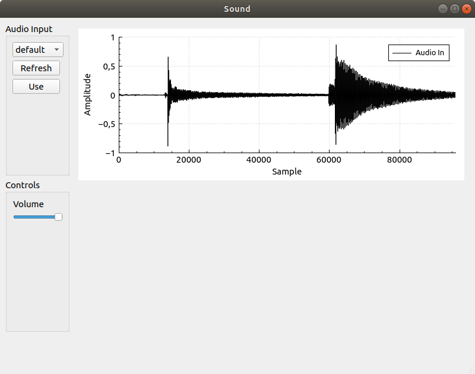

# Audio input using Qt and QAudioInput 

When working on the earlier [blog post](../qt_serial_datacollection/index.html)  
on serial communication with automatic data collection and plotting, I
thought that maybe it would be nice to try to plot some audio
waveforms as well.  Now, to do that we need an audio source and I went
for using a *QAudioInput* for that.

So, the plan for this post is to set up the following:
- selection of audio input device. 
- setup of sampling format and rate.
- sampling into a *QBuffer*.
- setting up *QCustomPlot* plot parameters.
- plotting of sample data on the *QCustomPlot*.


The GUI I made looks like below and is as usual created in the GUI
Designer part of Qt Creator. 



It takes some wrestling with this GUI Designer to get a hang of it and
I am not quite proficient yet (far from). The only recommendation I
can give about that tool is to play with it and see what happens.

The GUI consists of a left hand side with a *QComboBox* for selection
of audio device and a volume slider, a *QSlider*. On the right hand
side there is a *QCustomPlot* as
[earlier](../qt_serial_datacollection/index.html) created by inserting
a *QWidget* and then promoting in to a *QCustomPlot*.

The `Use` button activates the input device and starts the sampling 
and the `Refresh` button runs the scan for audio devices again and 
repopulates the *QComboBox*. 

## High level view of the program 

The idea is to have the *QAudioInput* device generating samples into a
QBuffer. Regularly, after sampling for 100ms (or some other time
interval we select) we are notified that there is sample data to
process in the buffer. When this notification comes, we will convert
the new sample data to a format that can be plotted on the
*QCustomPlot*.

The *QCustomPlot* will have a 2 seconds (or 96000 samples at 48KHz
sampling rate) sliding window of data that it displays as a waveform.

## The Code


```cpp
#ifndef MAINWINDOW_H
#define MAINWINDOW_H

#include <QMainWindow>
#include <QtMultimedia/QAudioInput>
#include <QBuffer>
#include "qcustomplot.h"

QT_BEGIN_NAMESPACE
namespace Ui { class MainWindow; }
QT_END_NAMESPACE

class MainWindow : public QMainWindow
{
    Q_OBJECT

public:
    MainWindow(QWidget *parent = nullptr);
    ~MainWindow();    

private slots:
    void on_refreshInputPushButton_clicked();
    void on_useInputPushButton_clicked();

    void processAudioIn();
    void stateChangeAudioIn(QAudio::State s);
    void on_volumeHorizontalSlider_sliderMoved(int position);

private:
    Ui::MainWindow *ui;

    void samplesUpdated();

    QList<QAudioDeviceInfo> mInputDevices;
    QAudioInput *mAudioIn = nullptr;
    QBuffer  mInputBuffer;

    QVector<double> mSamples;
    QVector<double> mIndices;

};
#endif // MAINWINDOW_H
```


```cpp
#include "mainwindow.h"
#include "ui_mainwindow.h"
#include <QDebug>

MainWindow::MainWindow(QWidget *parent)
    : QMainWindow(parent)
    , ui(new Ui::MainWindow)
{
    ui->setupUi(this);
    this->setWindowTitle("Sound");


    QList<QAudioDeviceInfo> inputDevices =
            QAudioDeviceInfo::availableDevices(QAudio::AudioInput);

    for (QAudioDeviceInfo d : inputDevices) {
        ui->inputDeviceComboBox->addItem(d.deviceName(),QVariant::fromValue(d));
    }

    /* Setup plot */
    ui->plot->setInteractions(QCP::iRangeDrag | QCP::iRangeZoom);
    ui->plot->legend->setVisible(true);
    QFont legendFont = font();
    legendFont.setPointSize(10);
    ui->plot->legend->setFont(legendFont);
    ui->plot->legend->setSelectedFont(legendFont);
    ui->plot->legend->setSelectableParts(QCPLegend::spItems);
    ui->plot->yAxis->setLabel("Amplitude");
    ui->plot->xAxis->setLabel("Sample");
    ui->plot->yAxis->setRange(-1.0, 1.0);
    ui->plot->clearGraphs();
    ui->plot->addGraph();

    ui->plot->graph()->setPen(QPen(Qt::black));
    ui->plot->graph()->setName("Audio In");

    for (int i = 0; i < 96000; i ++) {
        mIndices.append((double)i);
        mSamples.append(0);
    }

}

MainWindow::~MainWindow()
{
    delete ui;
}


void MainWindow::on_refreshInputPushButton_clicked()
{
    QList<QAudioDeviceInfo> inputDevices =
            QAudioDeviceInfo::availableDevices(QAudio::AudioInput);

    ui->inputDeviceComboBox->clear();
    for (QAudioDeviceInfo d : inputDevices) {
        ui->inputDeviceComboBox->addItem(d.deviceName(),QVariant::fromValue(d));
    }
}

void MainWindow::on_useInputPushButton_clicked()
{
    QVariant v = ui->inputDeviceComboBox->currentData();
    QAudioDeviceInfo dev = v.value<QAudioDeviceInfo>();

    QAudioFormat format;
    format.setSampleRate(48000);
    format.setChannelCount(1);
    format.setSampleType(QAudioFormat::SignedInt);
    format.setCodec("raw");
    format.setSampleSize(16);

    if (mAudioIn) delete mAudioIn;
    mAudioIn = nullptr;

    mAudioIn = new QAudioInput(dev,format);
    mAudioIn->setVolume(0.1);
    mAudioIn->setNotifyInterval(100);


    connect(mAudioIn, &QAudioInput::notify,
            this, &MainWindow::processAudioIn);
    connect(mAudioIn, &QAudioInput::stateChanged,
            this, &MainWindow::stateChangeAudioIn);

    mInputBuffer.open(QBuffer::ReadWrite);
    mAudioIn->start(&mInputBuffer);
}

void MainWindow::processAudioIn()
{
    mInputBuffer.seek(0);
    QByteArray ba = mInputBuffer.readAll();

    int num_samples = ba.length() / 2;
    int b_pos = 0;
    for (int i = 0; i < num_samples; i ++) {
        int16_t s;
        s = ba.at(b_pos++);
        s |= ba.at(b_pos++) << 8;
        if (s != 0) {
            mSamples.append((double)s / 32768.0);
        } else {
            mSamples.append(0);
        }
    }
    mInputBuffer.buffer().clear();
    mInputBuffer.seek(0);

    samplesUpdated();
}

void MainWindow::stateChangeAudioIn(QAudio::State s)
{
    qDebug() << "State change: " << s;
}

void MainWindow::on_volumeHorizontalSlider_sliderMoved(int position)
{
    if (mAudioIn) {
        mAudioIn->setVolume((double)position/1000.0);
    }
}

void MainWindow::samplesUpdated()
{
    int n = mSamples.length();
    if (n > 96000) mSamples = mSamples.mid(n - 96000,-1);

    ui->plot->graph(0)->setData(mIndices,mSamples);
    ui->plot->xAxis->rescale();
    ui->plot->replot();
}
```

# Wrap up 

Thanks for reading, I hope you enjoyed it. I would be grateful for any and all 
feedback you may have. I am not a Qt expert at all and may be doing things here 
that are very not-the-Qt-way. If that is the case, please let me know. 

___

[HOME](https://svenssonjoel.github.io)
