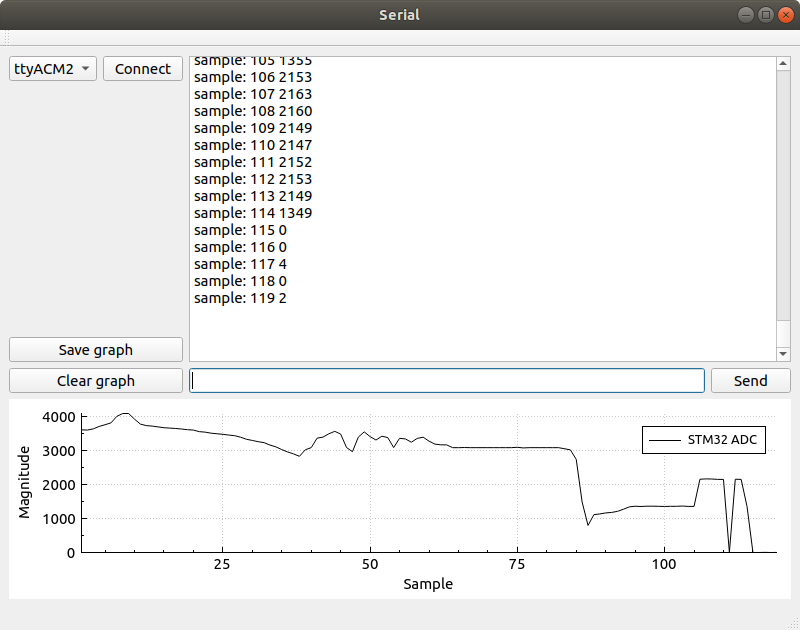
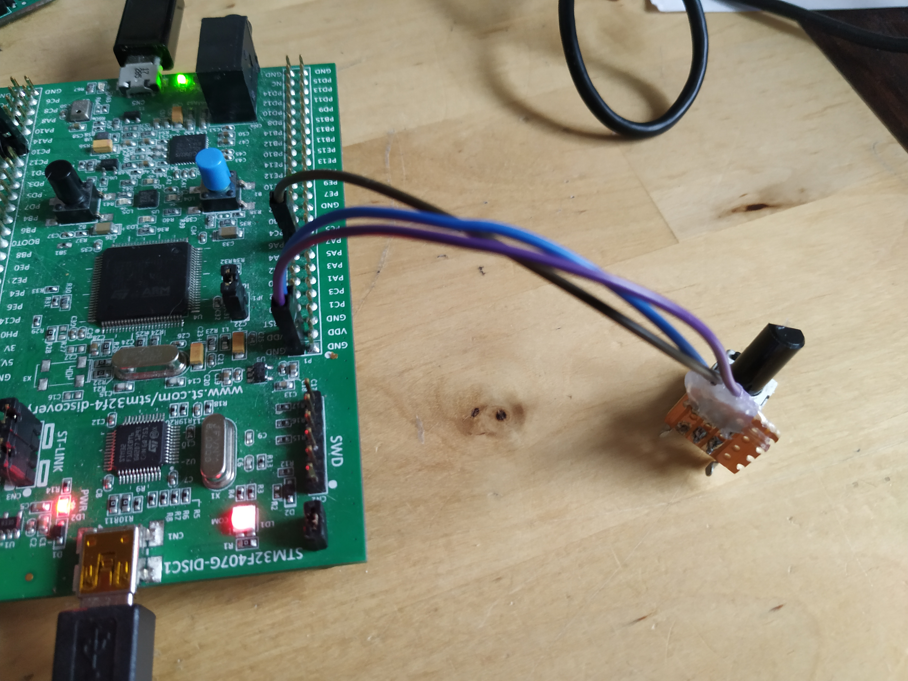

# Extending the Serial GUI with automatic data collection and plotting

Here we implement an extension to the serial GUI developed in a
[previous blog post](../qt_serial_gui/index.html). The extension adds
automatic data collection and plotting. 

Being able to collect and plot data quickly and easily, and in a way
that interfaces nicely with the experimental setup you are using is
always nice.  [QCustomPlot](https://www.qcustomplot.com/) creates nice
looking plots and allows you to save plots in a multitude of different
formats. This means that if you are already making a Qt GUI for your
experimental platform, adding plots is a small cost with a lot of
added value.

The example data that I collect in this post will come from an
STM32F4-Discovery board with a potentiometer attached to one of its
ADC (Analog to Digital Converter) pins. The STM32F4 program will
generate 120 samples taken about half a second apart that will be
plotted in the GUI using QCustomPlot. Each time that the STM32 is
grabbing a sample it outputs a string containing "sample:" followed by
sample number (sequence number) and the value obtained by the ADC for
that sample point. For example "sample: 45 2048". This is the pattern
that the automatic data collector will look for and parse. Of course
this can be extended with more tags such as "sample:" if you want to
collect many different sets of data at once. Maybe you want to collect
for example "time:", "accuracy:" or "position:" samples for your
particular use case.

The extended GUI that is developed in this text will look like the
picture below: 

 

As in the earlier [post](../qt_serial_gui/index.html), the GUI itself
(The placement of buttons and so on) is done using the GUI Designer
within Qt Creator. The new elements of this GUI is, of course, the
graph along the bottom of the window. This graph is added in the GUI
Designer as a *Widget* that is then *Promoted* to a *QCustomPlot*. The
other new elements are the *Save graph* and *Clear Graph* buttons.


## The Code

QCustomPlot requires that you add *printsupport*, this is done in the `.pro` file 
for your Qt project as shown below. 

```
QT       += core gui serialport printsupport
``` 

Most of the code is identical to the previous
[post](../qt_serial_gui/index.html) so this text will focus on the differences. 
What we will look at is:

- setting up storage for data.
- configuring the plot parameters.
- parsing of *tagged* data.
- updating and rescaling the plot.
- the save and the clear buttons.

This extension is not a whole lot of code, so all of it is still implemented
entirely within `mainwindow.h` and `mainwindow.cpp`.

Let's take a look at the additions to `mainwindow.h` first. 

``` 
#include "qcustomplot.h"
``` 

Include the `qcustomplot.h` file. QCustomPlot (at least the version I have) 
comes as just two files, `qcustomplot.h` and `qcustomplot.cpp`, just add 
these two files to the project. 

The state held by the *MainWindow* object is augmented with an `mData` member 
where we accumulate the data collected. 

```cpp
private:
    Ui::MainWindow *ui;

    QSerialPort *mSerial;
    QList<QSerialPortInfo> mSerialPorts;
    QTimer *mSerialScanTimer;

    QSharedPointer<QCPGraphDataContainer> mData;

    void updateSerialPorts();
```

`mData` is a *QSharedPointer* to a *QCPGraphDataContainer*. The
*QCPGraphDataContainer* is an abstract data container of
*QCPGraphData* object, one of which will be created for each data
point that we parse.

There seems to be two ways to add data to a QCustomPlot graph, either
you use data stored in a *QVector<double>* or you use one these
*QSharedPointer* to a *QCPGraphDataContainer*. It seems to me that
having a shared pointer to the data is beneficial as we can add data
to the same storage as QCustomPlot uses to plot without the need to
copy elements back and forth. This is speculation on my part.

That covers the changes to the header file. Below you can find the
complete code listing for `mainwindow.h`.

```cpp
#ifndef MAINWINDOW_H
#define MAINWINDOW_H

#include <QMainWindow>
#include <QSerialPort>
#include <QSerialPortInfo>
#include <QTimer>
#include "qcustomplot.h"

QT_BEGIN_NAMESPACE
namespace Ui { class MainWindow; }
QT_END_NAMESPACE

class MainWindow : public QMainWindow
{
    Q_OBJECT

public:
    MainWindow(QWidget *parent = nullptr);
    ~MainWindow();

private slots:
    void on_connectPushButton_clicked();
    void on_sendPushButton_clicked();
    void serialReadyRead();

    void on_clearGraphPushButton_clicked();

    void on_saveGraphPushButton_clicked();

private:
    Ui::MainWindow *ui;

    QSerialPort *mSerial;
    QList<QSerialPortInfo> mSerialPorts;
    QTimer *mSerialScanTimer;

    QSharedPointer<QCPGraphDataContainer> mData;

    void updateSerialPorts();
};
#endif // MAINWINDOW_H
```

Now, let us jump into the `mainwindow.cpp` file and take a look 
at the constructor of *MainWindow* objects. The unchanged code has been omitted. 

```cpp
MainWindow::MainWindow(QWidget *parent)
    : QMainWindow(parent)
    , ui(new Ui::MainWindow)
{

    /* The unchanged code is omitted */
	
    mData = QSharedPointer<QCPGraphDataContainer>(new QCPGraphDataContainer);

    /* Setup plot */
    ui->plot->setInteractions(QCP::iRangeDrag | QCP::iRangeZoom);
    ui->plot->legend->setVisible(true);
    QFont legendFont = font();
    legendFont.setPointSize(10);
    ui->plot->legend->setFont(legendFont);
    ui->plot->legend->setSelectedFont(legendFont);
    ui->plot->legend->setSelectableParts(QCPLegend::spItems);
    ui->plot->yAxis->setLabel("Magnitude");
    ui->plot->xAxis->setLabel("Sample");
    ui->plot->clearGraphs();
    ui->plot->addGraph();

    ui->plot->graph()->setPen(QPen(Qt::black));
    ui->plot->graph()->setData(mData);
    ui->plot->graph()->setName("STM32 ADC");
}
```

First a new *QCPGraphDataContainer* is created and a shared pointer to it is 
assigned to `mData`. That initializes our storage area for data samples.

```cpp
    mData = QSharedPointer<QCPGraphDataContainer>(new QCPGraphDataContainer);
```

Then the plot is configured and set up. 

``` 
    ui->plot->setInteractions(QCP::iRangeDrag | QCP::iRangeZoom);
    ui->plot->legend->setVisible(true);
    QFont legendFont = font();
    legendFont.setPointSize(10);
    ui->plot->legend->setFont(legendFont);
    ui->plot->legend->setSelectedFont(legendFont);
    ui->plot->legend->setSelectableParts(QCPLegend::spItems);
    ui->plot->yAxis->setLabel("Magnitude");
    ui->plot->xAxis->setLabel("Sample");

``` 

Dragging and zooming is enabled, the legend is set to be visible and so
on.  Then y-axis and x-axis labels are set to "Magnitude" and
"Sample".  There are a lot of things to configure and tweak when it
comes to QCustomPlot and I don't know even a third of it.


Then we add a graph. 
```cpp
	ui->plot->clearGraphs();
    ui->plot->addGraph();

    ui->plot->graph()->setPen(QPen(Qt::black));
    ui->plot->graph()->setData(mData);
    ui->plot->graph()->setName("STM32 ADC");
}
```
These settings are related to a particular data set, that we here give the 
name "STM32 ADC". `setData` is available in two different flavors, one that 
take two QVector<double> or this one that takes just one shared pointer to 
a QCPGraphDataContainer. With that, we are finished with the changes to the 
constructor. 

Next we take a look at the parsing of data to be plotted. This is 
implemented in the `serialReadyRead` slot. Just as in the earlier 
GUI, a string is read from the serial port and output onto the text browser. 

```cpp
void MainWindow::serialReadyRead()
{
    QByteArray data = mSerial->readAll();
    QString str = QString(data);
    ui->outputTextBrowser->insertPlainText(str);
    QScrollBar *sb = ui->outputTextBrowser->verticalScrollBar();
    sb->setValue(sb->maximum());


    if (str.startsWith("sample:",Qt::CaseInsensitive)) {
       QStringList parts = str.split(" ");
       if (parts.size() == 3) {
         qDebug() << "Got a sample " << parts.at(1).toDouble() << parts.at(2).toDouble();
         double num = parts.at(1).toDouble();
         double mag = parts.at(2).toDouble();
         mData->add(QCPGraphData(num, mag));
         ui->plot->rescaleAxes();
         ui->plot->replot();
       }
    }

}
```
In addition to outputting the str to the text window, we check if the 
string has the prefix "sample:" (using `str.startsWith`). If the string
does start with "sample:" we split it up at the spaces and check if 
the result of that splitting is a list of three elements. If there 
are not three strings in the `parts` list, that means the data is malformed 
and cannot be used. This is of course also application dependent, for 
a particular tag you could have more than 2 data fields. 

Anyway! if the string splits nicely into 3 chunks, the second and third 
of those string chunks are converted to doubles (`toDouble()`) and 
added to the `mData` (`mData->add(QCPGraphData(num, mag));`).

Lastly the plot is rescaled and replotted.

This brings us to the final parts of the extended GUI, the save and clear buttons. 
These are implemented in the slots `on_clearGraphPushButton_clicked` and
`on_saveGraphPushButton_clicked`. First the clear function, it is very simple. 


When the user presses the clear button, the data is cleared and the plot is 
rescaled and replotted. It is now ready to accept a new set of samples if that 
is desirable. 
```cpp
void MainWindow::on_clearGraphPushButton_clicked()
{
    mData->clear();
    ui->plot->rescaleAxes();
    ui->plot->replot();
}
```

The save button uses a *QFileDialog* to open up a filename selector/specification 
window. This results in a string representing a filename. 

```cpp

void MainWindow::on_saveGraphPushButton_clicked()
{
    QString filename = QFileDialog::getSaveFileName(this,
                                                    tr("Save pdf"), "",
                                                    tr("Pdf files (*.pdf)"));

    if (!filename.isEmpty()) {
        ui->plot->savePdf(filename);
    }
}
```
If the filename is not an empty string, then QCustomPlot's function for saving 
as pdf is called and the pdf is generated. Quite nice! The result of storing as 
pdf can be seen below.


Below you find the entire `mainwindow.cpp` for the extended functionality.

```cpp 
#include "mainwindow.h"
#include "ui_mainwindow.h"
#include <QDebug>
#include <QScrollBar>
#include <QFileDialog>

MainWindow::MainWindow(QWidget *parent)
    : QMainWindow(parent)
    , ui(new Ui::MainWindow)
{
    ui->setupUi(this);
    this->setWindowTitle("Serial");

    mSerial = new QSerialPort(this);
    updateSerialPorts();

    mSerialScanTimer = new QTimer(this);
    mSerialScanTimer->setInterval(5000);
    mSerialScanTimer->start();

    connect(mSerialScanTimer, &QTimer::timeout,
            this, &MainWindow::updateSerialPorts);

    connect(ui->inputLineEdit, &QLineEdit::returnPressed,
            this, &MainWindow::on_sendPushButton_clicked);

    connect(mSerial, &QSerialPort::readyRead,
            this, &MainWindow::serialReadyRead);

    mData = QSharedPointer<QCPGraphDataContainer>(new QCPGraphDataContainer);

    /* Setup plot */
    ui->plot->setInteractions(QCP::iRangeDrag | QCP::iRangeZoom);
    ui->plot->legend->setVisible(true);
    QFont legendFont = font();
    legendFont.setPointSize(10);
    ui->plot->legend->setFont(legendFont);
    ui->plot->legend->setSelectedFont(legendFont);
    ui->plot->legend->setSelectableParts(QCPLegend::spItems);
    ui->plot->yAxis->setLabel("Magnitude");
    ui->plot->xAxis->setLabel("Sample");
    ui->plot->clearGraphs();
    ui->plot->addGraph();

    ui->plot->graph()->setPen(QPen(Qt::black));
    ui->plot->graph()->setData(mData);
    ui->plot->graph()->setName("STM32 ADC");

}

MainWindow::~MainWindow()
{
    delete ui;
}

void MainWindow::updateSerialPorts()
{
    mSerialPorts = QSerialPortInfo::availablePorts();

    ui->serialComboBox->clear();
    for (QSerialPortInfo port : mSerialPorts) {
        ui->serialComboBox->addItem(port.portName(), port.systemLocation());
    }
}

void MainWindow::on_connectPushButton_clicked()
{
    ui->connectPushButton->setEnabled(false);
    //QString serialName =  ui->serialComboBox->currentText();
    QString serialLoc  =  ui->serialComboBox->currentData().toString();

    if (mSerial->isOpen()) {
        qDebug() << "Serial already connected, disconnecting!";
        mSerial->close();
    }

    mSerial->setPortName(serialLoc);
    mSerial->setBaudRate(QSerialPort::Baud115200);
    mSerial->setDataBits(QSerialPort::Data8);
    mSerial->setParity(QSerialPort::NoParity);
    mSerial->setStopBits(QSerialPort::OneStop);
    mSerial->setFlowControl(QSerialPort::NoFlowControl);

    if(mSerial->open(QIODevice::ReadWrite)) {
        qDebug() << "SERIAL: OK!";
    } else {
        qDebug() << "SERIAL: ERROR!";
    }
    ui->connectPushButton->setEnabled(true);
}

void MainWindow::on_sendPushButton_clicked()
{
    if (mSerial->isOpen()) {

        QString str= ui->inputLineEdit->text();
        ui->inputLineEdit->clear();
        str.append("\r\n");
        mSerial->write(str.toLocal8Bit());
    } else {
        qDebug() << "Serial port not connected!";
    }
}

void MainWindow::serialReadyRead()
{
    QByteArray data = mSerial->readAll();
    QString str = QString(data);
    ui->outputTextBrowser->insertPlainText(str);
    QScrollBar *sb = ui->outputTextBrowser->verticalScrollBar();
    sb->setValue(sb->maximum());


    if (str.startsWith("sample:",Qt::CaseInsensitive)) {
       QStringList parts = str.split(" ");
       if (parts.size() == 3) {
         qDebug() << "Got a sample " << parts.at(1).toDouble() << parts.at(2).toDouble();
         double num = parts.at(1).toDouble();
         double mag = parts.at(2).toDouble();
         mData->add(QCPGraphData(num, mag));
         ui->plot->rescaleAxes();
         ui->plot->replot();
       }
    }
}

void MainWindow::on_clearGraphPushButton_clicked()
{
    mData->clear();
    ui->plot->rescaleAxes();
    ui->plot->replot();
}

void MainWindow::on_saveGraphPushButton_clicked()
{
    QString filename = QFileDialog::getSaveFileName(this,
                                                    tr("Save pdf"), "",
                                                    tr("Pdf files (*.pdf)"));

    if (!filename.isEmpty()) {
        ui->plot->savePdf(filename);
    }
}
```


## In closing

This is a picture of the STM32F4-Discovery and potentiometer setup 
used in the examples. 




Thanks a lot for reading and please do not hesitate to ask me
questions if you like. Also feedback is always appreciated. I wish you
a good day and some good hacking! 


___

[HOME](https://svenssonjoel.github.io)
