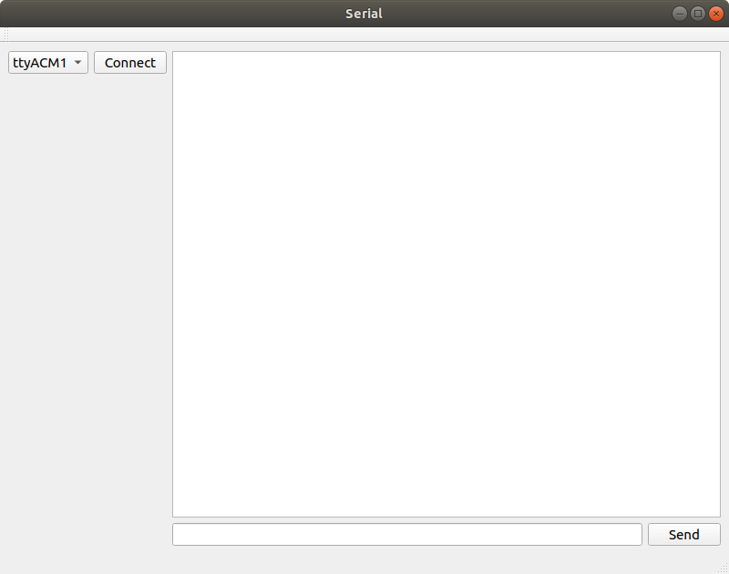
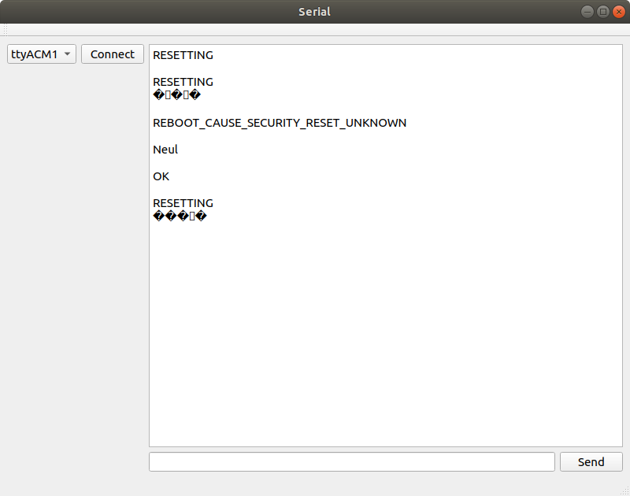

# A Qt GUI for Serial Communication with a Development Board

When working with a development board such as the STM32F4-Discovery,
it is very nice to be able to set up some serial com over the
USB. This can be used to provide a lot more information than you would be 
able to by just blinking LEDs (well, you could communicate one way board-to-human 
by encoding for example Morse-code). Anyway! its nice to have a serial com link!

But after a while of using just *miniterm* or *screen* as a serial terminal it 
may get a bit tedious and annoying. So this text is about the basics of 
setting up a GUI using QT for serial communication with for example a development board. 
The program can be extended with domain specific functionality in the form of additional 
buttons and such, whatever you desire. 

## The look of the GUI 

The GUI has been designed in the Qt GUI Designer within *Qt Creator* and 
looks like the picture below. 



On the left hand side there is a *QComboBox* that will list the
available serial ports on the system. Next to this combo box is a
*pushButton* with the string "connect" on it.  This button is used to
establish a connection to the serial port selected in the combo box.
This connecting procedure is implemented in the button's *clicked*
slot.

The right side of the GUI consists of a *QTextBrowser* that will
display data arriving from the serial port. Below the text browser is
a *QLineEdit* and a send button. Connections will also be made so that
the return key when pressed with focus on the line edit, will issue
the send. 

## Now, The Code

There is not a lot of code involved in this, which is good since it is
a pretty basic program. So, all of it is implemented within *mainwindow.h* 
and *mainwindow.cpp*.

The *mainwindow.h* file includes the following in addition to the *QMainWindow*:

```cpp
#include <QSerialPort>
#include <QSerialPortInfo>
#include <QTimer>
```

*QSerialPort* to establish a connection to a port and read and write
over that port. *QSerialPortInfo* is used to query the system for
available serial ports which provides their name and location (in the
Linux filesystem hierarchy).  *QTimer* will be used to set up a
periodic timer that updates the list of serial ports. Serial ports pop
into existence when devices are plugged in. 

The MainWindow class holds a bit of state in its member variables 
shown below. These consist of the *QSerialPort* we are going to use, 
the list of serial ports (*QSerialPortInfo* objects) and our timer. 

```cpp
QSerialPort *mSerial;
QList<QSerialPortInfo> mSerialPorts;
QTimer *mSerialScanTimer;
```

Those members above will be initialized in the constructor shown later
in this text.

There are also a bunch of slots and one member function declared in this 
class. 

```cpp
private slots:
    void on_connectPushButton_clicked();

    void on_sendPushButton_clicked();
    void serialReadyRead();

private: 
    void updateSerialPorts();
```

The implementation of all of these will be shown later in the text. 

Below you find *mainwindow.h* in its entirety:

```cpp
ifndef MAINWINDOW_H
#define MAINWINDOW_H

#include <QMainWindow>
#include <QSerialPort>
#include <QSerialPortInfo>
#include <QTimer>

QT_BEGIN_NAMESPACE
namespace Ui { class MainWindow; }
QT_END_NAMESPACE

class MainWindow : public QMainWindow
{
    Q_OBJECT

public:
    MainWindow(QWidget *parent = nullptr);
    ~MainWindow();

private slots:
    void on_connectPushButton_clicked();

    void on_sendPushButton_clicked();
    void serialReadyRead();

private:
    Ui::MainWindow *ui;

    QSerialPort *mSerial;
    QList<QSerialPortInfo> mSerialPorts;
    QTimer *mSerialScanTimer;

    void updateSerialPorts();
};
#endif // MAINWINDOW_H
```
Now, let us jump over the *mainwindow.cpp* file and go through that 
code. Starting with the constructor for the MainWindow object.

```cpp
MainWindow::MainWindow(QWidget *parent)
    : QMainWindow(parent)
    , ui(new Ui::MainWindow)
{
    ui->setupUi(this);
    this->setWindowTitle("Serial");

    mSerial = new QSerialPort(this);
    updateSerialPorts();

    mSerialScanTimer = new QTimer(this);
    mSerialScanTimer->setInterval(5000);
    mSerialScanTimer->start();

    connect(mSerialScanTimer, &QTimer::timeout,
            this, &MainWindow::updateSerialPorts);

    connect(ui->inputLineEdit, &QLineEdit::returnPressed,
            this, &MainWindow::on_sendPushButton_clicked);

    connect(mSerial, &QSerialPort::readyRead,
            this, &MainWindow::serialReadyRead);

}
``` 

In the constructor a QSerialPort object is created and, *mSerial* is
initialized. Then a function is called that updates the list of serial
ports for the combo box. Nothing very fancy so, will show the contents
of `updateSerialPorts` in a moment. 

The timer is initialized and set to a 5 seconds interval. 

Lastly, a bunch of connections are set up. The first of these connects the 
`updateSerialPorts` function to the timeout signal. It doesn't matter that 
`updateSerialPorts` isn't declared as a slot, it seems. The readyRead signal 
is also connected to a slot that will take care of reading the available data. 
To get the return key to act the same way as the send button, the `returnPressed` signal 
of the line edit widget is connected to the same slot as the send button. 

That was the constructor. There is destructor as well but it is unchanged 
from the template provided when creating the project. 


The `updateSerialPorts` function updates the list of serial ports by asking 
for the *availablePorts*. The combo box is cleared to then be refilled with the 
list of ports. The *addItem* method in the *QComboBox* takes two arguments, 
the first is a string and the second is a QVariant. In this case what we provide 
for second argument is another string, so this is fine as a *QVariant* it seems. 
However, when we access the data field of the combo box, we must convert it from a 
*QVariant* to a string before use. 

```cpp
void MainWindow::updateSerialPorts()
{
    mSerialPorts = QSerialPortInfo::availablePorts();

    ui->serialComboBox->clear();
    for (QSerialPortInfo port : mSerialPorts) {
        ui->serialComboBox->addItem(port.portName(), port.systemLocation());
    }
}
```

The combo box contents is accessed when the connect button is pressed.
The selected item of the combo box is then read out. We only need to
read out the data field from the combo box. The data is not actually
displayed in the combo box, only the name is. When we added items to
the combo box we put the name of the port as the first (or text)
argument to `addItem` which is what is displayed in the list.
The data from the combo box iten is converted from *QVariant* to string 
using `toString()`. 

If the program is already connected to a serial port when the user
clicks connect, the connection is closed.

Now we are ready to set up the serial connection parameters and open
the connection. 

Now one idea could be to add more GUI elements where the 
user can fill in the parameters. If that had been the case, we could 
load the information from those GUI elements at this time and use them 
to set up the connection. 

The whole contents of this method is wrapped in calls that disable the 
connection to grey it out while the computer is working on setting up a 
connection. This will make it harder to accidently queue up several of 
these connect events.

```cpp
void MainWindow::on_connectPushButton_clicked()
{
    ui->connectPushButton->setEnabled(false);
    QString serialLoc  =  ui->serialComboBox->currentData().toString();

    if (mSerial->isOpen()) {
        qDebug() << "Serial already connected, disconnecting!";
        mSerial->close();
    }

    mSerial->setPortName(serialLoc);
    mSerial->setBaudRate(QSerialPort::Baud115200);
    mSerial->setDataBits(QSerialPort::Data8);
    mSerial->setParity(QSerialPort::NoParity);
    mSerial->setStopBits(QSerialPort::OneStop);
    mSerial->setFlowControl(QSerialPort::NoFlowControl);

    if(mSerial->open(QIODevice::ReadWrite)) {
        qDebug() << "SERIAL: OK!";
    } else {
        qDebug() << "SERIAL: ERROR!";
    }
    ui->connectPushButton->setEnabled(true);
}
```


When the send button is clicked or the user presses return (while the focus is 
on the *QLineWidget* GUI element) the following code is executed. 

```cpp
void MainWindow::on_sendPushButton_clicked()
{
    if (mSerial->isOpen()) {

        QString str= ui->inputLineEdit->text();
        ui->inputLineEdit->clear();
        str.append("\r\n");
        mSerial->write(str.toLocal8Bit());
    } else {
        qDebug() << "Serial port not connected!";
    }
}
```
If the serial is connected, then a string is created from the contents 
of the *QLineEdit*. A carriage return and newline character is appended 
to the string which is then sent through the serial port. The string is 
converted to a raw 8 bit data before transmission. 

The last method is for reading of data from the serial port. 
This takes place whenever the signal *readyRead* is raised from the 
*QSerialPort*. 

```cpp
oid MainWindow::serialReadyRead()
{
    QByteArray data = mSerial->readAll();
    QString str = QString(data);
    ui->outputTextBrowser->insertPlainText(str);
    QScrollBar *sb = ui->outputTextBrowser->verticalScrollBar();
    sb->setValue(sb->maximum());
}
``` 
All the data that is avaialable from the serial port is read, with `readAll()`
as an array of raw bytes. The bytes are then converted into a string and 
displayed onto the *QTextBrowser* widget. 

Once a *QTextBrowser* has enough text in it, it grows a scrollbar. The final 
two lines of code there, scrolls to the end of the *QTextBrowser* so that 
it is automatically advanced to show the newly added text. 


Below you find the *mainwindow.cpp* file in its entirety:

```cpp
#include "mainwindow.h"
#include "ui_mainwindow.h"
#include <QDebug>
#include <QScrollBar>

MainWindow::MainWindow(QWidget *parent)
    : QMainWindow(parent)
    , ui(new Ui::MainWindow)
{
    ui->setupUi(this);
    this->setWindowTitle("Serial");

    mSerial = new QSerialPort(this);
    updateSerialPorts();

    mSerialScanTimer = new QTimer(this);
    mSerialScanTimer->setInterval(5000);
    mSerialScanTimer->start();

    connect(mSerialScanTimer, &QTimer::timeout,
            this, &MainWindow::updateSerialPorts);

    connect(ui->inputLineEdit, &QLineEdit::returnPressed,
            this, &MainWindow::on_sendPushButton_clicked);

    connect(mSerial, &QSerialPort::readyRead,
            this, &MainWindow::serialReadyRead);

}

MainWindow::~MainWindow()
{
    delete ui;
}

void MainWindow::updateSerialPorts()
{
    mSerialPorts = QSerialPortInfo::availablePorts();

    ui->serialComboBox->clear();
    for (QSerialPortInfo port : mSerialPorts) {
        ui->serialComboBox->addItem(port.portName(), port.systemLocation());
    }
}

void MainWindow::on_connectPushButton_clicked()
{
    ui->connectPushButton->setEnabled(false);
    QString serialName =  ui->serialComboBox->currentText();
    QString serialLoc  =  ui->serialComboBox->currentData().toString();

    if (mSerial->isOpen()) {
        qDebug() << "Serial already connected, disconnecting!";
        mSerial->close();
    }

    mSerial->setPortName(serialLoc);
    mSerial->setBaudRate(QSerialPort::Baud115200);
    mSerial->setDataBits(QSerialPort::Data8);
    mSerial->setParity(QSerialPort::NoParity);
    mSerial->setStopBits(QSerialPort::OneStop);
    mSerial->setFlowControl(QSerialPort::NoFlowControl);

    if(mSerial->open(QIODevice::ReadWrite)) {
        qDebug() << "SERIAL: OK!";
    } else {
        qDebug() << "SERIAL: ERROR!";
    }
    ui->connectPushButton->setEnabled(true);
}

void MainWindow::on_sendPushButton_clicked()
{
    if (mSerial->isOpen()) {

        QString str= ui->inputLineEdit->text();
        ui->inputLineEdit->clear();
        str.append("\r\n");
        mSerial->write(str.toLocal8Bit());
    } else {
        qDebug() << "Serial port not connected!";
    }
}

void MainWindow::serialReadyRead()
{
    QByteArray data = mSerial   ->readAll();
    QString str = QString(data);
    ui->outputTextBrowser->insertPlainText(str);
    QScrollBar *sb = ui->outputTextBrowser->verticalScrollBar();
    sb->setValue(sb->maximum());

}
``` 

## In Closing

This program could serve as a base for more complicated interaction
with a development board. Instead of repetitively type in long text
strings add a button that performs that interaction. Another idea
would be to add a history of typed in commands and some method of
quickly bringing up a previously entered command. 



The picture below shows the setup that is connected to the serial port
in when the screenshot above was taken. The involved components are an
STM32F4-Discovery, and a Dragino NB-IoT Bee module on a arduino
shield.

The software running on the STM32F4-Discovery board is implemented
using ChibiOs and it sets up a serial-over-usb connection to my laptop
and a Uart connection to the NB-IoT module. The STM32 software then
executes commands against the IoT module and performs resets on it. I
am currently trying to figure out how this NB-IoT module works, so I
thought that it would be nice to start on a GUI rather than keep doing
textual interactions over miniterm. One thing to add to the GUI would
be buttons for various kinds of AT commands that are a paint to type
out manually.


___

[HOME](https://svenssonjoel.github.io)
