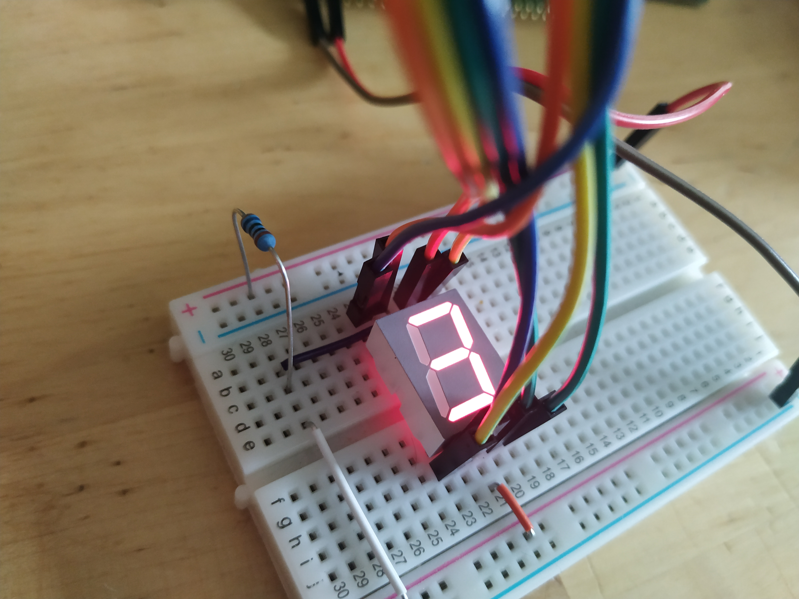
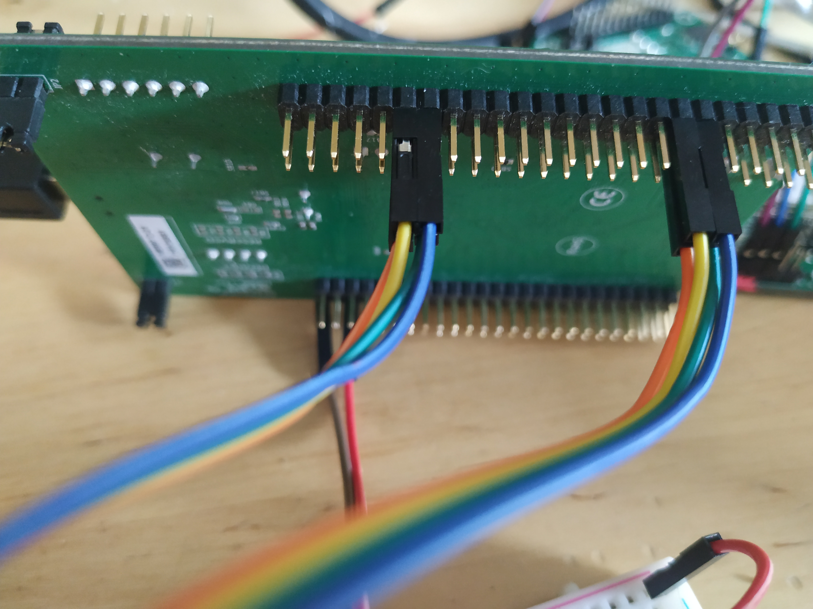

# Controlling a Seven-Segment Display from an STM32 running ChibiOs

**First I think a bit of disclaimer may be in place. I am not an electrical 
engineer or an expert in electronics in any way. I enjoy learning and 
would like to do that together with others. This is why I share my 
naive experimentation into the field of electronics. So please do not 
take what I write as an experts guide. Always do your own research and 
read datasheets. I would love to hear your feedback, help, constructive 
criticism and tips, that would be awesome!**

I have a number of different sensors, displays and servos just sitting
around. I will try to figure out how they work and write down my
findings. This first one was not very tricky (but not without its
caveats) it is a [seven-segment
display](https://en.wikipedia.org/wiki/Seven-segment_display). This
particular seven-segment display has a decimal point and thus have
eight input pins.  The approach taken here will be to connect each of
those pins to GPIO pins on the STM32F4-Discovery board as below.

 



This approach is taken because I currently do not have any
seven-segment decoder chip but still want to see if it will light up.
When I get my hand on some decoder chips I will revisit this
setup. This setup really does not feel ideal.

This seven-segment display has a common anode and one cathode per
segment LED.  I hope I am not mixing up the anode and cathode words
there but what it means is that I am connecting positive (+) 3V to the
anode pins. There are two anode pins and it seems to not matter at all
which one I use, so I connect 3V via a 365 Ohm resistor to both of
them. The anode pins are located in the middle of the top and bottom
row of 5 pins, that is pin 3 and pin 8. The seven-segment display used
here does not seem to require very much current at all to light up. 
Unfortunately I have no manufacturer information or model number of 
the display so it is hard to look up a datasheet.

Eight pins are unconnected so far. These eight pins, each turn a
segment LED if you connect that pin to ground. That feels a bit
awkward since I want to be able to turn the segments on using the
STM32 MCU.  and that would mean sinking the current through the
seven-segment display circuit into the GPIO pins of the MCU. From the
[datasheet](https://www.st.com/content/ccc/resource/technical/document/datasheet/ef/92/76/6d/bb/c2/4f/f7/DM00037051.pdf/files/DM00037051.pdf/jcr:content/translations/en.DM00037051.pdf)
the maximum current we can sink into a GPIO pin is 25mA. Given the 365
Ohm resistor between the 3V supply and the anode, the current can not
be higher than about 8.3 mA, which is well below the 25mA but still
seems to be quite enough to light up the LEDs in the display so that
they are visible even in a lit room. The way it is setup with a common
anode, current limited with a resistor, the more of the LEDs turned
on, the dimmer they become.

## Some code 

The Seven-segment display is connected to the STM32 at pins 
PA 0, 1, 2 and 3 and to PB 11, 12, 13, and 14. I think it makes 
sense to configure these as `PAL_MODE_OPENDRAIN` which as I understand it
means that the pins will "float" (essentially act as unconnected) when you 
assert high (1) on them. Asserting a low (0) will mean the pin is pulled 
to ground.

```c
  palSetGroupMode(GPIOA, PAL_GROUP_MASK(4), 0, PAL_MODE_OUTPUT_OPENDRAIN);
  palSetGroupMode(GPIOB, PAL_GROUP_MASK(4), 11, PAL_MODE_OUTPUT_OPENDRAIN);
``` 

The `palSetGroupMode` function used above changes the mode of a collection 
of GPIOs via a mask and a shift. The `PAL_GROUP_MASK(4)` function creates a mask 
with the 4 LSB set to 1, the shift distance (0 and 11) then moves this group 
of 1-bits to the position correlating with out GPIO A B pins. 

We can also write to these GPIOs in groups. 

```c
void setSevenSegment(uint8_t pat) {
    palWriteGroup(GPIOA, PAL_GROUP_MASK(4), 0, ~pat);
    palWriteGroup(GPIOB, PAL_GROUP_MASK(4), 11, ~pat >> 4);
}
```

The `setSevenSegment` function takes a byte called `pat` where the
containing ones for the leds to turn on. Since the LEDs will be active
low, this `pat` is bitwise inverted. Now we can write the least
significant 4 bits of `pat` to the GPIOA pins and the most significant 
4 bits to the GPIOB pins using `palWriteGroup`. 

So now we have configured the GPIOs and we have a function for turning 
on arbitrary combinations of LEDs within the seven-segment display. 
To display numbers we need a set of codes that correspond to the 
shapes that represents numbers on the display. 

```c
uint8_t ssCodes[10] = { 0x3f, 0x06, 0x5b, 0x4f, 0x66, 0x6d, 0x7d, 0x07, 0x7f, 0x6f }; 
```
The list of numbers above are bit patterns that represent 0 - 9. What codes 
to use of course corresponds to how you wire up the display! But I chose a wiring 
that corresponded to a code (a code found on the web) rather then the other way 
around, to chose a code corresponding to the wiring.

Below you find a complete ChibiOs based program that just counts 0-9 repeatedly 
and showing the digits on the display. 

```c
#include "ch.h"
#include "hal.h"

uint8_t ssCodes[10] = { 0x3f, 0x06, 0x5b, 0x4f, 0x66, 0x6d, 0x7d, 0x07, 0x7f, 0x6f }; 


void setSevenSegment(uint8_t pat) {
    palWriteGroup(GPIOA, PAL_GROUP_MASK(4), 0, ~pat);
    palWriteGroup(GPIOB, PAL_GROUP_MASK(4), 11, ~pat >> 4);
}

int main(void) {
  halInit();
  chSysInit();
    
  palSetGroupMode(GPIOA, PAL_GROUP_MASK(4), 0, PAL_MODE_OUTPUT_OPENDRAIN);
  palSetGroupMode(GPIOB, PAL_GROUP_MASK(4), 11, PAL_MODE_OUTPUT_OPENDRAIN);
      
  uint8_t i = 0;
  
  while(true) {
      
    setSevenSegment(ssCodes[i]);
    chThdSleepMilliseconds(250);
	
    i ++;
    if (i >= 10) i = 0;
  }

}
```

## Conclusion

Wow. It is actually quite interesting how tricky even simple things
become when they are in border-zone of electronics and software. How
insecure I get when doing things like this is a clear indication that
there is a lot left to learn. 

It feels a bit wonky to hook something up like this and sink current
through the GPIO pins, but maybe it is fine? the board has been
running here next to me repeatedly counting from 0 - 9 all day today,
while I have doing my day-job, and all seems fine ;)

I want to revisit this after getting my hands on some seven-segment
display decoders but that will have to wait until after pay-day. 

Thanks for reading and have a good day!

___

[HOME](https://svenssonjoel.github.io)
