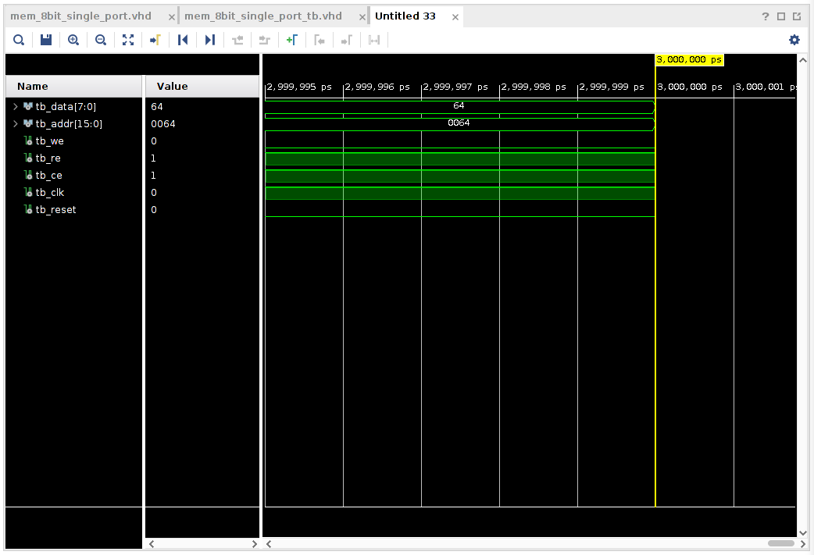
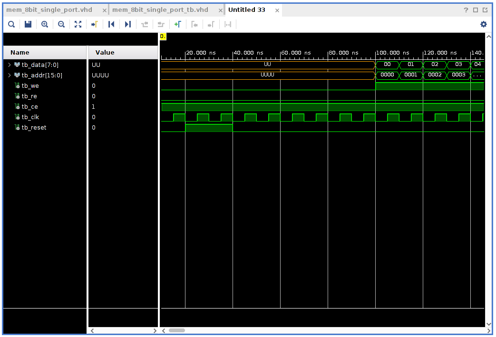
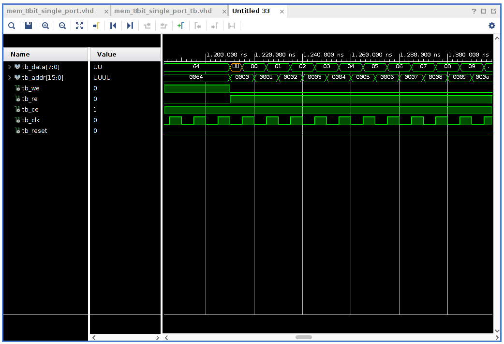

# Trying to make a memory in VHDL

I want to try and make a memory module in VHDL. I have a vague long
term plan but will keep that to myself at the moment, just in case 
it all goes into the bin. 

I am not an VHDL expert and would love your feedback. Either send 
it to me in email or join the Google group associated with the blog. 

It is very likely that later when we try to integrate the memory 
developed here into something larger, it will need to be tweaked 
or "fixed" if broken. 


## The interface to the memory 

I want a memory that can go onto an 8bit data bus together with 
other things on that same bus. So the memory module must be able to 
make the data signals *Float* (to be not connected (high impedance)). The memory 
module should support both reading and writing, both operations 
taking place on the same data bus. There should be an *enable* signal 
to module so that we can chose to enable it or something else connected 
to the bus. 

The size of the memory will be set by a generic parameter but the 
word-length will be fixed at a byte to start with. 

So given the above, the entity declaration for the memory looks 
like this: 

```
entity mem_8bit_single_port is
   generic (
        ADDRESS_BITS : integer := 16
    );
    Port ( 
        data : inout std_logic_vector(7 downto 0);
        addr : in std_logic_vector(ADDRESS_BITS-1 downto 0);
        ce : in std_logic;
        we : in std_logic;
        re : in std_logic;
        
        reset : in std_logic;
        clk: in std_logic
        );
end mem_8bit_single_port;
```
`data` is the data-bus of bytes and `addr` is the address-bus which 
is set to 16bits by default but is a generic parameter that can be customized. 
`ce`, `we` and `re` are the chip-enable, write-enable and read-enable signals. 
I am not entirely sure what to do with the reset signal at the moment.

So the idea is that to read from the memory you put an address on the address-bus, 
enable `ce` and `re` and the result should arrive on `data`. For storing, 
you put an address on the address-bus, enable `ce` and `we`. If both `we` and `re`
are enabled, then one of those operations will take priority over the other. 
Which one is given priority depends on the implementation. 

## Implementation of the architecture for the memory 

The implementation of the memory is based on an array of 
8-bit *std_logic_vector* defined by this type: 

``` 
    type mem_array is array((2**ADDRESS_BITS)-1 downto 0) of 
        std_logic_vector(7 downto 0);
``` 

The number of elements in the array is decided by the number of address bits. 
We need a couple of signals internally in the architecture. These are `mem`, the actual 
instance of an object of type `mem_array` and we need a *kind of* intermediate signal 
that I call `data_out`. I ran into some problems here at first trying to implement 
the memory without the intermediate `data_out` signal. 

The problem I ran into is that you want to put the `data` signals into state `Z` whenever 
there is no `ce`. I thought it would be fine to this with a statement like this: 

``` 
data <= "ZZZZZZZZ"; 
``` 

in the architecture. The plan was then to, later, in a process override that setting 
with actual data if needed. But that is not possible it seems. The statement, as I understand 
it right now should mean something like data is always "ZZZ..." and what happens then 
if I later have a (inside a process) `data <= the_actual_data` is that `data` is being 
driven from two places at once. So, do not do that... 

Here is what a better statement looks like: 

```
data <= data_out when (ce = '1' and re ='1' and we = '0') else "ZZZZZZZZ";
```
and this is where the intermediate `data_out` signal comes in. The `data_out` signal 
is given a value within a process that is sensitive to the `clk` signal. 


```
	process(clk, reset) 
    begin
        if (reset = '1') then 
            data <= "ZZZZZZZZ";
        elsif rising_edge(clk) then 
            if (ce = '1' and re = '1') then
                data_out <= mem(to_integer(unsigned(addr)));
            elsif (ce = '1' and we = '1') then
                mem(to_integer(unsigned(addr))) <= data;
            end if;
        end if;
    end process;
```

This process check the state of `ce`, `we` and `re` and either decides to 
put a value from the memory onto the data-bus or take the value from the data-bus 
and place it in memory. 

I am not actually sure what to do about the `reset` signal. It just feels nice 
and uniform that there is one. So right now `reset` just disconnects the memory from 
the bus, for the duration of the reset. 


Here is the full VHDL listing for the memory module: 

``` 
library IEEE;
use IEEE.STD_LOGIC_1164.ALL;
use IEEE.NUMERIC_STD.ALL;

entity mem_8bit_single_port is
    generic (
        ADDRESS_BITS : integer := 16
    );
    Port ( 
        data : inout std_logic_vector(7 downto 0);
        addr : in std_logic_vector(ADDRESS_BITS-1 downto 0);
        ce : in std_logic;
        we : in std_logic;
        re : in std_logic;
        
        reset : in std_logic;
        clk: in std_logic
        );
end mem_8bit_single_port;

architecture Behavioral of mem_8bit_single_port is
    
    type mem_array is array((2**ADDRESS_BITS)-1 downto 0) of 
        std_logic_vector(7 downto 0);
        
    signal mem : mem_array;
    signal data_out : std_logic_vector(7 downto 0);
begin
    
    data <= data_out when (ce = '1' and re ='1' and we = '0') else "ZZZZZZZZ";
        
    process(clk, reset) 
    begin
        if (reset = '1') then 
            data <= "ZZZZZZZZ";
        elsif rising_edge(clk) then 
            if (ce = '1' and re = '1') then
                data_out <= mem(to_integer(unsigned(addr)));
            elsif (ce = '1' and we = '1') then
                mem(to_integer(unsigned(addr))) <= data;
            end if;
        end if;
    end process;
end Behavioral;
```

## Testing the memory with a testbench 

This will be more like manual inspection so far as I am not putting
any *assertions* into the testbench. 

I define signals in the testbench to hook up to the memory in order 
to feed it with stimuli. 

```
    signal tb_data : std_logic_vector(7 downto 0);
    signal tb_addr : std_logic_vector(15 downto 0);
    signal tb_we : std_logic := '0';
    signal tb_re : std_logic := '0';
    signal tb_ce : std_logic := '1';
    
    signal tb_clk : std_logic := '0';
    signal tb_reset :std_logic := '0';
``` 

And we need to map the testbench signals to the corresponding memory signal. 

```
m : entity work.mem_8bit_single_port 
    port map 
    (
        reset => tb_reset, 
        clk => tb_clk,
        we => tb_we,
        re => tb_re,
        ce => tb_ce,
        addr => tb_addr,
        data => tb_data
    );
``` 

And set up a clock. 

```
tb_clk <= not tb_clk after 5ns;
``` 

The rest of the testbench is made up from a process that first of 
all resets the memory. Then executes a loop that performs a bunch of writes 
into the memory. This is followed by another loop that performs a bunch of 
reads from the memory. 

``` 
   tb_proc : process 
    begin
        
        wait for 20ns;
        tb_reset <= '1';
        wait for 20ns; 
        tb_reset <= '0';
        
        wait for 60ns; 
        
        tb_we <= '1';
        tb_re <= '0';
        tb_ce <= '1';
        for i in 0 to 100 loop 
            
            tb_addr <= std_logic_vector(to_unsigned(i, 16));
            tb_data <= std_logic_vector(to_unsigned(i, 8));
            
            
            wait for 10ns;
        end loop;
        
        wait for 100ns;
        tb_data <= "ZZZZZZZZ";
        tb_we <= '0';
        tb_re <= '1';
        tb_ce <= '1';
        for i in 0 to 100 loop 
            
            tb_addr <= std_logic_vector(to_unsigned(i, 16));
            
            wait for 10ns;
        end loop;
        
        wait;
    end process;
``` 

If you are not familiar with how to create a testbench (simulation
source) in Vivado, have a look at [this post](../behavioral-simulation-in-vivado/index.html).

Here is the complete testbench code listing:

```
library IEEE;
use IEEE.STD_LOGIC_1164.ALL;
use IEEE.NUMERIC_STD.ALL;

entity mem_8bit_single_port_tb is
end mem_8bit_single_port_tb;

architecture Behavioral of mem_8bit_single_port_tb is

    signal tb_data : std_logic_vector(7 downto 0);
    signal tb_addr : std_logic_vector(15 downto 0);
    signal tb_we : std_logic := '0';
    signal tb_re : std_logic := '0';
    signal tb_ce : std_logic := '1';
    
    signal tb_clk : std_logic := '0';
    signal tb_reset :std_logic := '0';
    
begin

m : entity work.mem_8bit_single_port 
    port map 
    (
        reset => tb_reset, 
        clk => tb_clk,
        we => tb_we,
        re => tb_re,
        ce => tb_ce,
        addr => tb_addr,
        data => tb_data
    );


    

tb_clk <= not tb_clk after 5ns;

    tb_proc : process 
    begin
        
        wait for 20ns;
        tb_reset <= '1';
        wait for 20ns; 
        tb_reset <= '0';
        
        wait for 60ns; 
        
        tb_we <= '1';
        tb_re <= '0';
        tb_ce <= '1';
        for i in 0 to 100 loop 
            
            tb_addr <= std_logic_vector(to_unsigned(i, 16));
            tb_data <= std_logic_vector(to_unsigned(i, 8));
            
            
            wait for 10ns;
        end loop;
        
        wait for 100ns;
        tb_data <= "ZZZZZZZZ";
        tb_we <= '0';
        tb_re <= '1';
        tb_ce <= '1';
        for i in 0 to 100 loop 
            
            tb_addr <= std_logic_vector(to_unsigned(i, 16));
            
            wait for 10ns;
        end loop;
                        
        wait;
    end process;
   
end Behavioral;
```


To run the testbench, click on *Run Simulation* under *Simulation* in the *Flow Navigator*
and select *Run Behavioral simulation*· Vivado will work for a while but should then 
present something looking like the picture below in the right side of the GUI. 

.


**Note** do not forget to go into the settings first and setting a sensible time duration 
for the simulation. Look [here](../behavioral-simulation-in-vivado/index.html).

 Zoom in at beginning of writes | zoom in at beginning of reads
| :---:|:---:|
| 


## Conclusions 

This was fun. No idea if this is going to work as part of any larger system at the moment. 
We will figure that out over time. As usual I would love your feedback, hints, tips or 
just friendly interaction. If you can tell that I am going off in a very wrong direction, 
let me know, please. 

Thanks for reading and have a good day!

___

[HOME](https://svenssonjoel.github.io)
