# Getting started with the Nexys A7 and Vivado

FPGAs seem like lots of fun but the initial investment in time 
and energy to get up and running with one is so very high. I recently 
had a little bit of time (and motivation) to learn a little about 
how to get up and running with Vivado and VHDL on an FPGA (I 
have some previous experience from some years ago with Vivado and HLS, this 
is slightly similar). When having gone through some kind of hurdle, 
I feel it is nice to try to make it a bit easier for the next person by 
writing about the experience. 


The FPGA used here is the Artix 7 on a Nexys A7-100t board from Digilent. 
I know there are probably already lots of "how-to" manuals for this but 
this one will be from my perspective as somewhat of an FPGA noob! I hope 
that leads to a somewhat different point of view. 


## Disclaimer

All content provided in this document is for informational purposes
only. The authors makes no guarantees as to the accuracy or completeness
of any information within this document.

The authors will not be liable for any errors or omissions in this
information nor for the availability of this information. The authors
will not be liable for any losses, injuries, or damages from the display
or use of this information.


## Installing the board files

There is a little bit of setup needed to get started. This comes 
in the form of "board files" containing parameters for a particular 
type of FPGA development board. Digilent provides [board files](https://github.com/Digilent/vivado-boards/archive/master.zip?_ga=2.219089753.1722140106.1606219307-803595090.1598879855)
in a github repository. 

Locate the directory where you installed Vivado and check for this
subdirectory `<Vivado_dir>/<version>/data/boards/board_files`.
If you already have a `nexys-a7-100t` sub folder located there, you do 
not need to do anything. But if not you should grab the board files from 
Digilent github, unzip the archive and locate `nexys-a7-100t` directory. 
This directory will be under a subdirectory called `new/board_files`. 

**Task:** Copy the `nexys-a7-100t` directory into your vivado
installation `board_files` directory. 


## Starting Vivado and creating a project 

Start up Vivado. If you use command line, it would be something like this: 

```
> source ~/opt/Xilinx/Vivado/2019.2/settings64.sh
> vivado &
```

and if you do not, then just double click your Vivado icon on the desktop. 

After a while (everything takes a while, quite a while, when using
Vivado) you will be greeted by the following screen: 

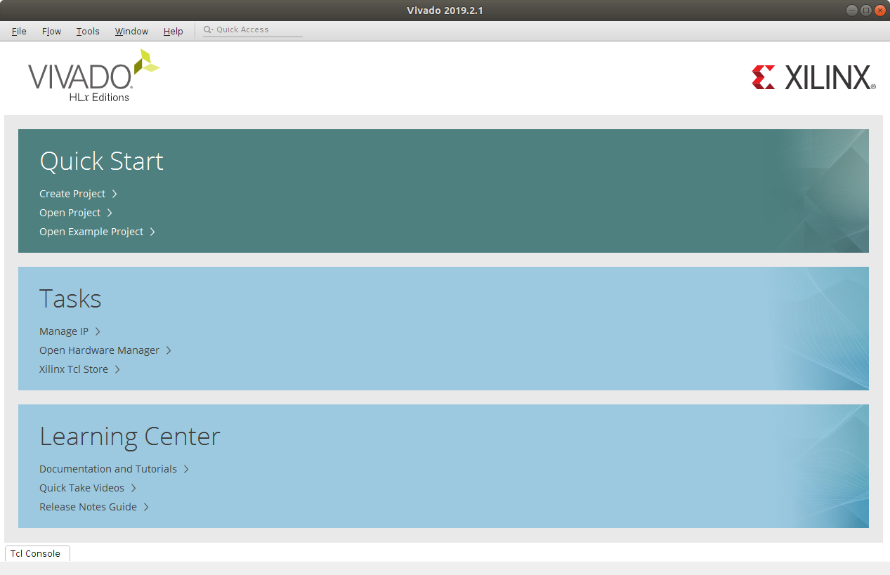

**Task:** Click on *Create Project*. You find this in the *Quick
Start* area. This starts up the *Create a New Vivado Project* wizard.
the first thing it does is show a little wizard welcome screen. Just
click next here.

**Task:** Make up a name for the project and pick a location for the
project related files. Check the *Create project subdirectory*
checkbox.  Click next to move on to the next setting. I called my
project "Blinky" as that is where I hope this will be going.

 Wizard welcoming screen  | Project name and location
| :---:|:---:|
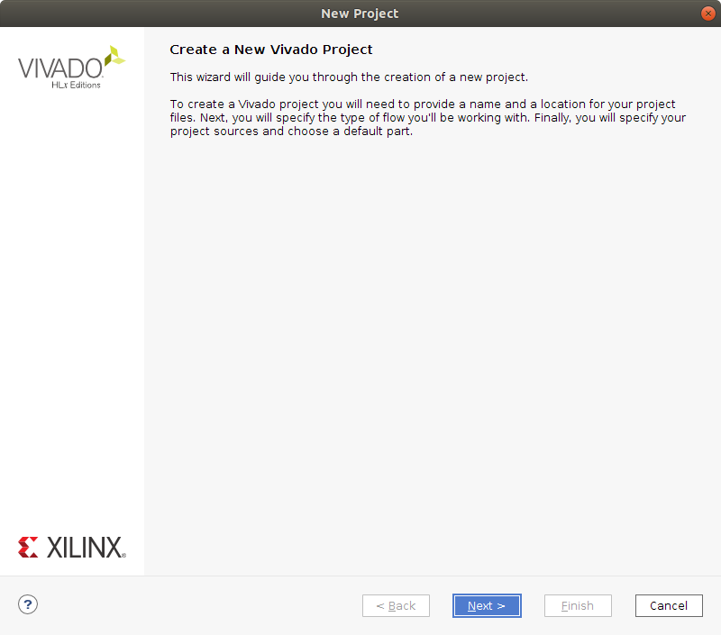| 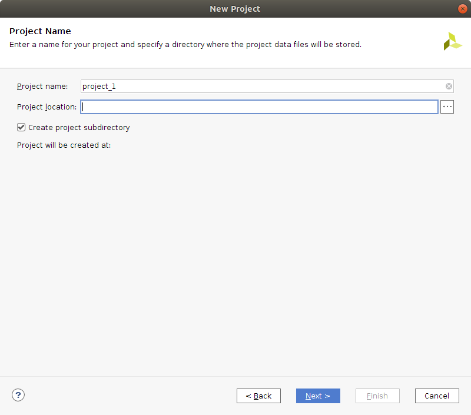

**Task:** Next up select *Project Type*. The type to use here is *RTL Project* and 
also click the *Do not specify sources at this time* checkbox. Then click next. 

The next step is to select the FPGA board to use as target. Locate the 
two tabs *Parts* and *Boards* and switch to tab *Boards*. You can narrow 
the list of selections down a bit by typing "nexys a7" into the search field. 

**Task:** Select the `Nexys A7-100T` board from the list and click next. 

 Project type  | Select the FPGA board
| :---:|:---:|
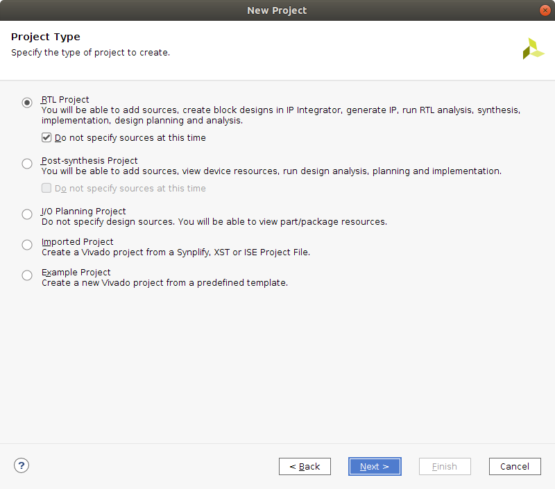| 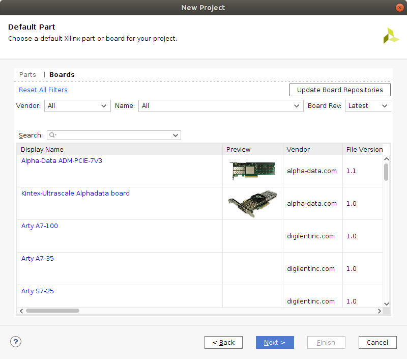


Project configuration is now completed and you will see a summary of your 
settings. 


**Task:** Click on *Finish*. 


## The Vivado GUI

After a brief pause (brief by Vivado standards) the GUI starts up and
you will be looking at something similar to this. 

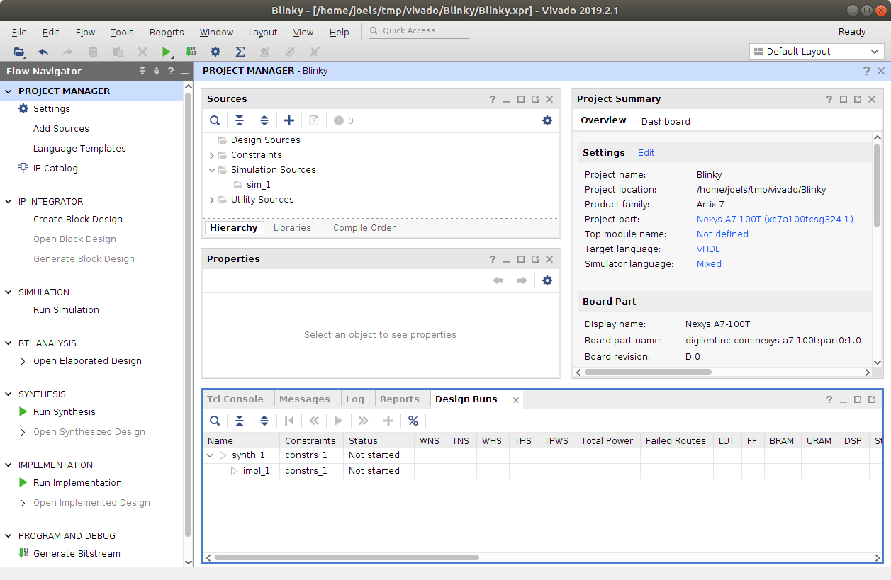

The GUI is divided into two main areas, a left *Flow Navigator* and a right side 
that changes quite a bit depending on what is currently going on. Right now the 
right hand side of the GUI is showing the *Project Manager* 

The first thing we are going to need to do is create some VHDL source. 

**TASK:** In the *Project Manager* locate the *Sources* pane and right
click within it.  This brings up a list of choices, click on *Add
Sources*. We are going to add a *design source* so check the *Add or
create design sources* option and click next.

**Task:** Click on the *Create File* button and provide a name for the file. I call mine `blinky`
click ok in the *Create File* dialog and then click *Finish* in the *Add Sources* window. After 
clicking *Finish* a *Define Module* dialog appears. This dialog lets you specify interface for 
the module if you wish, but I am going to do that by typing the VHDL manually. So just click 
Ok in this dialog. 

 Add Sources  | Add or Create Design Sources
| :---:|:---:|
| 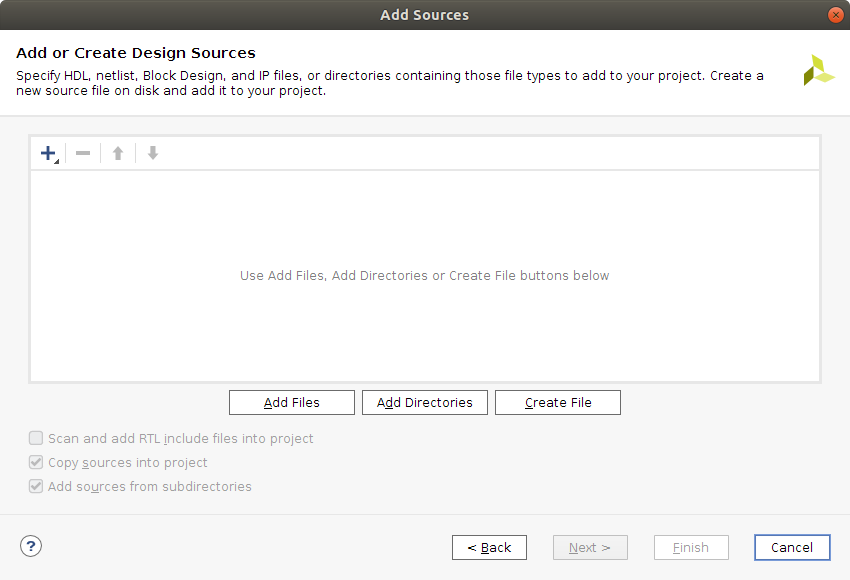

Now there should be a file called `blinky.vhd` listed under *Sources* in the *Project Manager*. 
Double click on this to open up an editor for the file. 

I have cleaned out most of the comments from the file, but the
contents will be roughly the following.

```
library IEEE;
use IEEE.STD_LOGIC_1164.ALL;
--use IEEE.NUMERIC_STD.ALL;

entity blinky is
--  Port ( );
end blinky;

architecture Behavioral of blinky is

begin


end Behavioral;
```

So, you get a skeleton of a module. In the next section I will try to fill 
that with some code. Keep in mind that I am a bit of a beginner at VHDL 
(feedback much appreciated). 


## The VHDL code 

Let's start with the entity declaration. 

```
entity blinky is
--  Port ( );
end blinky;
```

We are going to need a clock input signal and at least one output signal to drive 
an LED with. So add these to the Port list. 

``` 
entity blinky is
    Port ( 
        clk : in std_logic;
        led : out std_logic
         );
end blinky;
```

For the architecture (implementation of the entity) with my limited experience, 
I have a feeling it would work with a state machine that either is 
in a *Led is on* or *Led is off* state and that it remains in these states 
for some number of clock ticks. So, we need a way to maintain state and a 
way to count ticks. For the counter I will use an *unsigned*, so using
`IEEE.NUMERIC_STD` will be needed. 

```
architecture Behavioral of blinky is
    type state is (LED_On, LED_Off);
	signal s: state;
    signal counter : unsigned(24 downto 0);	
begin


end Behavioral;
```

So, now there are two states *LED_On* and *LED_Off* the `s` signal can
be set to one of these states and a counter that can count all the way up to
some high number above 33 million. Don't know yet for how long the
LED must be in on and off state (number of ticks) for it to visibly
blink.


What we want to implement now is hardware that sets the `led` signal 
to one when in the *On* State and zero when in *Off*, we also want to 
increment a counter each clock tick and check if the counter goes 
over some large number. When the counter goes above the large number 
we reset it to zero and also switch state. 

``` 
architecture Behavioral of blinky is
    type state is (LED_On, LED_Off);
    signal s: state;
    signal counter : unsigned(24 downto 0);
begin

    blinker: process (clk) 
    begin 
        if rising_edge(clk) then 
            case (s) is 
                when LED_On => 
                    led <= '1';
                when LED_Off => 
                    led <= '0';
            end case;
            
            if (counter >= 30000000 and s = LED_On) then 
                counter <= '0' & X"000000";
                s <= LED_off;
            elsif (counter >= 30000000 and s = LED_Off) then 
                counter <= '0' & X"000000"; 
                s <= LED_on; 
            else 
                counter <= counter + 1;
            end if; 
        end if;
    end process;

end Behavioral;
```

This code is a bit odd, for example it does not start from any known state 
when it comes to `s` or `counter`. What could be added is a reset signal  
and some logic associated with the reset that sets `s` to for example the *Off* 
state and sets `counter` to 0. My feeling is that it wont matter much in 
this case, as no matter what `s` and `counter` is initially it will sort itself 
out in a moment. This is of course no assumption you can make in general! 

Here is the complete VHDL code listing that will be used: 

``` 
library IEEE;
use IEEE.STD_LOGIC_1164.ALL;
use IEEE.NUMERIC_STD.ALL;

entity blinky is
    Port ( 
        clk : in std_logic;
        led : out std_logic
         );
end blinky;

architecture Behavioral of blinky is
    type state is (LED_On, LED_Off);
    signal s: state;
    signal counter : unsigned(24 downto 0);
begin

    blinker: process (clk) 
    begin 
        if rising_edge(clk) then 
            case (s) is 
                when LED_On => 
                    led <= '1';
                when LED_Off => 
                    led <= '0';
            end case;
            
            if (counter >= 30000000 and s = LED_On) then 
                counter <= '0' & X"000000";
                s <= LED_off;
            elsif (counter >= 30000000 and s = LED_Off) then 
                counter <= '0' & X"000000"; 
                s <= LED_on; 
            else 
                counter <= counter + 1;
            end if; 
        end if;
    end process;

end Behavioral;
``` 

## Setting some constraints

We have VHDL code with signals `clk` and `led` but nothing that tells vivado 
how those signals relate to clock generation or IO on the FPGA. To fix this 
we must create a *constraints file* that makes these connections from VHDL 
concepts to corresponding functionality on the FPGA. 

**Task:** In the *Sources* pane of the *Project Manager* right click and 
select *Add Sources*. Check the *Add or create constraints* radio-button. and click 
next. Now click the *Create File* button and a dialog pops up that asks you to 
provide a name for a file of type `.XDC`. I just call the file `constraints` and click ok. 
Then click *Finish* in the *Add or Create Constraints* dialog. 

 Add Sources  | Add or Create Constraints
| :---:|:---:|
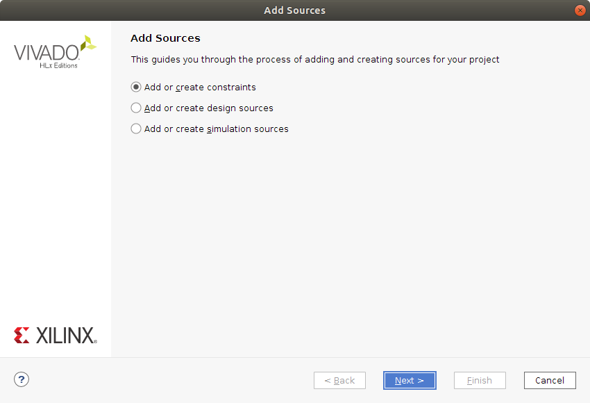| 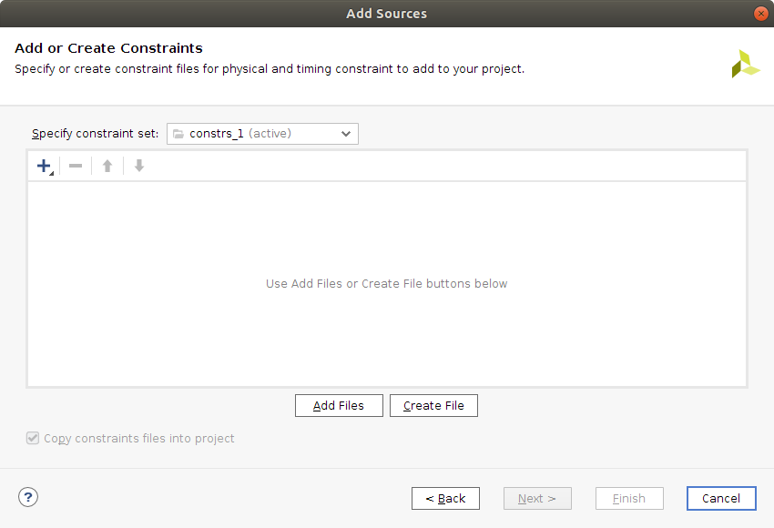


If we go back to the *Sources* pane of the *Project Manager* there should now 
be a file listed under *Constraints*. Double click on this to open the file 
in the editor. It should be empty. 

Copy the following into the `constraints.xdc` file. 

```
create_clock -period 10.000 -name clk -waveform {0.000 5.000} [get_ports clk]
set_property -dict { PACKAGE_PIN E3    IOSTANDARD LVCMOS33 } [get_ports { clk }];


set_property -dict { PACKAGE_PIN H17    IOSTANDARD LVCMOS33 } [get_ports { led }];
```

The first line sets a timing constraints that tells the system we want the design to 
run at 100MHz (period 10ns). You can also tweak the clocks duty cycle and phase by 
adjusting the *waveform* parameters. 

The next line states that something called *package pin* `E3` should be connected to 
the VHDL signal `clk`. The package pins and their meaning can be found in the 
[reference manual](https://reference.digilentinc.com/reference/programmable-logic/nexys-a7/reference-manual) provided 
by the board manufacturer. In this case E3 is associated with clocking resources. 

Lastly the `led` signal is connected to `H17` which is a pin on the FPGA 
connected to an LED on the board. The LED is located at the bottom right of 
the board, right above a switch. 

**Task:** add the constraints to the `constraints.xdc` file and save it using **CTRL + s**.

**Note:* There is a master [constraints
file](https://github.com/Digilent/digilent-xdc/blob/master/Nexys-A7-100T-Master.xdc) that 
Digilent provides for the board. You can download it and then tweak it as needed depending 
on your design. 

## Synthesis, Implementation and Programming the FPGA

Now we have reached the point where it is time to start the journey of turning 
the VHDL together with the constraints into hardware. This is where the *Flow Navigator* 
on the left hand side of the GUI comes in. 

We are going to perform the three bottom steps of this flow, *Synthesis*, *Implementation* 
and *Program and debug*. 

**Task:** Click on *Run Synthesis* under *Synthesis* in the *Flow Navigator*. This 
brings up a *Launch Runs* dialog where you can configure some parameters related to 
system resources to use for the synthesis task (if you have a separate computer with 
more power, I guess you can use that as a kind of build-server). The defaults 
are fine, so I click *Ok*.

 Launch Runs  | Synthesis Completed
| :---:|:---:|
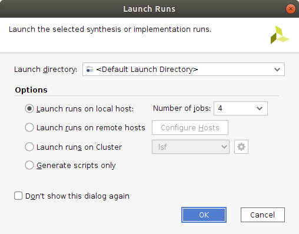 | 

Go make a cup of coffee while Vivado is crunching numbers. 

**Task:** After a moment the *Synthesis Completed* dialog will appear. The *Run Implementation* 
selection is already checked. Keep it so and click on *Ok* to start the 
*Implementation* part of the *Flow*. Another *Launch Runs* dialog appears, this 
time it is about configuring the *Implementation* step. Just click *Ok*.

Vivado will be busy for a while again but it is too soon for another cup of coffee. 

Then the *Implementation Completed* dialog appears!

**TASK:** in the *Implementation Completed* dialog click on *Generate Bitstream* 
and click *Ok*. There will, yet again, be a *Launch Runs* dialog where just clicking 
*Ok* is fine. 

After a moment a *Bitstream Generation Completed* dialog
appears. Select *Open Implemented Design" and Just click *ok*.

This opens up some interesting visualizations of your design that you can explore. 

 Graphical illustration of hardware   | Zoomed in
| :---:|:---:|
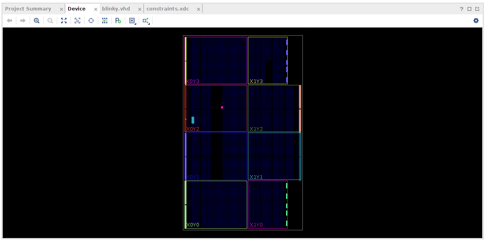 | 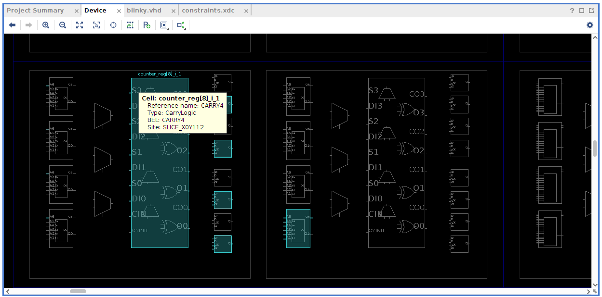


Anyway! We have reached the point where we have a bitstream that we
can program onto the FPGA. 

*Make sure your Nexys A7-100T is connected to your computer and turned on at this point*

**TASK:** At the bottom of the *Flow Navigator* there is the *Program and debug* 
operation. Under *Program and debug* you can find *Open Hardware manager* that can be "unfolded". 
Unfold this and click on *Open Target* and select *Auto Connect*. Now the *Program Device* 
option should be activated. Click on *Program Device* and select your device. 
Not a *Program Device* Dialog appears and you can click *Program*. 

If nothing went wrong along the way, the LED at the bottom right of your board should 
immediately start blinking when the programming of the FPGA completes. This [Blinky Video on YouTube](https://youtu.be/HCwPLk496Sw)
shows what it is supposed to look like. 

Also seems like the number of clock-ticks picked for the delay was quite ok. 

## Conclusion 

I hope to be learning a bit more about VHDL over time and will write down my findings 
as I go along. 

Please share your experience with trying to follow the steps outlined in this text. 

Thank you for reading and I hope that you have a good day. 

___

[HOME](https://svenssonjoel.github.io)
