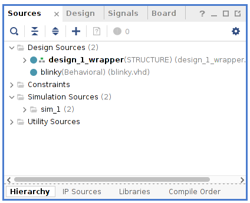

# Get to blinky with VHDL on the Zynq 7010 using Vivado 2020

This time I have taken a look at VHDL and the Zynq. I have used the
Zynq on and off for a long time but then just using high level
synthesis HLS (OpenCL or C). However, recently I have been playing with VHDL 
on the Nexys A7 platform and feel like it would be nice to do something 
in VHDL on the Zynq as well!

The zynq boards I use are the [Trenz
Zynqberry](https://shop.trenz-electronic.de/de/TE0726-03M-ZynqBerry-Modul-mit-Xilinx-Zynq-7010-in-Raspberry-Pi-Formfaktor)
boards. You can see two of my Zynqberries in the picture below. One of them 
is an early 128MB board and the one in currently in use is a newer TE0726-03 with 
512MB of DRAM. These boards are very affordable compared to other Zynq-7000 development boards
that I have seen, so they may be a good choice. 

This is not the first time I write about a VHDL blinky, see 
[blinky on Nexys A7](http://svenssonjoel.github.io/pages/vivado-nexys-a7-getting-started/index.html).
I have even written about blinky on the zynq before, but then not implementing 
in VHDL, [blinky Zynq using no explicit VHDL](http://svenssonjoel.github.io/writing/blinkledzynq.pdf).

If getting started with OpenCL on the Zynq sounds more interesting, you 
can jump over to [this text](http://svenssonjoel.github.io/pages/zynq_hls_opencl/index.html). 


The led to flash will be connected to the Zynqberry GPIO as shown in the picture below. 


## Some prerequisites 

If you are going to do this on a Zynqberry, you need to get board files 
for your Vivado installation. The board files I am using comes 
from [this page](https://shop.trenz-electronic.de/de/TE0726-03M-ZynqBerry-Modul-mit-Xilinx-Zynq-7010-in-Raspberry-Pi-Formfaktor?path=Trenz_Electronic/Modules_and_Module_Carriers/special/TE0726/Reference_Design/2019.2/test_board).
You find the board files within the archive under "Reference design - Quellcode und Konfigurationsdateien (1 Dateien)" 
called `TE0726-test_board-vivado_2019.2-build_10_20200408185804.zip`. 
The archive file name seems to indicate it is meant for Vivado 2019.2 but seems 
to work just fine with Vivado 2020. 

Open up the argument and copy the contents of `<archive-root>/test_board/board_files/`
into your Vivado install tree under `Xilinx/Vivado/2020.2/data/boards/board_files/`.

It is also a good idea to get [The Zynqberry
ref. manual](https://www.mouser.com/pdfDocs/TRM-TE0726-03.pdf) as it
has information about for example how gpio pins on the zynqberry are
connected to the FPGA (what package pin they are associated with). 


## Let's get coding! 

Start off by creating a new project in Vivado. I called mine `BlinkZynq`. 

New Project  | Project Name
| :---:|:---:|
| 

 Project type  | Select the FPGA board
| :---:|:---:|
| 


Selecting the correct board is, of course, important. A double click
seems to be required.  I have gone through that board selection screen
a couple of times and highlighted my selection just to end up with
some completely different board of part turning up in the
summary. Something about that GUI is not intuitive to me.

After going through the project creation Vivado starts up. 


Now click on *Create Block Design* in the flow navigator under *IP INTEGRATOR*. 
A dialog box appears, asking you to specify a name for the block design. The default 
is fine so OK. 

The GUI will now change appearance and look something like this. 


In the *Diagram* pane click on the plus symbol to add IP and in the search window 
that appears type "zynq" and select "Zynq7 Processing System". A representation 
of the processing system will now be added to the diagram. and the GUI should now 
look something like this. 


We wont actually use any AXI for this experiment so double click on the representation 
of the processing system to re-customize it. The following window should appear. 


Towards the bottom of the "Zynq Block Design" there is a green box with the text 
"32b GP AXI Master Ports", click on this to open up settings related to the AXI master ports. 

De-select the "M AXI GP0 interface" (that is, uncheck it) and then hit OK. 


Doing that should result in a block design looking something like this. 


Within the Diagram pane there is a green bar along the top with a link in it that 
says "Run Block Automation". Click this and a new dialog opens up. 


Going with the defaults there is just fine, so just click Ok. Now the block design 
looks as follows. 


in the *Sources* pane locate "design_1" and Right-click it. Select *Generate HDL Wrappers*. 
A dialog appears and you can let Vivado manage the wrappers.

 Generate HDL Wrappers  | Let Vivado Manage 
| :---:|:---:|
| 


That's enough "Block Design" for the moment! 

## Implement blinky in VHDL

In the *Sources* pane, right click and select "Add Sources". Select that you want 
to add "Design Sources". On the next page, click on "Create File". 


 Add Sources | Add or Create Design Sources
| :---:|:---:|
| 

When clicking on "Create File" a dialog appears where you can select a
name for the file. I went with "blinky.vhd". Now click Finish. 

In the "Define Module" dialog that appears, just click Ok (and then Yes).


Now our `blinky.vhd` file should be among the Design Sources in the Sources pane. 



Double click on `blinky.vhd` and a editor pane will appear. 

I use pretty much the same implementation of this VHD file as in the
Nexys-A7 Blinky experiment. But with faster flashing of the led, well that 
depends on the clock freq we end up using. 

```
library IEEE;
use IEEE.STD_LOGIC_1164.ALL;
use IEEE.NUMERIC_STD.ALL;

entity blinky is
  Port ( 
    clk : in std_logic;
    led : out std_logic
  );
end blinky;

architecture Behavioral of blinky is

    signal counter : unsigned(21 downto 0);
    
    type state is (LED_ON, LED_OFF);
    signal s : state; 

begin
    
    blinky : process(clk) 
    begin
    if rising_edge(clk) then
        case s is 
            when LED_ON => 
                led <= '1';
            when LED_OFF => 
                led <= '0';
        end case; 
         
        if (counter >= 3000000)then 
            if (s = LED_ON) then 
               s <= LED_OFF;
            else 
               s <= LED_ON; 
            end if;
			counter <= to_unsigned(0,22);
        else 
            counter <= counter + 1; 
        end if;
    end if;
    end process;
end Behavioral; 
``` 

Now we have a VHDL program typed in and the next thing to do is to integrate 
it with out block design. 


## Back to the block design

Open the block design either bt clicking on "Open Block Design" in the flow navigator 
or if you already find it open in a tab just select that. 

Right-click within the Diagram pane and select "Add Module". This opens a dialog window 
and you should be able to select the "blinky" module. 

 

If you cannot, check if Vivado is complaining about syntax errors in your VHDL. 

After adding the "blinky" module, the Diagram pane will now have the following contents. 


Look at that! we have another opportunity to click the "Run Connection Automation" link. 
Let's do that and then just go with the defaults. It will not do very much, just hooks up the 
clock signal to our blinky module. 


Now we need a port. Right-click in the Diagram pane and select "Create Port". Give the 
port a name ("LED") and set direction to be "output".


The port will appear in the block design towards the right hand side. Outputs appear on the 
right and inputs on the left. 


Connect the "led" output on the blinky module to the "LED" port. 


We are getting close now but we also need to create a constraints file that tells 
Vivado how to hook up the "LED" port to the outside world. 

To add a constraints file, right click in the Sources pane and select "Add Sources". 
This time chose "Add or Create Constraints" and click next followed by "Create File". 
I gave the file the name `constraints`, then click Finish. If all is good 
then a file called `constraints.xdc` will now exist under "Constraints" in the Sources pane. 


Double click on the `constraints.xdc` file to open it up in an editor pane. Paste 
the following into the file: 

``` 
# Zynqberry GPIO
set_property -dict {PACKAGE_PIN K15 IOSTANDARD LVCMOS33} [get_ports {LED}]
#set_property -dict {PACKAGE_PIN J14 IOSTANDARD LVCMOS33} [get_ports {gpio3}]
#set_property -dict {PACKAGE_PIN H12 IOSTANDARD LVCMOS33} [get_ports {gpio4}]
#set_property -dict {PACKAGE_PIN N14 IOSTANDARD LVCMOS33} [get_ports {gpio5}]
#set_property -dict {PACKAGE_PIN R15 IOSTANDARD LVCMOS33} [get_ports {gpio6}]
#set_property -dict {PACKAGE_PIN L14 IOSTANDARD LVCMOS33} [get_ports {gpio7}]
#set_property -dict {PACKAGE_PIN L15 IOSTANDARD LVCMOS33} [get_ports {gpio8}]
#set_property -dict {PACKAGE_PIN J13 IOSTANDARD LVCMOS33} [get_ports {gpio9}]
#set_property -dict {PACKAGE_PIN H14 IOSTANDARD LVCMOS33} [get_ports {gpio10}]
#set_property -dict {PACKAGE_PIN J15 IOSTANDARD LVCMOS33} [get_ports {gpio11}]
#set_property -dict {PACKAGE_PIN M15 IOSTANDARD LVCMOS33} [get_ports {gpio12}]
#set_property -dict {PACKAGE_PIN R13 IOSTANDARD LVCMOS33} [get_ports {gpio13}]
#set_property -dict {PACKAGE_PIN M12 IOSTANDARD LVCMOS33} [get_ports {gpio14}]
#set_property -dict {PACKAGE_PIN N13 IOSTANDARD LVCMOS33} [get_ports {gpio15}]
#set_property -dict {PACKAGE_PIN L13 IOSTANDARD LVCMOS33} [get_ports {gpio16}]
#set_property -dict {PACKAGE_PIN G11 IOSTANDARD LVCMOS33} [get_ports {gpio17}]
#set_property -dict {PACKAGE_PIN H11 IOSTANDARD LVCMOS33} [get_ports {gpio18}]
#set_property -dict {PACKAGE_PIN R12 IOSTANDARD LVCMOS33} [get_ports {gpio19}]
#set_property -dict {PACKAGE_PIN M14 IOSTANDARD LVCMOS33} [get_ports {gpio20}]
#set_property -dict {PACKAGE_PIN P15 IOSTANDARD LVCMOS33} [get_ports {gpio21}]
#set_property -dict {PACKAGE_PIN H13 IOSTANDARD LVCMOS33} [get_ports {gpio22}]
#set_property -dict {PACKAGE_PIN J11 IOSTANDARD LVCMOS33} [get_ports {gpio23}]
#set_property -dict {PACKAGE_PIN K11 IOSTANDARD LVCMOS33} [get_ports {gpio24}]
#set_property -dict {PACKAGE_PIN K13 IOSTANDARD LVCMOS33} [get_ports {gpio25}]
#set_property -dict {PACKAGE_PIN L12 IOSTANDARD LVCMOS33} [get_ports {gpio26}]
#set_property -dict {PACKAGE_PIN G12 IOSTANDARD LVCMOS33} [get_ports {gpio27}]
``` 

Only one of these lines are active, the rest are comments. But there is one line 
for each of the GPIO on the Zynqberry here just in case you need more in the future. 

The line

```
set_property -dict {PACKAGE_PIN K15 IOSTANDARD LVCMOS33} [get_ports {LED}]
```
connects the port "LED" to the package pin "K15" which is Zynqberry GPIO2.


Now we can try to synthesize, implement and generate a bitstream. We can initiate the 
entire flow by click on "Generate Bitstream" under "PROGRAM and DEBUG" in the flow navigator. 
A dialog appears where you can configure some parameters about the flow (like how much computer resources 
to use. Just going with the default should be fine. 

Vivado will now be working hard for a while. Sooner or later the
process will finish (I hope successfully).


 Launch Runs  | Success!
| :---:|:---:|
| 

The the design run is finished just click Ok. 

This is where I thought we would be done but that seems to not be the case. If we 
open the hardware manager and connect to our board and program it, nothing happens. 
I thought that since this is a purely hardware design we wouldn't need to write any 
software for the ARM cores of the Zynq. I do not understand what is going on here, but 
my guess is that some kind of initialization needs to take place and that the processing system 
is in charge of this initialization. 

## Hello world in Vitis IDE

A few more steps are needed before the led starts to flash. Go to the "File" menu and "Export" 
and select "Export Hardware". 


Export Hardware  | Include Bitstream
| :---:|:---:|
| 

 Files  | Summary
| :---:|:---:|
| 

Include the bitstream in the export, apart from that going with defaults is fine. 


Now go to the "Tools" menu and select "Launch Vitis IDE". You will be prompted to 
select a location for a workspace (seems very Eclipse based). 

When Vitis starts up create a new application project.

Select the "Create a new platform from hardware (XSA)" and locate 
the .xsa file in your project directory. 


 New Application Project  | Platform
| :---:|:---:|
| 

 Project Details  | Domain
| :---:|:---:|
| 

 

Most of the settings are can be left as they are by default. Of course come up with a 
suitable name for project ;) and when asked to pick a template, just go with the hello world 
template. 

The IDE should now start up and look something like this. 

 

Right-click on your project in the "Explorer" and select build. Which should be successful. 
Then locate the "Assistant" window:

 

Right-click on "Debug" under your app and select "run" and "launch on hardware". 

Now the led should be flashing! You can see what my setup looks like 
in [this](https://youtu.be/Mua2TCGxYK8) YouTube video.


## Conclusions

A few extra steps are required here compared to the Nexys A7 setup but
it was all fun. As usual, if you have hints, tips or questions please contact me. 

Thank you for reading and have a great day!

___

[HOME](https://svenssonjoel.github.io)
