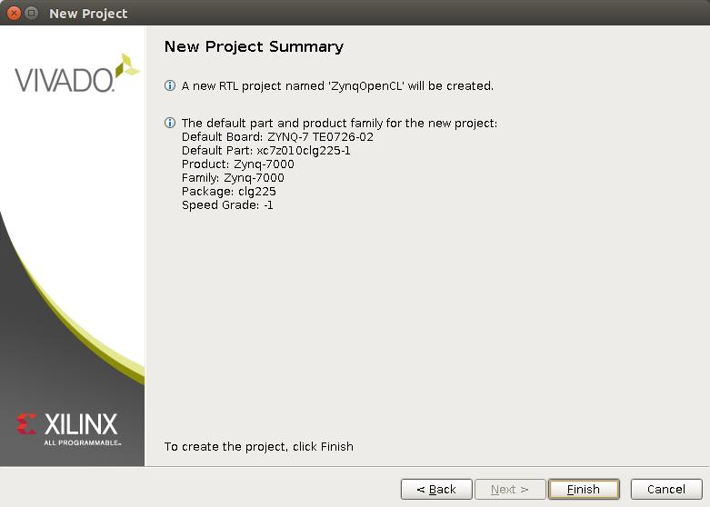

| Guide version          |        2020.0      |
| :--------------------- | :----------------: |
| Last edited            |      June 3 - 2020 |
| Board compatibility    |                    |
| Tested Vivado versions | 2019.2.1           |

# Preface to version 2020.0

Back in 2015 or 2016 me and a colleague at the time wrote the first
version of this guide on how to "get started" with OpenCL HLS on the
Zynq platform. We wrote it because we struggled immensely to get
anywhere with this and once that we did get something to work, we felt
that it was worth sharing (there must be someone else, somewhere out
there going throug the same struggle). I think that I can safely
assume that yes, someone else was struggling in the same way because I
have never before been contacted so much by people with questions
about anything else I've ever been part of writing. 

Years have passed since the writing of this and I have been doing
other things for a while. Haven't really touched FPGAs or the Zynq
very much at all in quite a while. So, I want to see how relevant this
document still is and also see if I can update or improve it in some
way. Step one in this process is to try to go through it myself using
contemporary versions of the tooling.

The Zynq-board that I use is still the Trenz Zynqberry equiped with a
Zynq 7010.  Board-files for these boards can be found in the reference
designs that Trenz provides on their website, look
[here](https://wiki.trenz-electronic.de/display/PD/TE0726+Reference+Designs)
for info and
[here](https://shop.trenz-electronic.de/Download/?path=Trenz_Electronic/Modules_and_Module_Carriers/special/TE0726/Reference_Design/2019.2/test_board)
for actual reference designs. The board files can be found in a
subdirectory.

An older version of this guide can be found on
[researchgate](https://www.researchgate.net/publication/302300881_Getting_Started_with_OpenCL_on_the_ZYNQ). I
have no idea how much has changed. That will become clear while going
through the steps on this. 

Thanks for reading! I hope this document will be easy to follow and
will help someone get started with FPGA programming. Thank you! 

# Disclaimer

All content provided in this document is for informational purposes
only. The authors makes no guarantees as to the accuracy or completeness
of any information within this document.

The authors will not be liable for any errors or omissions in this
information nor for the availability of this information. The authors
will not be liable for any losses, injuries, or damages from the display
or use of this information.

# Introduction

This document attempts to provide a complete walk through of the entire
OpenCL HLS work flow using Xilinx Vivado. That is, it will all be about
interacting with the various GUIs.

This document is work in progress and new versions will be posted as we
refine the procedure and gain a deeper understanding of all the details.

All feedback, hints, tips, corrections and explanations of details we
are vague upon, would be greatly appreciated!

## Initial setup

Board files should be copied from a reference design that can be
downloaded
[here](https://shop.trenz-electronic.de/Download/?path=Trenz_Electronic/Modules_and_Module_Carriers/special/TE0726/Reference_Design/2019.2/test_board)
(if you are using the ZynqBerry). The interesting files are located in
the subdirectory named `board_files` within the reference design
archive.  The subdirectories within `board_files` should be copied to
a directory in your Vivado instalation. I installed Vivado under a
directory called `opt` within my home directory. So, in my case I copy
the contents of `board_files` to directory:

```
~/opt/tools/Xilinx/Vivado/2019.2/data/boards/board_files
```

If your starting point is a fresh install of Vivado on a Linux
machine there are some additional steps that must be taken. There is a script that installs
some "cable_drivers" and sets some udev rules located in the following directory:

``` 
~/opt/tools/Xilinx/Vivado/2019.2/data/xicom/cable_drivers/lin64/install_script/install_drivers
```

This script should be run (`sudo ./install_drivers`).
Then source the vivado settings, this updates the path variables in your current shell so that
all the necessary tools can be found. 

```
source ./opt/tools/Xilinx/Vivado/2019.2/.settings64-Vivado.sh
```

## Guide structure

This guide is split into three parts that goes through: first writing a
simple OpenCL program and synthesizing it using Vivado HLS, second
designing a system (in Vivado) that interfaces the hardware generated by
HLS in step 1 with the processing system and the memory system in the
Zynq chip, finally we show how to develop software (in the SDK) for the
processing system that starts computations in the OpenCL generated
hardware.

# Part 1: Vivado HLS and OpenCL

In this section we develop an OpenCL program for vector addition
(`vadd`). This `vadd` computation is given pointers to three vectors
(arrays), two inputs and one output, and performs element wise
addition of the inputs into the output.

## Creating a Vivado HLS project

Start Vivado\_hls and create project using the steps outlined
below. If you have sourced the Vivado settings, Vivado_hls can be
started by the command `vivado_hls` in the same console. 

  - step1: Create a project and name it “vadd\_OpenCL”.

    New project  | Name project     
    | :---:|:---:|
     | 
    
  - step2: Now you are asked to provide a name for the top level
    function. This is the function that specifies the interface to the
    generated hardware. Name the top level function (vadd).

  - step3: We are not adding a testbench file.

     Top function | Testbench
    | :---:|:---:|
     | 


  - step4: Now it is time to configure the solution details. We can
    leave the solution name unchanged (“solution1”) and then we select
    the device:
    
      - Family: Zynq
    
      - Package: clg225
    
      - Speed grade: -1
    
    These steps are of course very specific to the particular FPGA
    that your development board is equiped with. Looking up the actual
    values for your situation can most likely be done in the
    datasheets associated with your board. But if you have a the very
    same ZynqBerry as I do, the choice to pick is `xc7z010clg225-1`
    that is suitable for the TE0726-03 version ZynqBerry.

    Solution configuration | Device selection
    | :---:|:---:|
     | 


Now project configuration is done and we can hit finish and enter into
the development environment. This should look like the left part of
figure [8](#fig:hls8to9).


## Writing a simple OpenCL kernel

The example kernel used in this guide is very simple and is outlined in
total below. Add a new source file to the project. Right click “source”
in the <span>*Explorer*</span> under “vadd\_OpenCL” and select “New
file”. Name the file “vadd.cl”. The file extension is important “.cl”.

Explorer | File creation dialog
|:---:|:---:|
 | 


``` 
#include <clc.h>
    
__kernel void __attribute__ ((reqd_work_group_size(128,1,1)))
vadd( __global int *a, __global int *b, __global int *c) {
  int i = get_global_id(0);
    
  c[i] = a[i] + b[i];
}
```    

After creating the new file type in the OpenCL code as above.

## Synthesize the OpenCL code

After writing the OpenCL, synthesis and exporting the IP remains in
order to conclude the part of the work that takes place in vivado\_hls.
If the code has been entered correctly this should go through synthesis
without problems. Hit the green “synthesis” button in the toolbar.


As the synthesis finishes a post synthesis report is brought up.


Now export the generated hardware description into the IP catalog. This
step makes our vadd hardware unit available for use in Vivado. Click the
“Export RTL” button in the toolbar.


The choices we make in the “Export RTL” dialog are shown in
figure [10](#fig:hls12). We choose “IP Catalog” and VHDL as the desired
language. One can also provide identification details using
“Configuration” button but we leave these settings unchanged.

Export RTL | IP configuration 
|:---:|:---:|
 | 

We are now done with vivado\_hls and will start up Vivado.

## Programming Interface Generated by HLS

After synthesizing hardware from the OpenCL code new directories
appeared called “impl” and “syn” containing VHDL code. Within one of
these files we find information that is important to keep in mind
later when writing the software that interfaces with the generated
hardware, this information will be used later. The information we
seek, is located in the “vadd\_control\_s\_axi.vhd” file and shows the
layout of the memory mapped interface for communication with the vadd
hardware unit:

    -- ------------------------Address Info-------------------
    -- 0x00 : Control signals
    --        bit 0  - ap_start (Read/Write/COH)
    --        bit 1  - ap_done (Read/COR)
    --        bit 2  - ap_idle (Read)
    --        bit 3  - ap_ready (Read)
    --        bit 7  - auto_restart (Read/Write)
    --        others - reserved
    -- 0x04 : Global Interrupt Enable Register
    --        bit 0  - Global Interrupt Enable (Read/Write)
    --        others - reserved
    -- 0x08 : IP Interrupt Enable Register (Read/Write)
    --        bit 0  - Channel 0 (ap_done)
    --        bit 1  - Channel 1 (ap_ready)
    --        others - reserved
    -- 0x0c : IP Interrupt Status Register (Read/TOW)
    --        bit 0  - Channel 0 (ap_done)
    --        bit 1  - Channel 1 (ap_ready)
    --        others - reserved
    -- 0x10 : Data signal of group_id_x
    --        bit 31~0 - group_id_x[31:0] (Read/Write)
    -- 0x14 : reserved
    -- 0x18 : Data signal of group_id_y
    --        bit 31~0 - group_id_y[31:0] (Read/Write)
    -- 0x1c : reserved
    -- 0x20 : Data signal of group_id_z
    --        bit 31~0 - group_id_z[31:0] (Read/Write)
    -- 0x24 : reserved
    -- 0x28 : Data signal of global_offset_x
    --        bit 31~0 - global_offset_x[31:0] (Read/Write)
    -- 0x2c : reserved
    -- 0x30 : Data signal of global_offset_y
    --        bit 31~0 - global_offset_y[31:0] (Read/Write)
    -- 0x34 : reserved
    -- 0x38 : Data signal of global_offset_z
    --        bit 31~0 - global_offset_z[31:0] (Read/Write)
    -- 0x3c : reserved
    -- 0x40 : Data signal of a
    --        bit 31~0 - a[31:0] (Read/Write)
    -- 0x44 : reserved
    -- 0x48 : Data signal of b
    --        bit 31~0 - b[31:0] (Read/Write)
    -- 0x4c : reserved
    -- 0x50 : Data signal of c
    --        bit 31~0 - c[31:0] (Read/Write)
    -- 0x54 : reserved
    -- (SC = Self Clear, COR = Clear on Read, TOW = Toggle on Write, COH = Clear on Handshake)

This gives us the “offsets” from some base address to where each of the
register used by the vadd hardware is located. Later, in vivado, a
complementary step will provide us with the base address.

The directly important pieces of information here is the control
register, the group\_id registers and the a,b and c data registers.

  - <span>**Control**</span>: using this register we can start
    computations in the vadd hardware unit and also poll for the done
    signal.

  - <span>**Group id**</span>: group\_id\_x, group\_id\_y, group\_id\_z
    specifies a three dimensional workgroup id. Since the OpenCL kernel
    we use is meant for one dimensional “NDRanges” only group\_id\_x is
    of importance. This value (group\_id\_x) is changed between
    invocations of vadd if the data we operate upon is larger than what
    can be computed by one workgroup instance (the only valid value for
    the others is zero).

  - <span>**Argument pointers**</span>: pointer to memory where the vadd
    hardware can fetch and store data should be written to the a,b,c
    register.


## Concluding part 1

So far everything seems to work very much the same as "years ago". I
did notice that there were some new clickboxes in the **Export RTL**
dialogs, but ignoring those seems fine so far. If it turns out to be a
problem I will edit this. 

# Part 2: Vivado

This section presents step by step instructions on how to integrate the
OpenCL kernel IP-block designed earlier into a Zynq base system.

## Creating a Vivado project

Begin by starting Vivado, this is done with the command `vivado` in
the console that you sourced the Vivado settings in. This presents you
with the view shown in the figure below. Select “Create
New Project” and click “Next”.

Create project | Project wizard step 1
|:---:|:---:| 
 | 

The GUI that starts up for project creation had some cosmetic changes
since last time I used Vivado but when it comes fucntionality it seems
the same. 

Choose a name and location for the project, in this case “ZynqOpenCL”
and a directory called “Vivado”. Click “Next”. In the next window select
“RTL Project” and check “Do not specify sources..”. This part of the
procedure is shown in the figures below.

Directory selection | RTL Project no sources
|:---:|:---:| 
 | 

Now it is time to select the “Default Part” to use as target platform.
Click “Boards”. If the steps in the section about initial setup have been
performed there should be an options for different versions of the zynqberry
board. Select the suitable board then click “Next” and then “Finish’

Board selection | Summary
|:---:|:---:| 
 | 

In the 2019 version of Vivado this part of the GUI has been extended
with pictures of boards. But the functionality of the GUI is the same.


Since I have the TE0726-03 version of the Zynqberry i selected the
board that is highlighted in the picture above.

This concludes the project configuration procedure.

## Designing the system

Now we have entered Vivado and are presented with a “Project Manager”
view, a “Project Summary” and the “Flow Navigator”.


In the Flow Navigator select “Create Block Design” located under the
heading "IP INTEGRATOR".  The default name “design\_1” is fine and we
can keep it and just hit “OK”. This should bring up a “Block Diagram
View” as is shown below.


In the Diagram view “design\_1” we click the add IP button. The shape
of this button should now be shown in the middle of the diagram view.
Click “add IP” and enter “zynq” into the search field. Select
the “ZYNQ7 Processing System”. IP blocks can later be added by right
clicking in the diagram area and selecting "Add IP" in the menu that
pops up.


The diagram view should now contain a Zynq processing system as shown in the
figure below. Note that there is a “Run Block Automation”
link within the block diagram at this point. Hit this link and mark “All
Automation” and then click Ok. The block automation dialog is shown in
figure [19](#fig:vivadoAuto).

Diagram with PS | Block automation
|:---:|:---:| 
 | 

After allowing the block automation for the processing system to apply
the default settings, the block diagram should look as in the
figure below.


Now it is time to add the vadd IP block to the design but before doing
that we need to point out to Vivado where that IP can be found. Find the
“IP settings” by right clicking in the diagram area of the GUI.
. Then click the “Repository Manager” tab and the plus (+) symbol.
Find the “impl” directory of the vadd\_OpenCL vivado\_hls project and
click select. This process is outlined in pictures below.

Project settings | IP repository manager
|:---:|:---:| 
 | 


Clicking “Select” should bring up the “Add Repository” dialog. Just
click “OK” and then we are back to the list of IP Repositories, but now
augmented with our recently added IP. Click “OK”.

Add Repository dialog | IP repository manager
|:---:|:---:|
 | 

With the IP repository configured we can add the vadd IP to the design.
Right click and select “Add IP” within the diagram view. Type
“vadd” in the search field and the “Vadd” IP should appear in the
list window. Select it.


After adding the Vadd IP the block Diagram should look as in
figure [26](#fig:vivadoVadd). Now we need to connect the Vadd unit to
the processing system but in order to that we need to go into the
processing system block and reconfigure it. If you look at the Vadd\_0
unit it has a “s\_axi\_control” interface and a “m\_axi\_gmem”
interface. These interfaces needs to be connected (as well as the clock
and reset). Luckily much of this connecting can be done for us
automatically, if only we configure the processing system block
correctly.


Double click on the ZYNQ7 Processing system in the in the diagram view.
This should bring up a view of the internals of the processing system as
below:


There are two interfaces that needs to be configured inside the
processing system. the “32b GP AXI Master Ports” and the “32b GP AXI
Slave Ports”. Double click on the Master ports and configure according
to the left picture below. Then do the same for the
Slave ports and the right picture.

AXI Master Ports | AXI Slave Ports
|:---:|:---:|
 | 

All of this is very similar to the old document. There seems to be a
difference in that the AXI master port was already enabled. This is
most likely due to some update in the board files. 

When this configuration of the processing system is completed the ZYNQ
Processing System in the diagram view should show the newly added
interfaces.


Most important here is to note that this change makes the “Run
Connection Automation” link to appear at the top of the block diagram
view. Actually, This time the link has been there a while. This is
because the AXI master interface was already activated and could have
been auto-connected. I think it is better to wait until now, when the
slave interface is also activated before running the automation
though. 

Click the "Run Connection Automation" link and make the following selections:


At this point the diagram view should look similar to
figure [30](#fig:vivadoRouted). Notice how two AXI interconnects have
been automatically added to the design and connects to the processing
system and to the vadd unit. One of these interfaces connect to the
control port on the vadd unit and is used to program the vadd unit
control registers. The other interface is used by the vadd unit for
memory accesses.


At this stage the design is mostly complete. We do, however, need to go
into the “Address editor” and perform some small tweaks. Within the Address
editor some address ranges are listed as excluded, we need to set these
as included.

Address editor | Include segments
|:---:|:---:|
 | 

Now it is time to go through the process that in the end results in a
bitstream that we can use to program the Zynq FPGA. This procedure is
outlined below, in text, and following this in pictures:

  - Validate the design: In the tools menu, click Validate design. This
    should finish with a message saying “Validation successful”.

  - Create HDL wrappers: This is done in the sources window by right
    clicking on “design\_1” and selecting “Create HDL Wrappers”.

  - Save and run synthesis: In the flow navigator under synthesis, click
    run synthesis.

  - Synthesis completed: In this dialog choose “Run Implementation”.

  - Implementation completes: Potentially reporting a great number of
    critical warnings. Fortunately these can be ignored. One should
    however check where the warnings come from. If there are warnings
    directly in relation to the IP you developed yourself it may be
    important.

  - Implementation Completed dialog: Choose “Generate Bitstream”.

  - After generation of bitstream one can take a look at the implemented
    design.

Once you start the synthesis (and your computer is anything like
mine), your system will be working very hard and use up a lot of
memory for quite a long time and can as result become very
unresponsive.


Create HDL Wrapper | HDL Wrapper Dialog
|:---:|:---:|
 | 

Launch runs | Synthesis complete
|:---:|:---:|
 | 


Example of critical warnings | Implementation complete 
|:---:|:---:|
 | 


Now "Export" the hardware. Go to the FILE menu and select EXPORT
followed by export hardware.


Here things start to look quite different compaired to back in the old
days! I cannot find any Launch SDK. There is this thing called "Launch
Vitis" under the TOOLS menu. I think this may be the replacement!
Clicking Launch Vitis starts something called the Vitis IDE (which is
based on eclipse).

Before going into the work with the software for the ARM processor
lets review some important details from the address editor.

## Important details from the Address Editor

Before going into the part of the guide that takes place in the SDK we
want to point out some details from the Address Editor. Make a note of
the address mentioned for the s\_axi\_control. In this case this address
is 0x43C00000. It is on this address and onwards that the control
registers for the vadd hardware unit is mapped into the address space.


# Part 3: Xilinx SDK

When the Xilinx SDK has launched (after launching it from the File menu
in Vivado) we are presented with a view like the left part of
figure [38](#fig:sdk1). Here we just click the “File” menu and “New”
“Application Project”. In the right part of figure [38](#fig:sdk1) we
name our application project “HelloOpenCL” and click next and select
“hello world” then “Finish” .


Now we need to perform one key piece of configuration to the Board
Support Package, the “system.mss” file of the “HelloOpenCL\_bsp”. The
configuration we need to change is the stdin/stdout under “Overview”,
“Standalone”. Both stdin and stdout should be pointed to
“ps7\_uart\_1” and not to uart\_0 as per default.


Next we go into the Xilinx tools menu and clicks “Generate linker
script”. Here we want to make the heap larger. Find the “Heap Size”
box and enter for example 33554432 (for 32mb). The default setting of
1KB will not be enough for what we are going to do.


Now it is time to write the C code that talks to the vadd unit. Edit the
“helloworld.c” file in the “HelloOpenCL” project as listed in
figure [\[fig:CCODE\]](#fig:CCODE).

    #include <stdlib.h>
    #include "platform.h"
    
    #include "xil_mmu.h"
    #include "xil_cache.h"
    #include "xil_cache_l.h"
    
    void print(char *str);
    
    volatile char *control = (volatile char*)0x43C00000;
    
    volatile int *wg_x   = (volatile int*)0x43C00010;
    volatile int *wg_y   = (volatile int*)0x43C00018;
    volatile int *wg_z   = (volatile int*)0x43C00020;
    volatile int *o_x    = (volatile int*)0x43C00028;
    volatile int *o_y    = (volatile int*)0x43C00030;
    volatile int *o_z    = (volatile int*)0x43C00038;
    
    volatile int *a_addr = (volatile int*)0x43C00040;
    volatile int *b_addr = (volatile int*)0x43C00048;
    volatile int *c_addr = (volatile int*)0x43C00050;
    
    
    #define WG_SIZE_X 128
    #define WG_SIZE_Y 1
    #define WG_SIZE_Z 1
    
    int main()
    {
        init_platform();
        /* more initialization */
        Xil_SetTlbAttributes(0x43c00000,0x10c06);  /* non cacheable */
    
        int *a;
        int *b;
        int *c;
        int i;
        int ok = 1;
    
        a = (int*)malloc(WG_SIZE_X *sizeof(int));
        b = (int*)malloc(WG_SIZE_X *sizeof(int));
        c = (int*)malloc(WG_SIZE_X *sizeof(int));
    
        print("Generating input data: \n\r");
        for (i = 0; i < WG_SIZE_X; i ++) {
            a[i] = 1;
            b[i] = 2;
            c[i] = 0;
        }
        Xil_DCacheFlush();

``` 

    *a_addr = (unsigned int)a;
    *b_addr = (unsigned int)b;
    *c_addr = (unsigned int)c;

    /* set the workgroup identity */
    *wg_y = 0;
    *wg_z = 0;
    *wg_x = 0;

    *o_x = 0;
    *o_y = 0;
    *o_z = 0;


    print("Status of control register: \n\r");
    unsigned int con = *control;
    for (i = 0; i < 8; i ++) {
        if (con & (1  << i) ) {
            print("1");
        } else {
            print("0");
        }
    }
    print("\n\r");

    print("Starting OpenCL kernel execution\n\r");
    *control = *control | 1;  /* start */

    /* waiting for hardware to report "done" */
    while (! ((*control) & 2));
    print("DONE!\n\r");


    Xil_DCacheInvalidate();

    for (i = 0; i < WG_SIZE_X; i ++) {
        if (c[i] != 3) ok = 0;
    }

    if (ok) {
        print("Success!\n\r");
    } else {
        print("Error: Something went wrong!\n\r");
    }

    cleanup_platform();
    return 0;
}
```

After writing the code we can right click on the “HelloOpenCL” project
in the “Project Explorer” and choose “Debug as” and “Debug
Configuration”. In the debug configuration select “Reset entire
system” and “Program FPGA” then “Apply”.


Now to start the application in Debug mode right click on “HelloOpenCL”
select “Debug as” and “Launch on hardware”. The ZynqBerry should now be
connected and its LEDs will be on while the device is being programmed.
The SDK will automatically enter into Debug mode and you can press
“Resume” (F8) button to run. In order to see any output from the
device you need to have a terminal link to it. On linux using the screen
command works well: <span>`screen /dev/ttyUSB1`</span>. This part of the
procedure is shown in figure [46](#fig:sdk5).


##  C Code Walkthrough

The code for interfacing with the generated hardware is given in full in
figure [\[fig:CCODE\]](#fig:CCODE) but is here given a step by step
explanation.

The code starts out by including some headers. This is just shown here
for completeness.

    #include <stdlib.h>
    #include "platform.h"
    
    #include "xil_mmu.h"
    #include "xil_cache.h"
    #include "xil_cache_l.h"
    
    void print(char *str);

The code below, declares names for the programming registers. The base
address was for this was found in section [3.3](#sec:addresseditor) and
the offsets to each specific register is found in
section [2.4](#sec:programminginterface).

``` 

volatile char *control = (volatile char*)0x43C00000;

volatile int *wg_x   = (volatile int*)0x43C00010;
volatile int *wg_y   = (volatile int*)0x43C00018;
volatile int *wg_z   = (volatile int*)0x43C00020;
volatile int *o_x    = (volatile int*)0x43C00028;
volatile int *o_y    = (volatile int*)0x43C00030;
volatile int *o_z    = (volatile int*)0x43C00038;

volatile int *a_addr = (volatile int*)0x43C00040;
volatile int *b_addr = (volatile int*)0x43C00048;
volatile int *c_addr = (volatile int*)0x43C00050;
```

The workgroup size is 128 (in the x direction). This means that each
“run” of the generated hardware will perform 128 element wise
additions.

    #define WG_SIZE_X 128
    #define WG_SIZE_Y 1
    #define WG_SIZE_Z 1

This also means that the smallest amount of additions we can perform
using the vadd hardware is 128 and that we can only perform multiples of
128 additions by repeatedly launching work on the vadd hardware with
different workgroup identities. This restriction comes the use of the
“reqd\_work\_group\_size(128,1,1)” attribute used in the
implementation of vadd in vivado\_hls. This attribute can be left out
resulting in a more flexible (but less efficient) hardware
implementation with a more complicated interface.

The <span>`main`</span> function starts out by performing some standard
initialization but we also add a step that marks the range of memory
containing the programming registers as “non cacheable”.

    int main()
    {
        init_platform();
        /* more initialization */
        Xil_SetTlbAttributes(0x43c00000,0x10c06);  /* non cacheable */

The following piece of code declares pointers and allocates memory for
the input and output to the vadd computation. It also declares a counter
variable i (used in some loops later on) and an ok status variable.

    int *a;
        int *b;
        int *c;
        int i;
        int ok = 1;
    
        a = (int*)malloc(WG_SIZE_X *sizeof(int));
        b = (int*)malloc(WG_SIZE_X *sizeof(int));
        c = (int*)malloc(WG_SIZE_X *sizeof(int));

Generate some input data and flush the cache to ensure that all the data
we generated has been stored all the way to DRAM before launching the
vadd computation.

    print("Generating input data: \n\r");
        for (i = 0; i < WG_SIZE_X; i ++) {
            a[i] = 1;
            b[i] = 2;
            c[i] = 0;
        }
        Xil_DCacheFlush();

The next step is to program the registers of the vadd unit and prepare
for launching a workgroup. The workgroup id is set to (0,0,0).

    *a_addr = (unsigned int)a;
        *b_addr = (unsigned int)b;
        *c_addr = (unsigned int)c;
    
        /* set the workgroup identity */
        *wg_y = 0;
        *wg_z = 0;
        *wg_x = 0;
    
        *o_x = 0;
        *o_y = 0;
        *o_z = 0;

The next piece of code prints the contents of the control register. This
serves no important purpose for the application but only provides a way
to visually inspect that the control status (which should be “idle”).

    print("Status of control register: \n\r");
        unsigned int con = *control;
        for (i = 0; i < 8; i ++) {
            if (con & (1  << i) ) {
                print("1");
            } else {
                print("0");
            }
        }
        print("\n\r");

We instruct the vadd hardware to start computing by putting a one at bit
position zero in the control register.

    print("Starting OpenCL kernel execution\n\r");
        *control = *control | 1;  /* start */

And then we wait for the hardware to report done in bit position two.

    /* waiting for hardware to report "done" */
        while (! ((*control) & 2));
        print("DONE!\n\r");
    
    
        Xil_DCacheInvalidate();

After the hardware reports to be done, we invalidate the cache of the
processing system in order to ensure that we will see the fresh data
that the programmable logic has computed (without any involvement of the
cache hierarchy, so the changes in memory are not yet visible to the ARM
cores).

After that we can check the result for correctness.

    for (i = 0; i < WG_SIZE_X; i ++) {
            if (c[i] != 3) ok = 0;
        }
    
        if (ok) {
            print("Success!\n\r");
        } else {
            print("Error: Something went wrong!\n\r");
        }

And we are done.

    cleanup_platform();
        return 0;
    }

# Conclusion

We hope that following this guide has allowed you to run OpenCL on a
Zynq device. Please send us feedback or questions.

1.  http://www.trenz-electronic.de/products/fpga-boards/trenz-electronic/te0726-zynq.html

2.  http://www.trenz-electronic.de/download/d0/Trenz\_Electronic/d1/TE0726/d2/Reference%20Designs/d3//d4/test\_board.html
